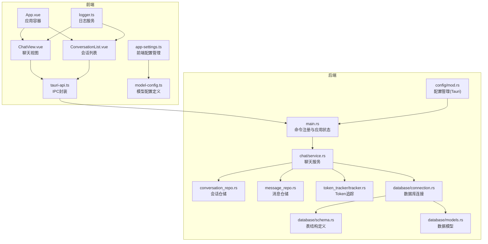
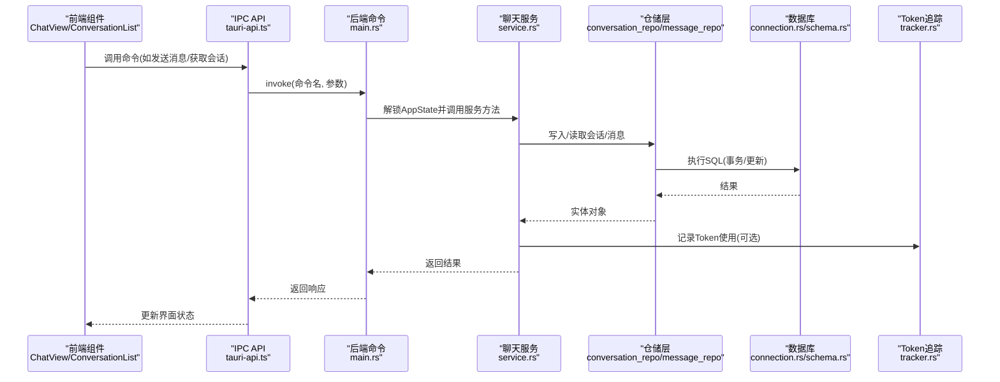
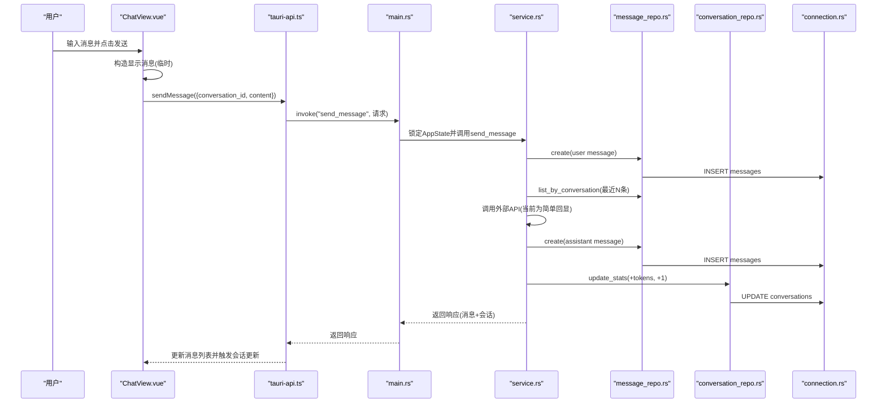
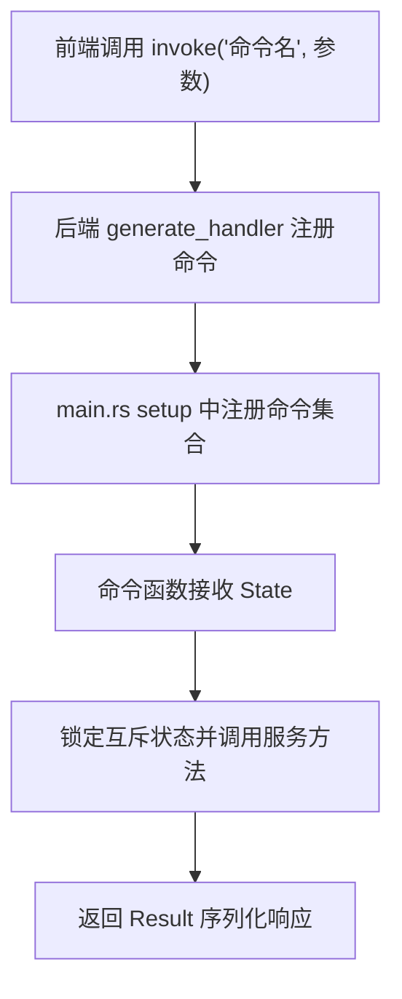
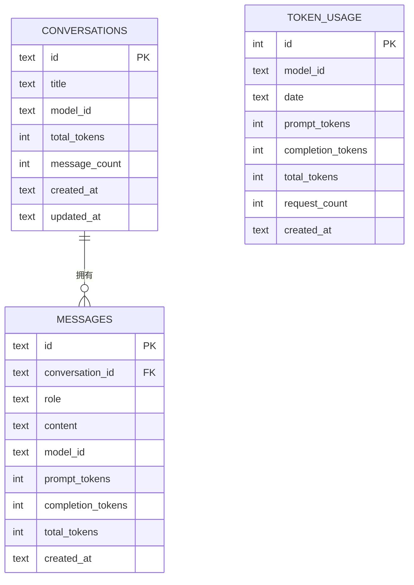
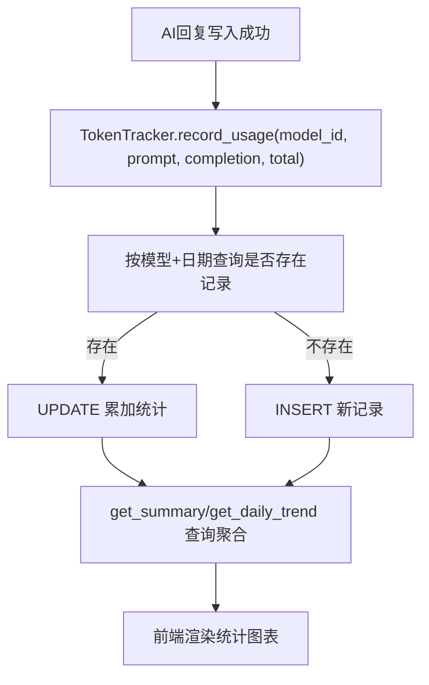
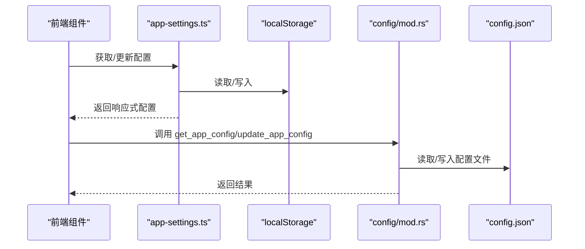
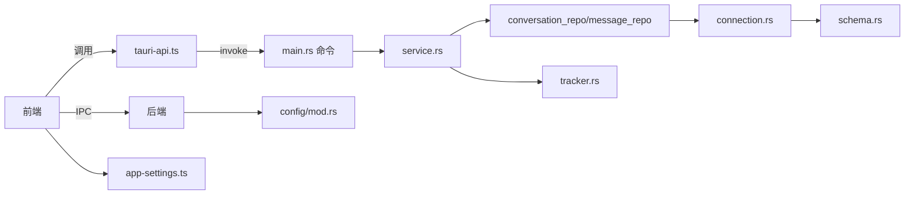

# 数据流设计

<cite>
**本文引用的文件**
- [src/main.ts](file://src/main.ts)
- [src/App.vue](file://src/App.vue)
- [src/components/business/ChatView.vue](file://src/components/business/ChatView.vue)
- [src/components/business/ConversationList.vue](file://src/components/business/ConversationList.vue)
- [src/api/tauri-api.ts](file://src/api/tauri-api.ts)
- [src/config/app-settings.ts](file://src/config/app-settings.ts)
- [src/config/model-config.ts](file://src/config/model-config.ts)
- [src/utils/logger.ts](file://src/utils/logger.ts)
- [src-tauri/src/main.rs](file://src-tauri/src/main.rs)
- [src-tauri/src/chat/service.rs](file://src-tauri/src/chat/service.rs)
- [src-tauri/src/chat/conversation_repo.rs](file://src-tauri/src/chat/conversation_repo.rs)
- [src-tauri/src/chat/message_repo.rs](file://src-tauri/src/chat/message_repo.rs)
- [src-tauri/src/token_tracker/tracker.rs](file://src-tauri/src/token_tracker/tracker.rs)
- [src-tauri/src/config/mod.rs](file://src-tauri/src/config/mod.rs)
- [src-tauri/src/database/connection.rs](file://src-tauri/src/database/connection.rs)
- [src-tauri/src/database/models.rs](file://src-tauri/src/database/models.rs)
- [src-tauri/src/database/schema.rs](file://src-tauri/src/database/schema.rs)
</cite>

## 目录
1. [简介](#简介)
2. [项目结构](#项目结构)
3. [核心组件](#核心组件)
4. [架构总览](#架构总览)
5. [详细组件分析](#详细组件分析)
6. [依赖关系分析](#依赖关系分析)
7. [性能考量](#性能考量)
8. [故障排查指南](#故障排查指南)
9. [结论](#结论)
10. [附录](#附录)

## 简介
本文件面向Malou Agent的数据流设计，覆盖从前端用户交互到后端数据处理的完整链路，重点说明：
- Tauri IPC通信协议与命令调用流程
- 消息传递机制、数据转换与状态同步
- 数据库操作、事务与一致性保障
- Token使用统计的采集、聚合与报表生成
- 配置数据的读取、验证与持久化
- 缓存策略、增量更新与冲突解决
- 数据安全传输、加密存储与隐私保护

## 项目结构
Malou Agent采用前后端分离架构：
- 前端基于Vue 3 + Element Plus，通过Tauri IPC与后端通信
- 后端基于Rust + Tauri，提供命令接口、数据库访问与业务逻辑
- 数据库采用SQLite，配合WAL模式提升并发性能

**图表来源**
- [src/App.vue](file://src/App.vue#L1-L121)
- [src/components/business/ChatView.vue](file://src/components/business/ChatView.vue#L1-L569)
- [src/components/business/ConversationList.vue](file://src/components/business/ConversationList.vue#L1-L367)
- [src/api/tauri-api.ts](file://src/api/tauri-api.ts#L1-L242)
- [src-tauri/src/main.rs](file://src-tauri/src/main.rs#L1-L316)
- [src-tauri/src/chat/service.rs](file://src-tauri/src/chat/service.rs#L1-L224)
- [src-tauri/src/chat/conversation_repo.rs](file://src-tauri/src/chat/conversation_repo.rs#L1-L161)
- [src-tauri/src/chat/message_repo.rs](file://src-tauri/src/chat/message_repo.rs#L1-L175)
- [src-tauri/src/token_tracker/tracker.rs](file://src-tauri/src/token_tracker/tracker.rs#L1-L195)
- [src-tauri/src/database/connection.rs](file://src-tauri/src/database/connection.rs#L1-L89)
- [src-tauri/src/database/schema.rs](file://src-tauri/src/database/schema.rs#L1-L68)
- [src-tauri/src/database/models.rs](file://src-tauri/src/database/models.rs#L1-L110)
- [src-tauri/src/config/mod.rs](file://src-tauri/src/config/mod.rs#L1-L334)
- [src/config/app-settings.ts](file://src/config/app-settings.ts#L1-L195)
- [src/config/model-config.ts](file://src/config/model-config.ts#L1-L163)
- [src/utils/logger.ts](file://src/utils/logger.ts#L1-L95)

**章节来源**
- [src/main.ts](file://src/main.ts#L1-L13)
- [src/App.vue](file://src/App.vue#L1-L121)
- [src-tauri/src/main.rs](file://src-tauri/src/main.rs#L242-L315)

## 核心组件
- 前端应用入口与路由容器：负责UI布局、标签页切换与组件编排
- 聊天视图与会话列表：负责用户输入、消息渲染、会话管理与模型切换
- IPC API封装：统一暴露后端命令，屏蔽底层Tauri细节
- 后端命令与应用状态：集中注册命令、维护应用状态与配置
- 聊天服务与仓储层：封装会话、消息与Token统计的业务逻辑
- 数据库连接与Schema：提供SQLite连接、WAL模式与表结构
- 配置管理：前端localStorage与后端文件配置双轨持久化

**章节来源**
- [src/App.vue](file://src/App.vue#L1-L121)
- [src/components/business/ChatView.vue](file://src/components/business/ChatView.vue#L1-L569)
- [src/components/business/ConversationList.vue](file://src/components/business/ConversationList.vue#L1-L367)
- [src/api/tauri-api.ts](file://src/api/tauri-api.ts#L1-L242)
- [src-tauri/src/main.rs](file://src-tauri/src/main.rs#L58-L315)
- [src-tauri/src/chat/service.rs](file://src-tauri/src/chat/service.rs#L11-L224)
- [src-tauri/src/database/connection.rs](file://src-tauri/src/database/connection.rs#L1-L89)
- [src-tauri/src/database/schema.rs](file://src-tauri/src/database/schema.rs#L1-L68)
- [src-tauri/src/config/mod.rs](file://src-tauri/src/config/mod.rs#L144-L334)
- [src/config/app-settings.ts](file://src/config/app-settings.ts#L1-L195)

## 架构总览
前端通过Tauri IPC调用后端命令，后端命令在AppState中查找对应服务，服务调用仓储层进行数据库操作，并在必要时记录Token统计。

**图表来源**
- [src/api/tauri-api.ts](file://src/api/tauri-api.ts#L108-L110)
- [src-tauri/src/main.rs](file://src-tauri/src/main.rs#L140-L161)
- [src-tauri/src/chat/service.rs](file://src-tauri/src/chat/service.rs#L94-L177)
- [src-tauri/src/chat/conversation_repo.rs](file://src-tauri/src/chat/conversation_repo.rs#L14-L42)
- [src-tauri/src/chat/message_repo.rs](file://src-tauri/src/chat/message_repo.rs#L14-L52)
- [src-tauri/src/token_tracker/tracker.rs](file://src-tauri/src/token_tracker/tracker.rs#L14-L48)
- [src-tauri/src/database/connection.rs](file://src-tauri/src/database/connection.rs#L50-L57)

## 详细组件分析

### 前端用户交互到后端命令的完整数据流
- 用户在聊天视图输入消息，触发发送流程
- 前端调用IPC API封装的命令，传入会话ID与内容
- 后端命令解析请求，委托聊天服务执行
- 服务写入用户消息、构建上下文、调用外部API（当前为简单回显）、保存AI回复并更新统计
- 后端返回消息与统计信息，前端更新界面并发出会话更新事件

**图表来源**
- [src/components/business/ChatView.vue](file://src/components/business/ChatView.vue#L162-L222)
- [src/api/tauri-api.ts](file://src/api/tauri-api.ts#L108-L110)
- [src-tauri/src/main.rs](file://src-tauri/src/main.rs#L140-L161)
- [src-tauri/src/chat/service.rs](file://src-tauri/src/chat/service.rs#L94-L177)
- [src-tauri/src/chat/message_repo.rs](file://src-tauri/src/chat/message_repo.rs#L14-L52)
- [src-tauri/src/chat/conversation_repo.rs](file://src-tauri/src/chat/conversation_repo.rs#L102-L116)
- [src-tauri/src/database/connection.rs](file://src-tauri/src/database/connection.rs#L50-L57)

**章节来源**
- [src/components/business/ChatView.vue](file://src/components/business/ChatView.vue#L162-L222)
- [src/api/tauri-api.ts](file://src/api/tauri-api.ts#L108-L110)
- [src-tauri/src/main.rs](file://src-tauri/src/main.rs#L140-L161)
- [src-tauri/src/chat/service.rs](file://src-tauri/src/chat/service.rs#L94-L177)

### Tauri IPC通信协议与命令调用流程
- 前端通过invoke调用后端命令，命令名与参数映射到后端#[tauri::command]函数
- 后端在setup阶段注册所有命令，命令持有State引用以访问AppState
- 命令内部锁定互斥状态，调用服务层方法，返回序列化结果

**图表来源**
- [src/api/tauri-api.ts](file://src/api/tauri-api.ts#L108-L110)
- [src-tauri/src/main.rs](file://src-tauri/src/main.rs#L285-L312)
- [src-tauri/src/main.rs](file://src-tauri/src/main.rs#L242-L284)

**章节来源**
- [src/api/tauri-api.ts](file://src/api/tauri-api.ts#L1-L242)
- [src-tauri/src/main.rs](file://src-tauri/src/main.rs#L285-L312)

### 数据库操作、事务与一致性保障
- 数据库连接采用Mutex包装的rusqlite连接，并通过execute闭包确保线程安全
- 初始化时启用外键约束与WAL模式，提升并发与可靠性
- 会话与消息表通过外键关联，删除会话触发级联删除消息
- Token统计表按模型+日期聚合，UPSERT逻辑避免重复写入

**图表来源**
- [src-tauri/src/database/schema.rs](file://src-tauri/src/database/schema.rs#L3-L62)
- [src-tauri/src/database/models.rs](file://src-tauri/src/database/models.rs#L3-L110)

**章节来源**
- [src-tauri/src/database/connection.rs](file://src-tauri/src/database/connection.rs#L12-L58)
- [src-tauri/src/database/schema.rs](file://src-tauri/src/database/schema.rs#L1-L68)
- [src-tauri/src/chat/conversation_repo.rs](file://src-tauri/src/chat/conversation_repo.rs#L146-L152)
- [src-tauri/src/chat/message_repo.rs](file://src-tauri/src/chat/message_repo.rs#L142-L151)

### Token使用统计的采集、聚合与报表生成
- 聊天服务在保存AI回复后，根据usage记录prompt/completion/total tokens
- Token追踪器按日期聚合，支持按日期范围查询汇总与每日趋势
- 前端通过命令获取统计并渲染报表

**图表来源**
- [src-tauri/src/chat/service.rs](file://src-tauri/src/chat/service.rs#L160-L166)
- [src-tauri/src/token_tracker/tracker.rs](file://src-tauri/src/token_tracker/tracker.rs#L14-L48)
- [src-tauri/src/token_tracker/tracker.rs](file://src-tauri/src/token_tracker/tracker.rs#L50-L113)
- [src-tauri/src/token_tracker/tracker.rs](file://src-tauri/src/token_tracker/tracker.rs#L143-L168)
- [src-tauri/src/main.rs](file://src-tauri/src/main.rs#L165-L186)

**章节来源**
- [src-tauri/src/chat/service.rs](file://src-tauri/src/chat/service.rs#L160-L166)
- [src-tauri/src/token_tracker/tracker.rs](file://src-tauri/src/token_tracker/tracker.rs#L14-L195)
- [src-tauri/src/main.rs](file://src-tauri/src/main.rs#L165-L186)

### 配置数据的读取、验证与持久化
- 前端配置管理：localStorage持久化，提供响应式配置与校验
- 后端配置管理：应用配置目录下的JSON文件，支持读取、更新与节级修改
- 命令接口：提供获取与更新应用配置、当前模型信息、模型切换与ONNX开关

**图表来源**
- [src/config/app-settings.ts](file://src/config/app-settings.ts#L152-L179)
- [src-tauri/src/config/mod.rs](file://src-tauri/src/config/mod.rs#L149-L187)
- [src-tauri/src/config/mod.rs](file://src-tauri/src/config/mod.rs#L258-L276)

**章节来源**
- [src/config/app-settings.ts](file://src/config/app-settings.ts#L1-L195)
- [src-tauri/src/config/mod.rs](file://src-tauri/src/config/mod.rs#L144-L334)

### 数据缓存策略、增量更新与冲突解决
- 前端缓存：聊天视图在发送消息时先插入临时消息，收到后端响应后再替换ID；会话列表通过ref暴露刷新方法
- 增量更新：消息按created_at升序加载，会话统计字段按增量累加
- 冲突解决：Token统计采用UPSERT策略，按模型+日期聚合，避免并发写入冲突

**章节来源**
- [src/components/business/ChatView.vue](file://src/components/business/ChatView.vue#L172-L222)
- [src/components/business/ConversationList.vue](file://src/components/business/ConversationList.vue#L149-L158)
- [src-tauri/src/chat/conversation_repo.rs](file://src-tauri/src/chat/conversation_repo.rs#L102-L116)
- [src-tauri/src/token_tracker/tracker.rs](file://src-tauri/src/token_tracker/tracker.rs#L25-L48)

### 数据安全传输、加密存储与隐私保护
- 传输安全：Tauri IPC在本地进程内通信，避免网络传输风险；OpenAI配置通过命令更新内存状态，注意敏感信息不应长期驻留内存
- 存储安全：数据库文件位于应用数据目录；建议在生产环境对配置文件与数据库文件进行权限控制
- 隐私保护：当前实现未见内置加密存储；建议在后续版本对敏感字段（如API密钥）采用加密存储并在内存中及时清理

**章节来源**
- [src-tauri/src/main.rs](file://src-tauri/src/main.rs#L242-L284)
- [src-tauri/src/config/mod.rs](file://src-tauri/src/config/mod.rs#L150-L157)

## 依赖关系分析
- 前端依赖：Element Plus、@tauri-apps/api、自定义日志与配置模块
- 后端依赖：tauri、serde、rusqlite、uuid、chrono、tokio
- 前后端耦合点：IPC命令名与参数结构需保持一致

**图表来源**
- [src/api/tauri-api.ts](file://src/api/tauri-api.ts#L1-L242)
- [src-tauri/src/main.rs](file://src-tauri/src/main.rs#L285-L312)
- [src-tauri/src/chat/service.rs](file://src-tauri/src/chat/service.rs#L1-L224)
- [src-tauri/src/chat/conversation_repo.rs](file://src-tauri/src/chat/conversation_repo.rs#L1-L161)
- [src-tauri/src/chat/message_repo.rs](file://src-tauri/src/chat/message_repo.rs#L1-L175)
- [src-tauri/src/token_tracker/tracker.rs](file://src-tauri/src/token_tracker/tracker.rs#L1-L195)
- [src-tauri/src/database/connection.rs](file://src-tauri/src/database/connection.rs#L1-L89)
- [src-tauri/src/database/schema.rs](file://src-tauri/src/database/schema.rs#L1-L68)
- [src-tauri/src/config/mod.rs](file://src-tauri/src/config/mod.rs#L1-L334)
- [src/config/app-settings.ts](file://src/config/app-settings.ts#L1-L195)

**章节来源**
- [src-tauri/src/main.rs](file://src-tauri/src/main.rs#L1-L316)
- [src/api/tauri-api.ts](file://src/api/tauri-api.ts#L1-L242)

## 性能考量
- 数据库并发：WAL模式提升读写并发；索引优化会话与消息查询
- 会话统计：按需累加，避免全表扫描
- Token统计：按模型+日期分组聚合，减少写放大
- 前端渲染：消息按时间排序，避免不必要的重绘

[本节为通用指导，无需具体文件分析]

## 故障排查指南
- 数据库测试：通过命令测试会话创建、消息发送与删除，快速定位数据库连接问题
- 日志记录：前端使用logger记录关键事件，便于定位异常
- 命令调用：检查命令名与参数是否匹配，确认后端命令已注册

**章节来源**
- [src-tauri/src/main.rs](file://src-tauri/src/main.rs#L219-L238)
- [src/utils/logger.ts](file://src/utils/logger.ts#L1-L95)
- [src/api/tauri-api.ts](file://src/api/tauri-api.ts#L174-L176)

## 结论
Malou Agent的数据流设计以Tauri IPC为核心，结合Rust后端与SQLite数据库，实现了从前端交互到后端处理的闭环。通过仓储层抽象、Token追踪与配置管理，系统具备良好的扩展性与可维护性。建议后续增强敏感数据的加密存储与传输安全，并完善模型切换与ONNX功能的异步配置更新能力。

[本节为总结性内容，无需具体文件分析]

## 附录
- 关键命令清单
  - 会话管理：create_conversation、list_conversations、get_conversation、update_conversation_title、delete_conversation
  - 消息管理：send_message、get_conversation_messages、clear_conversation_messages
  - Token统计：get_token_usage_summary、get_token_usage_trend
  - 配置管理：get_app_config、update_app_config、get_current_model_info、update_model_selection、toggle_local_models、toggle_onnx_feature

**章节来源**
- [src-tauri/src/main.rs](file://src-tauri/src/main.rs#L285-L312)
- [src/api/tauri-api.ts](file://src/api/tauri-api.ts#L66-L176)