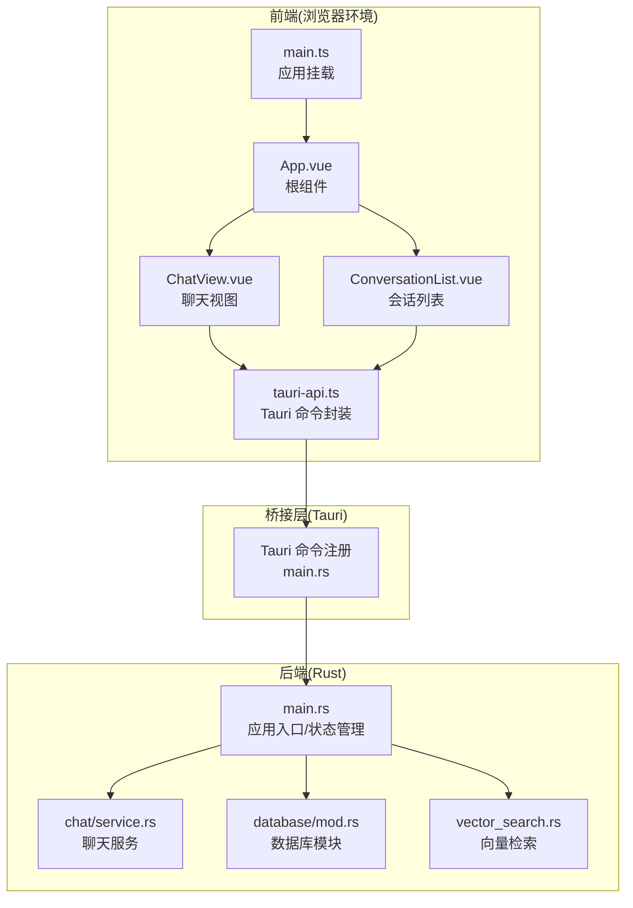
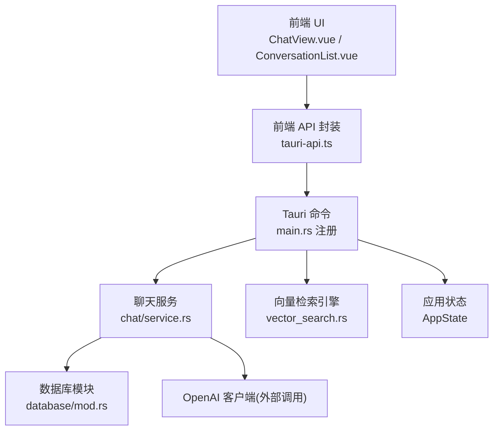
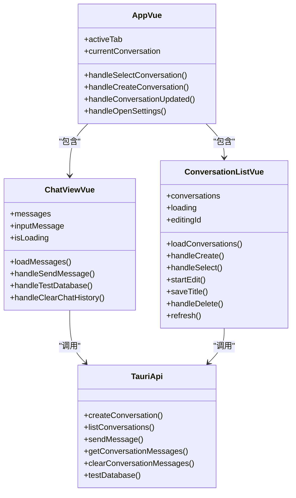
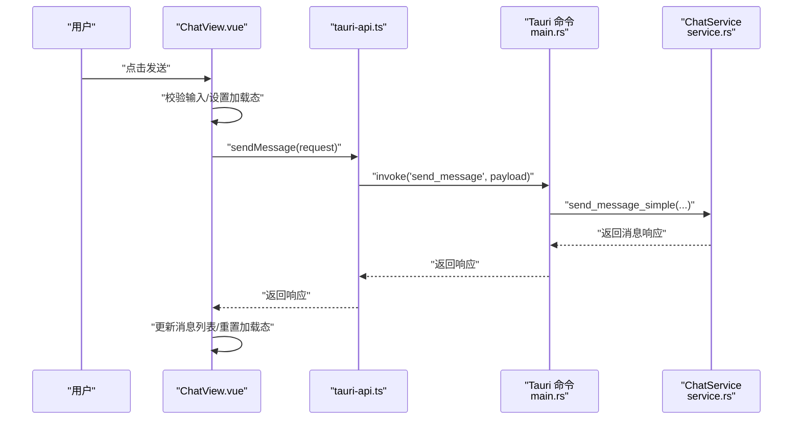
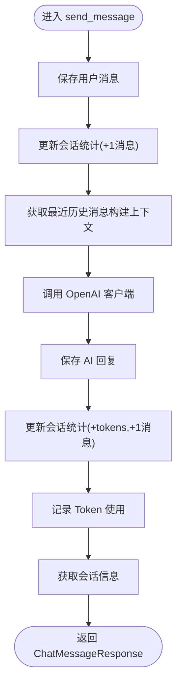
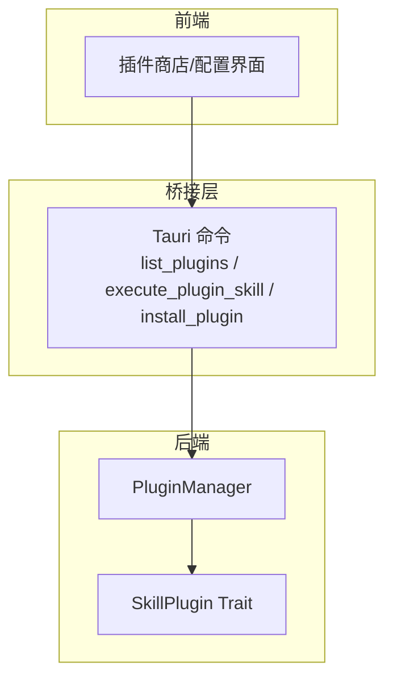
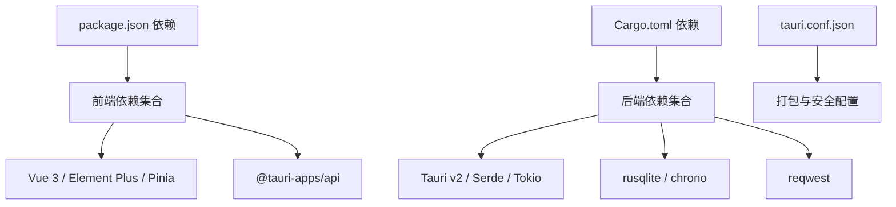

# 架构设计

<cite>
**本文引用的文件**
- [README.md](file://README.md)
- [package.json](file://package.json)
- [src-tauri/Cargo.toml](file://src-tauri/Cargo.toml)
- [src-tauri/tauri.conf.json](file://src-tauri/tauri.conf.json)
- [src/main.ts](file://src/main.ts)
- [src/App.vue](file://src/App.vue)
- [src/api/tauri-api.ts](file://src/api/tauri-api.ts)
- [src/components/business/ChatView.vue](file://src/components/business/ChatView.vue)
- [src/components/business/ConversationList.vue](file://src/components/business/ConversationList.vue)
- [src-tauri/src/main.rs](file://src-tauri/src/main.rs)
- [src-tauri/src/chat/service.rs](file://src-tauri/src/chat/service.rs)
- [src-tauri/src/database/mod.rs](file://src-tauri/src/database/mod.rs)
- [src-tauri/src/vector_search.rs](file://src-tauri/src/vector_search.rs)
- [docs/skill-plugins-system.md](file://docs/skill-plugins-system.md)
</cite>

## 目录
1. [引言](#引言)
2. [项目结构](#项目结构)
3. [核心组件](#核心组件)
4. [架构总览](#架构总览)
5. [详细组件分析](#详细组件分析)
6. [依赖分析](#依赖分析)
7. [性能考虑](#性能考虑)
8. [故障排查指南](#故障排查指南)
9. [结论](#结论)
10. [附录](#附录)

## 引言
本架构设计文档面向 Malou Agent 桌面应用，系统采用“前端 Vue 层 + Tauri 桥接层 + 后端 Rust 服务层”的三层架构。该设计结合 Tauri v2 的原生能力与 Rust 的内存安全优势，实现高性能、可扩展且跨平台的桌面应用。文档从系统边界、数据流、组件关系、MVC 与组件化设计、状态管理、异步编程模式、内存安全与跨平台兼容性等方面进行深入解析，并给出架构决策的技术权衡与性能建议。

## 项目结构
Malou Agent 的工程由前端与后端两部分组成：
- 前端：基于 Vue 3 + TypeScript + Vite，使用 Element Plus 与 Pinia 实现 UI 与状态管理。
- 后端：基于 Tauri v2 + Rust，提供系统命令、数据库访问、聊天服务与向量检索等能力。
- 配置：通过 tauri.conf.json 控制窗口、打包与安全策略；Cargo.toml 管理 Rust 依赖。

图表来源
- [src/App.vue](file://src/App.vue#L1-L121)
- [src/components/business/ChatView.vue](file://src/components/business/ChatView.vue#L1-L569)
- [src/components/business/ConversationList.vue](file://src/components/business/ConversationList.vue#L1-L367)
- [src/api/tauri-api.ts](file://src/api/tauri-api.ts#L1-L242)
- [src-tauri/src/main.rs](file://src-tauri/src/main.rs#L249-L323)
- [src-tauri/src/chat/service.rs](file://src-tauri/src/chat/service.rs#L1-L214)
- [src-tauri/src/database/mod.rs](file://src-tauri/src/database/mod.rs#L1-L7)
- [src-tauri/src/vector_search.rs](file://src-tauri/src/vector_search.rs#L1-L84)

章节来源
- [README.md](file://README.md#L45-L61)
- [src-tauri/tauri.conf.json](file://src-tauri/tauri.conf.json#L1-L32)
- [package.json](file://package.json#L1-L31)

## 核心组件
- 前端应用入口与状态管理
  - 应用入口负责创建 Vue 应用、挂载 Pinia 与 UI 组件库。
  - 根组件 App.vue 提供主布局与页签导航，承载聊天、知识库与设置页面。
- 前端业务组件
  - ChatView.vue：负责消息渲染、输入处理、模型切换、数据库测试与清空记录等交互。
  - ConversationList.vue：负责会话列表展示、创建、编辑标题与删除等操作。
- 前端 API 封装
  - tauri-api.ts：对后端 Tauri 命令进行封装，统一数据类型与调用方式。
- 后端应用入口与状态
  - main.rs：初始化数据库、构建聊天服务、注入应用状态（含 ChatService 与 OpenAI 配置），注册命令。
- 后端聊天服务
  - chat/service.rs：封装会话与消息 CRUD、调用 OpenAI 客户端、统计 Token 使用、记录会话统计。
- 数据库模块
  - database/mod.rs：导出数据库连接、模型与模式定义，支撑聊天数据持久化。
- 向量检索引擎
  - vector_search.rs：提供余弦相似度与欧氏距离两种相似度度量，支持向量搜索与 Top-K 返回。

章节来源
- [src/main.ts](file://src/main.ts#L1-L13)
- [src/App.vue](file://src/App.vue#L1-L121)
- [src/components/business/ChatView.vue](file://src/components/business/ChatView.vue#L1-L569)
- [src/components/business/ConversationList.vue](file://src/components/business/ConversationList.vue#L1-L367)
- [src/api/tauri-api.ts](file://src/api/tauri-api.ts#L1-L242)
- [src-tauri/src/main.rs](file://src-tauri/src/main.rs#L249-L323)
- [src-tauri/src/chat/service.rs](file://src-tauri/src/chat/service.rs#L1-L214)
- [src-tauri/src/database/mod.rs](file://src-tauri/src/database/mod.rs#L1-L7)
- [src-tauri/src/vector_search.rs](file://src-tauri/src/vector_search.rs#L1-L84)

## 架构总览
Malou Agent 采用“前端渲染 + Tauri 桥接 + Rust 后端服务”的分层架构：
- 前端层：负责用户交互、视图渲染与状态管理，通过 Tauri 命令与后端通信。
- 桥接层：Tauri 将前端与后端 Rust 服务连接，暴露命令接口并管理应用生命周期。
- 后端层：Rust 提供聊天服务、数据库访问、向量检索与 Token 统计等核心能力。

图表来源
- [src/api/tauri-api.ts](file://src/api/tauri-api.ts#L1-L242)
- [src-tauri/src/main.rs](file://src-tauri/src/main.rs#L292-L323)
- [src-tauri/src/chat/service.rs](file://src-tauri/src/chat/service.rs#L1-L214)
- [src-tauri/src/database/mod.rs](file://src-tauri/src/database/mod.rs#L1-L7)
- [src-tauri/src/vector_search.rs](file://src-tauri/src/vector_search.rs#L1-L84)

## 详细组件分析

### 前端 MVC 与组件化设计
- 视图层（View）
  - App.vue：主容器与页签布局，协调 ChatView 与 ConversationList 的组合使用。
  - ChatView.vue：聊天视图，包含消息列表、输入框、模型选择下拉与操作按钮。
  - ConversationList.vue：会话列表，支持创建、编辑标题、删除与高亮当前会话。
- 控制器（Controller）
  - ChatView.vue 与 ConversationList.vue 作为控制器，处理用户事件、调用 API 并更新视图状态。
- 模型（Model）
  - tauri-api.ts 定义数据模型与 API 方法，作为前端与后端交互的契约。
- 状态管理
  - main.ts 中创建并挂载 Pinia，为全局状态提供集中管理（如后续引入 Store）。

图表来源
- [src/App.vue](file://src/App.vue#L1-L121)
- [src/components/business/ChatView.vue](file://src/components/business/ChatView.vue#L1-L569)
- [src/components/business/ConversationList.vue](file://src/components/business/ConversationList.vue#L1-L367)
- [src/api/tauri-api.ts](file://src/api/tauri-api.ts#L1-L242)

章节来源
- [src/App.vue](file://src/App.vue#L1-L121)
- [src/components/business/ChatView.vue](file://src/components/business/ChatView.vue#L1-L569)
- [src/components/business/ConversationList.vue](file://src/components/business/ConversationList.vue#L1-L367)
- [src/api/tauri-api.ts](file://src/api/tauri-api.ts#L1-L242)
- [src/main.ts](file://src/main.ts#L1-L13)

### 前端到后端的调用序列
以下序列图展示了“发送消息”这一关键流程的调用链路。

图表来源
- [src/components/business/ChatView.vue](file://src/components/business/ChatView.vue#L163-L222)
- [src/api/tauri-api.ts](file://src/api/tauri-api.ts#L108-L110)
- [src-tauri/src/main.rs](file://src-tauri/src/main.rs#L141-L161)
- [src-tauri/src/chat/service.rs](file://src-tauri/src/chat/service.rs#L169-L207)

章节来源
- [src/components/business/ChatView.vue](file://src/components/business/ChatView.vue#L163-L222)
- [src/api/tauri-api.ts](file://src/api/tauri-api.ts#L108-L110)
- [src-tauri/src/main.rs](file://src-tauri/src/main.rs#L141-L161)
- [src-tauri/src/chat/service.rs](file://src-tauri/src/chat/service.rs#L169-L207)

### 聊天服务处理流程（算法）
聊天服务在收到消息后，按顺序执行：保存用户消息、更新会话统计、构建上下文、调用外部模型、保存 AI 回复、更新统计与记录 Token 使用。

图表来源
- [src-tauri/src/chat/service.rs](file://src-tauri/src/chat/service.rs#L91-L167)

章节来源
- [src-tauri/src/chat/service.rs](file://src-tauri/src/chat/service.rs#L91-L167)

### 技能插件系统（概念性架构）
根据文档，Malou Agent 计划引入插件化技能系统，后端通过 PluginManager 管理插件，前端提供插件商店与配置界面。该系统遵循“后端命令 + 前端封装 + 插件协议”的模式，便于扩展与安全控制。

图表来源
- [docs/skill-plugins-system.md](file://docs/skill-plugins-system.md#L126-L170)

章节来源
- [docs/skill-plugins-system.md](file://docs/skill-plugins-system.md#L1-L214)

## 依赖分析
- 前端依赖
  - Vue 3、Element Plus、Pinia、Vue Router、@tauri-apps/api 等。
- 后端依赖
  - Tauri v2、Serde、Tokio、SQLite(rusqlite)、reqwest、uuid、chrono、image、dirs 等。
- 配置与打包
  - tauri.conf.json 定义窗口尺寸、安全策略与打包图标；package.json 定义脚本与依赖。

图表来源
- [package.json](file://package.json#L14-L30)
- [src-tauri/Cargo.toml](file://src-tauri/Cargo.toml#L9-L25)
- [src-tauri/tauri.conf.json](file://src-tauri/tauri.conf.json#L1-L32)

章节来源
- [package.json](file://package.json#L1-L31)
- [src-tauri/Cargo.toml](file://src-tauri/Cargo.toml#L1-L25)
- [src-tauri/tauri.conf.json](file://src-tauri/tauri.conf.json#L1-L32)

## 性能考虑
- 异步与并发
  - 后端使用 Tokio 运行时，聊天服务在发送消息时采用异步调用外部模型，避免阻塞主线程。
- 数据库访问
  - 使用 rusqlite 并开启内置压缩特性，减少 IO 压力；消息列表默认限制数量，降低前端渲染压力。
- 向量检索
  - 向量引擎提供余弦相似度与欧氏距离两种度量，支持 Top-K 检索；建议在大规模文档场景中预构建索引或分片存储。
- 前端渲染
  - ChatView 对消息列表进行虚拟滚动与懒加载，减少 DOM 节点数量；输入框与按钮禁用态避免重复提交。
- 跨平台与打包
  - Tauri v2 提供轻量级原生外壳，结合多目标打包策略，兼顾体积与性能。

章节来源
- [src-tauri/src/main.rs](file://src-tauri/src/main.rs#L16-L16)
- [src-tauri/src/chat/service.rs](file://src-tauri/src/chat/service.rs#L110-L125)
- [src-tauri/src/vector_search.rs](file://src-tauri/src/vector_search.rs#L60-L75)
- [src/components/business/ChatView.vue](file://src/components/business/ChatView.vue#L117-L144)

## 故障排查指南
- 数据库测试
  - ChatView 提供 testDatabase 调用，若失败可在前端弹窗提示并记录日志；后端 main.rs 中也提供 test_database 命令用于快速验证。
- 消息发送失败
  - ChatView 在发送异常时回滚临时用户消息并提示错误；检查网络连通性与 OpenAI 配置是否正确。
- 会话列表为空
  - ConversationList 在加载失败时显示错误提示；确认后端命令注册与数据库初始化是否成功。
- Token 统计异常
  - 通过 get_token_usage_summary 与 get_token_usage_trend 获取统计；若失败查看后端日志与 TokenTracker 初始化状态。

章节来源
- [src/api/tauri-api.ts](file://src/api/tauri-api.ts#L174-L176)
- [src/components/business/ChatView.vue](file://src/components/business/ChatView.vue#L224-L243)
- [src-tauri/src/main.rs](file://src-tauri/src/main.rs#L226-L245)

## 结论
Malou Agent 的三层架构清晰地划分了前端渲染、桥接通信与后端服务的职责，结合 Tauri 与 Rust 的优势，在保证内存安全与跨平台兼容的同时，提供了良好的扩展性与性能表现。未来可进一步完善向量数据库集成、技能插件系统与配置管理界面，持续提升用户体验与系统稳定性。

## 附录
- 系统边界
  - 前端仅通过 Tauri 命令与后端交互，不直接访问数据库或外部服务。
  - 后端命令集中注册于 main.rs，统一入口便于维护与安全控制。
- 数据流向
  - 用户输入 → 前端组件 → API 封装 → Tauri 命令 → 后端服务 → 数据库/外部模型 → 响应返回。
- 组件关系
  - App.vue 作为根容器协调多个业务组件；业务组件通过 API 封装与后端解耦。