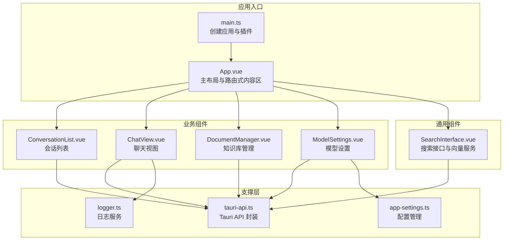
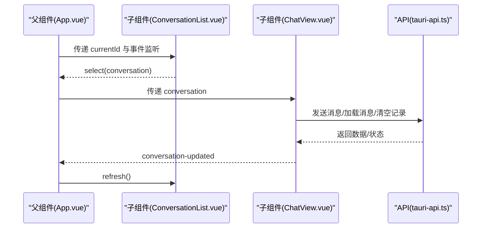
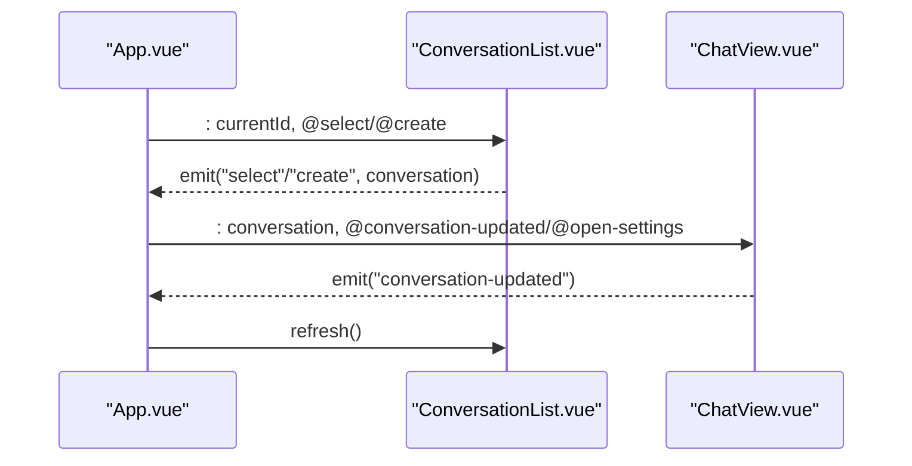
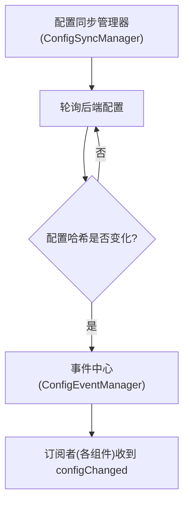
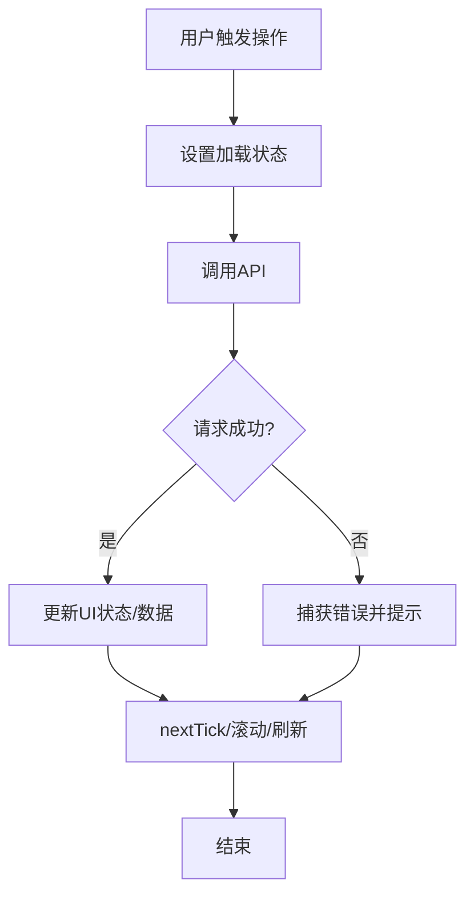
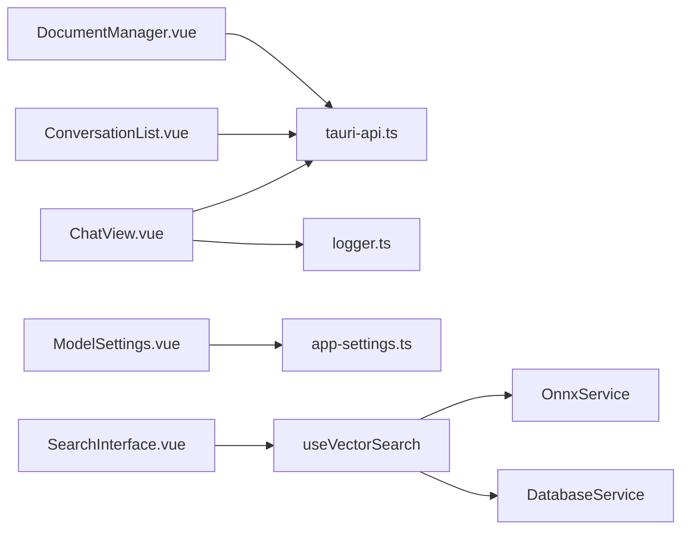

# 组件交互设计

<cite>
**本文引用的文件**   
- [src/App.vue](file://src/App.vue)
- [src/main.ts](file://src/main.ts)
- [src/components/business/ChatView.vue](file://src/components/business/ChatView.vue)
- [src/components/business/ConversationList.vue](file://src/components/business/ConversationList.vue)
- [src/components/business/DocumentManager.vue](file://src/components/business/DocumentManager.vue)
- [src/components/settings/ModelSettings.vue](file://src/components/settings/ModelSettings.vue)
- [src/components/SearchInterface.vue](file://src/components/SearchInterface.vue)
- [src/api/tauri-api.ts](file://src/api/tauri-api.ts)
- [src/utils/logger.ts](file://src/utils/logger.ts)
- [src/config/app-settings.ts](file://src/config/app-settings.ts)
- [src/config/index.ts](file://src/config/index.ts)
- [docs/testing-and-optimization.md](file://docs/testing-and-optimization.md)
</cite>

## 目录
1. [简介](#简介)
2. [项目结构](#项目结构)
3. [核心组件](#核心组件)
4. [架构总览](#架构总览)
5. [详细组件分析](#详细组件分析)
6. [依赖关系分析](#依赖关系分析)
7. [性能考量](#性能考量)
8. [故障排查指南](#故障排查指南)
9. [结论](#结论)
10. [附录](#附录)

## 简介
本文件系统性梳理 Malou Agent 的组件交互设计，聚焦 Vue 组件间通信机制（父子、兄弟、跨层级）、事件总线与 provide/inject、全局状态共享策略、生命周期与条件渲染、动态组件加载、API 封装与错误处理、加载状态管理、响应式设计与动画、用户体验优化、组件测试策略与 Mock、以及性能优化与懒加载最佳实践。文档基于仓库现有源码进行分析与总结。

## 项目结构
Malou Agent 采用基于功能域的组件组织方式，主要业务组件位于 src/components 下，按领域划分为基础组件、业务组件与设置组件；API 层通过 Tauri 桥接到 Rust 后端；配置与日志分别提供全局状态与可观测能力；入口在 main.ts 中挂载应用。

图表来源
- [src/main.ts](file://src/main.ts#L1-L13)
- [src/App.vue](file://src/App.vue#L1-L121)
- [src/components/business/ChatView.vue](file://src/components/business/ChatView.vue#L1-L569)
- [src/components/business/ConversationList.vue](file://src/components/business/ConversationList.vue#L1-L367)
- [src/components/business/DocumentManager.vue](file://src/components/business/DocumentManager.vue#L1-L256)
- [src/components/settings/ModelSettings.vue](file://src/components/settings/ModelSettings.vue#L1-L580)
- [src/components/SearchInterface.vue](file://src/components/SearchInterface.vue#L1-L611)
- [src/api/tauri-api.ts](file://src/api/tauri-api.ts#L1-L242)
- [src/utils/logger.ts](file://src/utils/logger.ts#L1-L95)
- [src/config/app-settings.ts](file://src/config/app-settings.ts#L179-L195)

章节来源
- [src/main.ts](file://src/main.ts#L1-L13)
- [src/App.vue](file://src/App.vue#L1-L121)

## 核心组件
- 主容器与路由式内容区：App.vue 通过活动标签页控制聊天、知识库、设置三块内容区的显示与隐藏，实现“多页面”式布局。
- 会话列表：ConversationList 负责会话的 CRUD、列表展示与当前项高亮，支持父组件通过暴露方法刷新。
- 聊天视图：ChatView 负责消息的加载、发送、显示、模型切换、清空记录、数据库连通性测试等，向上游发出会话更新事件。
- 知识库管理：DocumentManager 提供文档的增删改查、搜索过滤与批量操作。
- 模型设置：ModelSettings 提供模型配置、ONNX 功能开关、导出/导入配置等。
- 搜索接口：SearchInterface.vue 提供搜索输入、防抖、结果展示与组合式函数 useVectorSearch，内部封装 OnnxService 与 DatabaseService。

章节来源
- [src/App.vue](file://src/App.vue#L1-L121)
- [src/components/business/ConversationList.vue](file://src/components/business/ConversationList.vue#L1-L367)
- [src/components/business/ChatView.vue](file://src/components/business/ChatView.vue#L1-L569)
- [src/components/business/DocumentManager.vue](file://src/components/business/DocumentManager.vue#L1-L256)
- [src/components/settings/ModelSettings.vue](file://src/components/settings/ModelSettings.vue#L1-L580)
- [src/components/SearchInterface.vue](file://src/components/SearchInterface.vue#L1-L611)

## 架构总览
组件交互遵循“自上而下”的数据流与“自下而上”的事件流：
- 父组件通过 props 向子组件传递状态（如当前会话、当前选中项 ID）。
- 子组件通过 emits 向父组件回传事件（如选择会话、创建会话、会话更新、打开设置）。
- 跨层级通信通过事件总线（配置变更事件）与全局状态（配置管理器）实现。
- provide/inject 在本项目中未直接出现，但配置管理器通过组合式函数对外暴露读写接口，达到类似依赖注入的效果。

图表来源
- [src/App.vue](file://src/App.vue#L13-L31)
- [src/components/business/ConversationList.vue](file://src/components/business/ConversationList.vue#L17-L20)
- [src/components/business/ChatView.vue](file://src/components/business/ChatView.vue#L29-L32)
- [src/api/tauri-api.ts](file://src/api/tauri-api.ts#L108-L132)

## 详细组件分析

### 父子组件通信：App → ConversationList → ChatView
- App.vue 作为根容器，维护当前活动标签页与当前会话对象，并将当前会话 ID 传递给 ConversationList；同时监听其 select/create 事件以更新当前会话。
- ConversationList 通过 emits 将选中/创建事件上抛，父组件再将当前会话传递给 ChatView。
- ChatView 通过 emits 向父组件报告会话更新，父组件可据此触发 ConversationList.refresh() 刷新列表。

图表来源
- [src/App.vue](file://src/App.vue#L13-L31)
- [src/components/business/ConversationList.vue](file://src/components/business/ConversationList.vue#L17-L20)
- [src/components/business/ChatView.vue](file://src/components/business/ChatView.vue#L29-L32)

章节来源
- [src/App.vue](file://src/App.vue#L13-L31)
- [src/components/business/ConversationList.vue](file://src/components/business/ConversationList.vue#L17-L20)
- [src/components/business/ChatView.vue](file://src/components/business/ChatView.vue#L29-L32)

### 兄弟组件通信：通过父组件中转
- ConversationList 与 ChatView 之间无直接耦合，通过 App.vue 作为中介进行通信：选择会话 → 刷新列表 → 更新聊天上下文。
- 这种模式降低组件间耦合，提升可维护性。

章节来源
- [src/App.vue](file://src/App.vue#L13-L31)
- [src/components/business/ConversationList.vue](file://src/components/business/ConversationList.vue#L17-L20)
- [src/components/business/ChatView.vue](file://src/components/business/ChatView.vue#L29-L32)

### 跨层级通信：事件总线与全局状态
- 配置变更事件：通过配置同步管理器定期轮询后端配置，若发现变更则通过事件中心分发 configChanged，实现跨层级的配置同步。
- 全局状态：配置管理器通过组合式函数对外暴露 config 引用与更新方法，组件可通过 useConfig 获取与更新配置，实现“依赖注入式”的全局状态共享。

图表来源
- [src/api/config-api.ts](file://src/api/config-api.ts#L169-L199)
- [src/config/app-settings.ts](file://src/config/app-settings.ts#L186-L195)

章节来源
- [src/api/config-api.ts](file://src/api/config-api.ts#L169-L199)
- [src/config/app-settings.ts](file://src/config/app-settings.ts#L186-L195)

### provide/inject 与依赖注入
- 本项目未直接使用 Vue 的 provide/inject；但通过 useConfig 组合式函数与配置管理器形成“依赖注入式”的全局状态访问与更新能力，满足跨层级共享配置的需求。

章节来源
- [src/config/app-settings.ts](file://src/config/app-settings.ts#L186-L195)
- [src/config/index.ts](file://src/config/index.ts#L1-L3)

### 生命周期钩子与条件渲染
- ChatView 在 onMounted 时加载应用配置；在 watch 监听 props.conversation 变化时重新加载消息；在发送消息前后使用 nextTick 保证 DOM 更新后再滚动到底部。
- App.vue 使用 v-if/v-else-if 控制三大内容区的显示，实现“按需渲染”与“隔离状态”。

章节来源
- [src/components/business/ChatView.vue](file://src/components/business/ChatView.vue#L146-L153)
- [src/App.vue](file://src/App.vue#L48-L72)

### 动态组件加载与路由式内容区
- App.vue 通过活动标签页控制内容区切换，结合 v-if/v-else-if 实现“动态内容区”的加载与卸载，减少不必要的渲染开销。

章节来源
- [src/App.vue](file://src/App.vue#L39-L72)

### API 调用封装、错误处理与加载状态
- ChatView：发送消息时设置 isLoading，成功后追加 AI 回复并 emit 会话更新；失败时移除临时用户消息并提示错误；清空记录与数据库测试同样具备错误处理与反馈。
- ConversationList：加载列表、创建、删除、修改标题均包含 try/catch 与 Element Plus 消息提示；删除前弹窗确认。
- DocumentManager：表格加载状态、搜索过滤、编辑/删除对话框、表单校验与保存流程均包含错误处理与提示。
- SearchInterface：useVectorSearch 组合式函数统一管理搜索状态、并发请求与结果合并，提供 clear/refresh 能力。

图表来源
- [src/components/business/ChatView.vue](file://src/components/business/ChatView.vue#L163-L222)
- [src/components/business/ConversationList.vue](file://src/components/business/ConversationList.vue#L67-L79)
- [src/components/business/DocumentManager.vue](file://src/components/business/DocumentManager.vue#L136-L202)
- [src/components/SearchInterface.vue](file://src/components/SearchInterface.vue#L286-L310)

章节来源
- [src/components/business/ChatView.vue](file://src/components/business/ChatView.vue#L163-L222)
- [src/components/business/ConversationList.vue](file://src/components/business/ConversationList.vue#L67-L79)
- [src/components/business/DocumentManager.vue](file://src/components/business/DocumentManager.vue#L136-L202)
- [src/components/SearchInterface.vue](file://src/components/SearchInterface.vue#L286-L310)

### 响应式设计、动画与用户体验
- ChatView：消息气泡样式区分用户与 AI；输入区域禁用与加载态；打字指示器使用 CSS 动画；滚动到底部增强阅读体验。
- App.vue：侧边栏宽度固定，主内容区自适应；头部与主内容区的样式隔离，提升视觉层次。
- SearchInterface：搜索输入防抖、结果列表、相似度评分、空状态提示，提升搜索体验。

章节来源
- [src/components/business/ChatView.vue](file://src/components/business/ChatView.vue#L402-L568)
- [src/App.vue](file://src/App.vue#L78-L120)
- [src/components/SearchInterface.vue](file://src/components/SearchInterface.vue#L508-L611)

### 组件测试策略、Mock 与集成测试
- 单元测试：对组合式函数（如 useVectorSearch）进行纯函数测试，模拟 OnnxService 与 DatabaseService 的返回值，验证搜索、合并结果、状态流转。
- Mock 数据：使用 jest 或 vitest 的 mock 实现 API 返回值与错误场景，覆盖正常/异常分支。
- 集成测试：通过 DOM 测试框架（如 @testing-library/vue）验证组件渲染、事件触发、状态更新与 UI 交互一致性。
- 性能测试：结合文档中的内存优化建议，对长列表、图片懒加载与虚拟滚动进行基准测试。

章节来源
- [docs/testing-and-optimization.md](file://docs/testing-and-optimization.md#L129-L157)

## 依赖关系分析
- 组件依赖：ChatView/ConversationList/DocumentManager 均依赖 tauri-api.ts；ChatView 依赖 logger.ts；ModelSettings 依赖配置管理器；SearchInterface 依赖组合式函数与服务类。
- 外部依赖：Element Plus 用于 UI 组件；Tauri invoke 用于与 Rust 后端通信；Vue 响应式系统与组合式 API。

图表来源
- [src/components/business/ChatView.vue](file://src/components/business/ChatView.vue#L1-L16)
- [src/components/business/ConversationList.vue](file://src/components/business/ConversationList.vue#L1-L11)
- [src/components/business/DocumentManager.vue](file://src/components/business/DocumentManager.vue#L94-L102)
- [src/components/settings/ModelSettings.vue](file://src/components/settings/ModelSettings.vue#L4-L11)
- [src/components/SearchInterface.vue](file://src/components/SearchInterface.vue#L258-L260)
- [src/api/tauri-api.ts](file://src/api/tauri-api.ts#L1-L3)
- [src/utils/logger.ts](file://src/utils/logger.ts#L1-L10)
- [src/config/app-settings.ts](file://src/config/app-settings.ts#L179-L195)

章节来源
- [src/api/tauri-api.ts](file://src/api/tauri-api.ts#L1-L3)
- [src/utils/logger.ts](file://src/utils/logger.ts#L1-L10)
- [src/config/app-settings.ts](file://src/config/app-settings.ts#L179-L195)
- [src/components/SearchInterface.vue](file://src/components/SearchInterface.vue#L258-L260)

## 性能考量
- 懒加载与代码分割：将重型功能拆分为独立模块，结合路由级懒加载与动态 import，减少首屏体积。
- 虚拟滚动：对长列表（如会话列表、文档表格）采用虚拟滚动，仅渲染可视区域元素。
- 图片懒加载：IntersectionObserver 监听进入视口的图片并延迟加载，降低初始渲染压力。
- 防抖与节流：搜索输入采用防抖，避免频繁触发 API 请求。
- 缓存与去重：合并语义搜索与文本搜索结果，去重并按相似度排序，减少重复渲染。
- 内存管理：限制日志条目数量，避免长期运行内存膨胀。

章节来源
- [docs/testing-and-optimization.md](file://docs/testing-and-optimization.md#L129-L157)
- [src/components/SearchInterface.vue](file://src/components/SearchInterface.vue#L486-L495)
- [src/utils/logger.ts](file://src/utils/logger.ts#L12-L77)

## 故障排查指南
- 发送消息失败：检查网络与后端服务可用性；查看 ChatView 的错误提示与日志；确认会话 ID 是否有效。
- 会话列表不刷新：确认父组件是否正确调用 ConversationList.refresh()；检查事件是否正确冒泡。
- 配置不同步：检查配置同步管理器是否启动；确认事件中心是否收到 configChanged。
- ONNX/数据库服务异常：通过 ChatView 的数据库测试按钮快速定位问题；查看 OnnxService/DatabaseService 的错误堆栈。

章节来源
- [src/components/business/ChatView.vue](file://src/components/business/ChatView.vue#L224-L243)
- [src/components/business/ConversationList.vue](file://src/components/business/ConversationList.vue#L149-L152)
- [src/api/config-api.ts](file://src/api/config-api.ts#L173-L191)
- [src/components/SearchInterface.vue](file://src/components/SearchInterface.vue#L20-L144)

## 结论
Malou Agent 的组件交互设计以“父子通信 + 父中转 + 全局状态 + 事件总线”为核心，实现了清晰的职责分离与低耦合。通过组合式函数与配置管理器，项目在不引入复杂依赖注入的情况下，提供了全局状态共享与跨层级通信能力。配合完善的错误处理、加载状态管理与响应式 UI，整体用户体验良好。建议在后续迭代中进一步引入虚拟滚动、图片懒加载与更细粒度的单元/集成测试，持续优化性能与稳定性。

## 附录
- 术语说明
  - 事件总线：通过事件中心分发配置变更等跨层级事件。
  - 全局状态：通过配置管理器与组合式函数对外暴露读写接口，实现依赖注入式的状态共享。
  - 组合式函数：将可复用逻辑抽取为函数，便于在多个组件间共享。