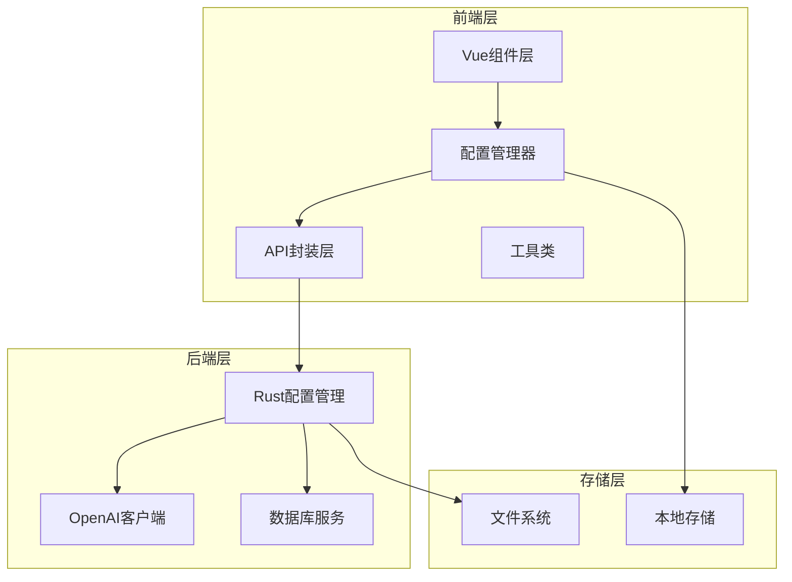
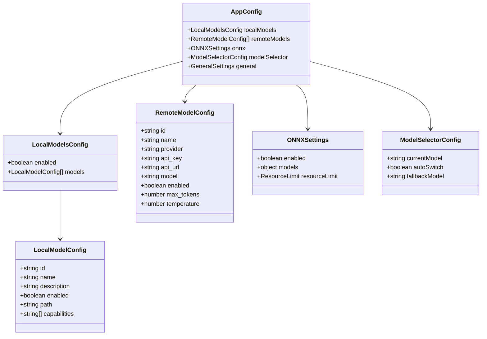
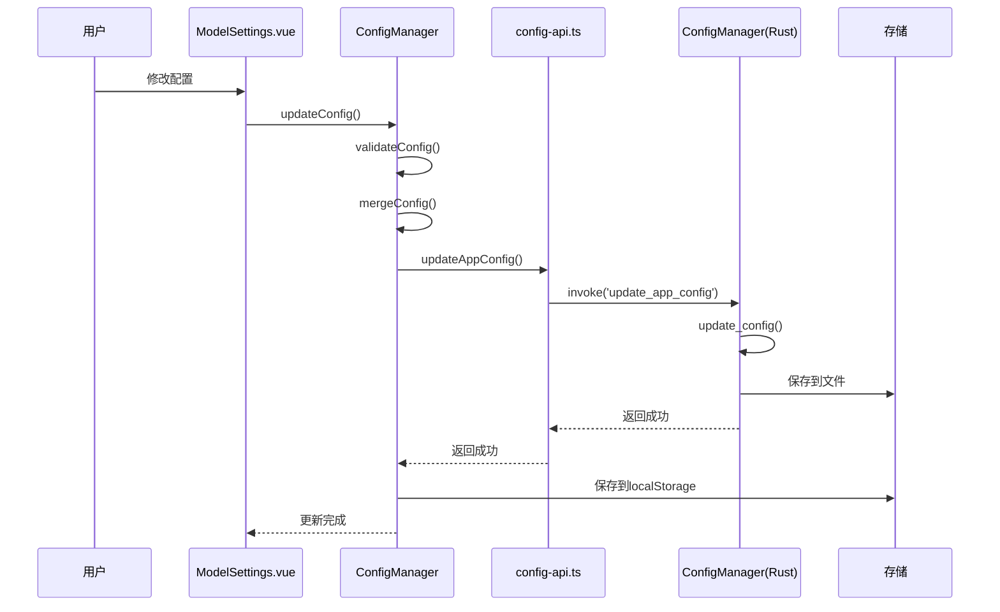
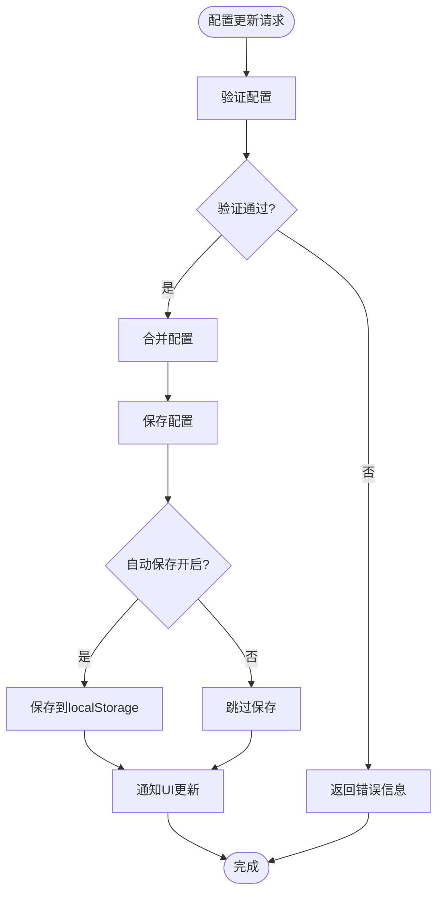
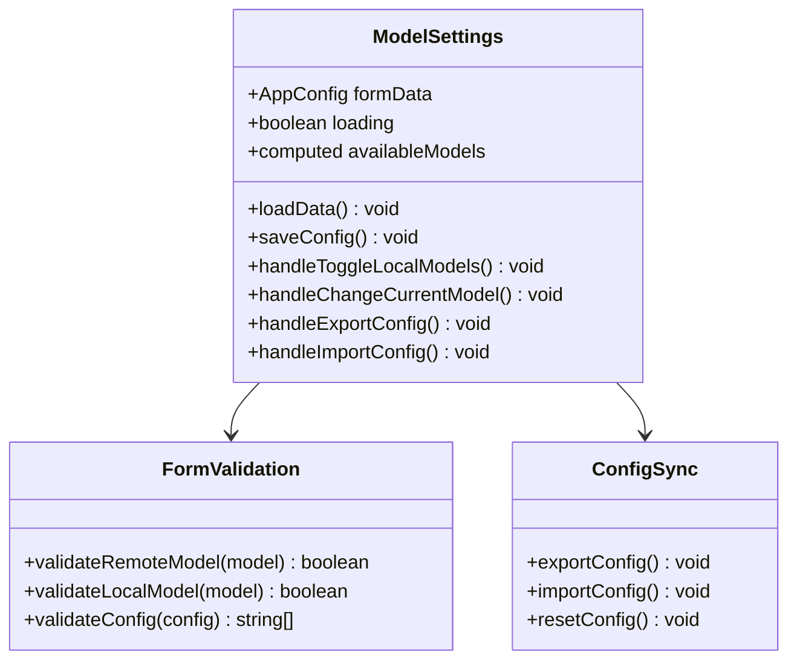
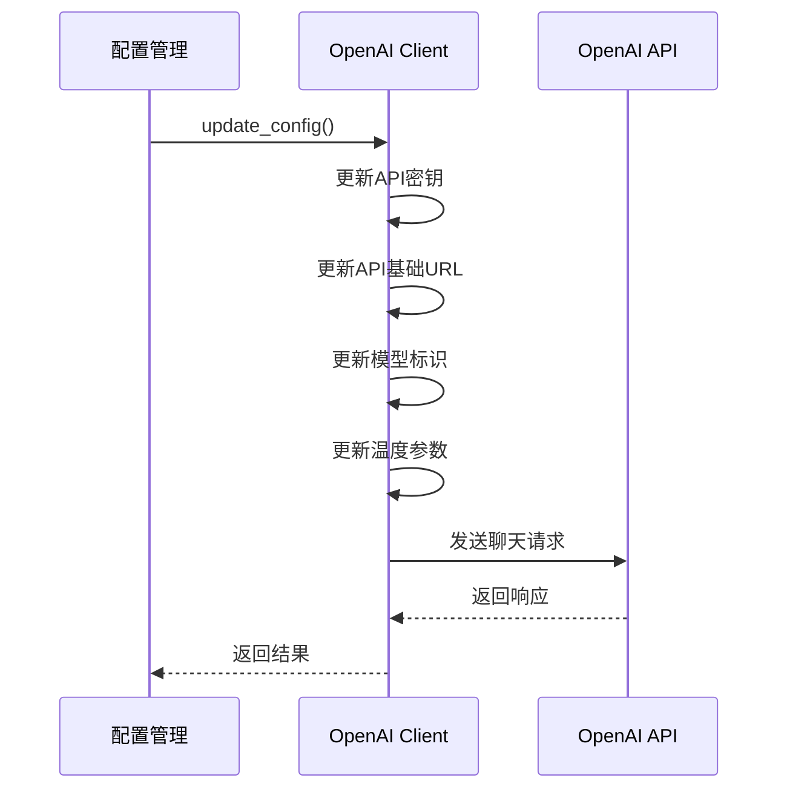
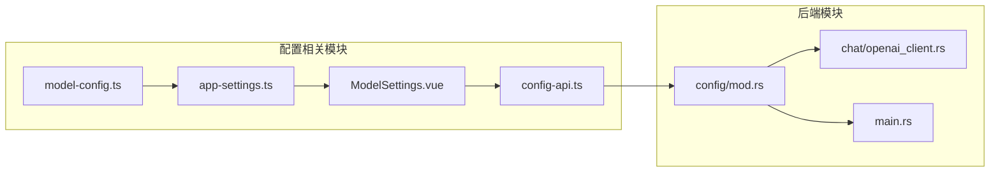
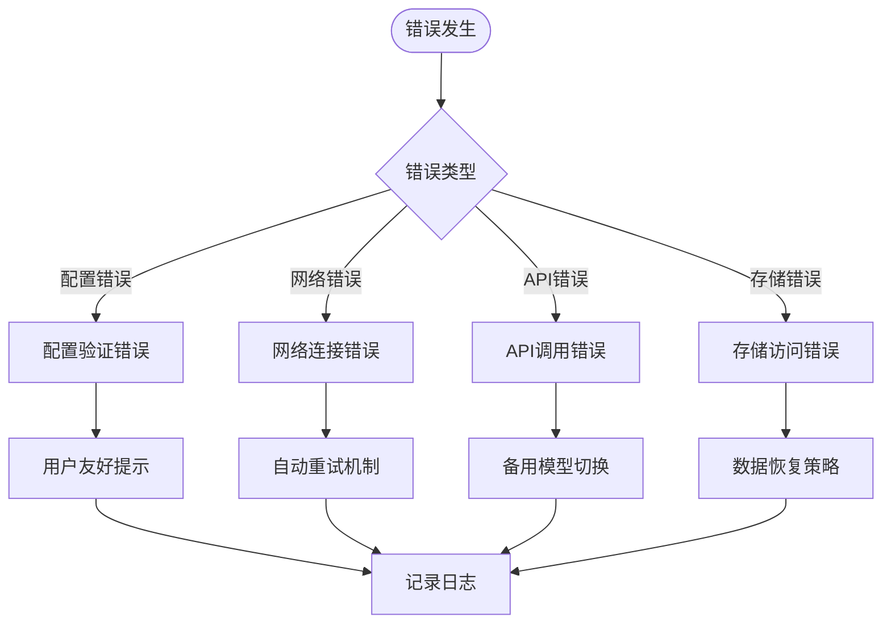

# 模型配置系统

<cite>
**本文档引用的文件**
- [model-config.ts](file://src/config/model-config.ts)
- [app-settings.ts](file://src/config/app-settings.ts)
- [index.ts](file://src/config/index.ts)
- [ModelSettings.vue](file://src/components/settings/ModelSettings.vue)
- [config-api.ts](file://src/api/config-api.ts)
- [tauri-api.ts](file://src/api/tauri-api.ts)
- [mod.rs](file://src-tauri/src/config/mod.rs)
- [openai_client.rs](file://src-tauri/src/chat/openai_client.rs)
- [main.rs](file://src-tauri/src/main.rs)
- [configuration-management.md](file://docs/configuration-management.md)
- [MODEL_CONFIGURATION_IMPLEMENTATION_SUMMARY.md](file://MODEL_CONFIGURATION_IMPLEMENTATION_SUMMARY.md)
- [logger.ts](file://src/utils/logger.ts)
- [package.json](file://package.json)
</cite>

## 目录
1. [简介](#简介)
2. [项目结构](#项目结构)
3. [核心组件](#核心组件)
4. [架构概览](#架构概览)
5. [详细组件分析](#详细组件分析)
6. [依赖关系分析](#依赖关系分析)
7. [性能考虑](#性能考虑)
8. [故障排除指南](#故障排除指南)
9. [结论](#结论)
10. [附录](#附录)

## 简介

Malou Agent模型配置系统是一个完整的多模型支持架构，集成了本地ONNX模型和远程OpenAI API的配置管理。该系统提供了统一的配置界面，支持模型切换机制、参数验证和配置持久化策略，为用户提供直观易用的模型管理体验。

系统采用前后端分离架构，前端使用Vue 3 + TypeScript，后端使用Rust + Tauri，实现了类型安全的配置管理和高性能的模型切换机制。

## 项目结构



**图表来源**
- [ModelSettings.vue](file://src/components/settings/ModelSettings.vue#L1-L580)
- [app-settings.ts](file://src/config/app-settings.ts#L1-L195)
- [mod.rs](file://src-tauri/src/config/mod.rs#L1-L334)

**章节来源**
- [MODEL_CONFIGURATION_IMPLEMENTATION_SUMMARY.md](file://MODEL_CONFIGURATION_IMPLEMENTATION_SUMMARY.md#L1-L155)
- [package.json](file://package.json#L1-L31)

## 核心组件

### 配置数据结构设计

系统采用分层配置架构，包含以下核心数据结构：



**图表来源**
- [model-config.ts](file://src/config/model-config.ts#L3-L56)
- [mod.rs](file://src-tauri/src/config/mod.rs#L8-L65)

### 配置验证与默认值管理

系统实现了完善的配置验证机制和默认值管理策略：

**验证规则**：
- 远程模型必须配置API密钥和API地址
- 启用本地模型时必须至少配置一个模型
- 参数范围验证（如温度范围0-2，最大Token范围1-32768）

**默认值策略**：
- 所有配置项都有明确的默认值
- ONNX功能默认启用，资源限制合理配置
- 模型选择器默认指向GPT-3.5 Turbo

**章节来源**
- [model-config.ts](file://src/config/model-config.ts#L119-L138)
- [model-config.ts](file://src/config/model-config.ts#L59-L116)

## 架构概览

### 系统架构图

```mermaid
graph TB
subgraph "用户界面层"
UI[ModelSettings.vue]
CM[ConfigManager]
end
subgraph "API层"
CA[config-api.ts]
TA[tauri-api.ts]
end
subgraph "后端服务层"
CFG[ConfigManager(Rust)]
OAC[OpenAI Client]
DB[Database Service]
end
subgraph "存储层"
LS[localStorage]
FS[文件系统]
end
UI --> CM
CM --> CA
CA --> TA
TA --> CFG
CFG --> OAC
CFG --> DB
CM --> LS
CFG --> FS
```

**图表来源**
- [ModelSettings.vue](file://src/components/settings/ModelSettings.vue#L1-L580)
- [config-api.ts](file://src/api/config-api.ts#L1-L201)
- [mod.rs](file://src-tauri/src/config/mod.rs#L144-L248)

### 配置管理流程



**图表来源**
- [app-settings.ts](file://src/config/app-settings.ts#L26-L35)
- [config-api.ts](file://src/api/config-api.ts#L62-L64)
- [mod.rs](file://src-tauri/src/config/mod.rs#L268-L276)

**章节来源**
- [configuration-management.md](file://docs/configuration-management.md#L164-L221)

## 详细组件分析

### 配置管理器（ConfigManager）

ConfigManager是整个配置系统的核心组件，负责配置的存储、验证和管理。

#### 核心功能

**配置加载与持久化**：
- 从localStorage加载配置
- 自动保存配置变更
- 支持配置重置为默认值

**配置验证**：
- 实时验证配置有效性
- 提供详细的错误信息
- 支持部分配置更新

**模型选择管理**：
- 支持自动模型切换
- 备用模型机制
- 当前模型状态跟踪



**图表来源**
- [app-settings.ts](file://src/config/app-settings.ts#L26-L35)
- [app-settings.ts](file://src/config/app-settings.ts#L152-L171)

**章节来源**
- [app-settings.ts](file://src/config/app-settings.ts#L6-L180)

### 前端配置界面

ModelSettings.vue提供了统一的配置管理界面，支持所有配置项的可视化管理。

#### 界面组件设计

**模型选择面板**：
- 当前模型选择下拉框
- 自动切换开关
- 备用模型配置

**本地模型管理**：
- 启用/禁用控制
- 模型路径显示
- 能力标签展示

**远程模型配置**：
- 多服务商支持（OpenAI、Azure、自定义）
- API密钥安全输入
- 参数调节滑块

**ONNX辅助功能**：
- 独立的功能开关
- 资源限制配置
- 实时状态反馈



**图表来源**
- [ModelSettings.vue](file://src/components/settings/ModelSettings.vue#L17-L45)
- [ModelSettings.vue](file://src/components/settings/ModelSettings.vue#L88-L219)

**章节来源**
- [ModelSettings.vue](file://src/components/settings/ModelSettings.vue#L1-L580)

### 后端配置管理

Rust后端实现了完整的配置管理功能，提供了类型安全的配置存储和访问接口。

#### 配置存储机制

**文件系统持久化**：
- 配置文件存储在应用配置目录
- 自动创建配置目录
- JSON格式存储，便于调试

**内存缓存策略**：
- 内存中缓存配置数据
- 减少文件I/O操作
- 支持快速读取

**并发安全**：
- 使用Mutex保护配置访问
- 线程安全的配置更新
- 避免竞态条件

**章节来源**
- [mod.rs](file://src-tauri/src/config/mod.rs#L149-L206)

### OpenAI客户端集成

系统集成了OpenAI API客户端，支持远程模型的配置和使用。

#### 客户端功能

**API调用封装**：
- 标准化的聊天请求格式
- 错误处理和重试机制
- 使用量统计支持

**配置动态更新**：
- 支持运行时配置修改
- 实时生效的配置变更
- 客户端自动重新配置



**图表来源**
- [openai_client.rs](file://src-tauri/src/chat/openai_client.rs#L119-L124)
- [main.rs](file://src-tauri/src/main.rs#L200-L223)

**章节来源**
- [openai_client.rs](file://src-tauri/src/chat/openai_client.rs#L62-L130)
- [main.rs](file://src-tauri/src/main.rs#L191-L223)

## 依赖关系分析

### 技术栈依赖

```mermaid
graph TB
subgraph "前端依赖"
Vue[Vue 3.5.12]
TS[TypeScript ~5.6.2]
ElementPlus[Element Plus 2.8.8]
TauriAPI[@tauri-apps/api 2.0.0-beta]
end
subgraph "后端依赖"
Rust[Rust]
Tauri[Tauri 2.0.0-beta]
Serde[Serde JSON]
Reqwest[HTTP Client]
end
subgraph "开发工具"
Vite[Vite 6.2.0]
TSCompiler[Vue TSC]
CLI[@tauri/cli 2.0.0-beta]
end
Vue --> ElementPlus
Vue --> TauriAPI
TauriAPI --> Tauri
Tauri --> Serde
Tauri --> Reqwest
```

**图表来源**
- [package.json](file://package.json#L14-L30)

### 模块间依赖关系



**图表来源**
- [index.ts](file://src/config/index.ts#L1-L3)
- [config-api.ts](file://src/api/config-api.ts#L1-L201)
- [mod.rs](file://src-tauri/src/config/mod.rs#L1-L334)

**章节来源**
- [index.ts](file://src/config/index.ts#L1-L3)
- [MODEL_CONFIGURATION_IMPLEMENTATION_SUMMARY.md](file://MODEL_CONFIGURATION_IMPLEMENTATION_SUMMARY.md#L96-L119)

## 性能考虑

### 模型性能对比

基于系统配置，不同模型的性能特征如下：

**本地ONNX模型**：
- 启动速度快，延迟低
- 无网络依赖，隐私安全
- 计算资源占用较少
- 适合轻量级文本处理任务

**远程OpenAI模型**：
- 上下文理解能力强
- 多语言支持优秀
- 需要网络连接
- 有API调用成本

### 资源消耗分析

**内存使用**：
- ONNX模型：约512MB内存上限
- OpenAI客户端：轻量级内存占用
- 前端配置管理：响应式数据结构

**CPU使用**：
- ONNX推理：可配置线程数限制
- HTTP请求：异步非阻塞
- 配置更新：批量处理减少重渲染

### 优化建议

1. **配置缓存策略**：前端使用localStorage缓存，后端使用内存缓存
2. **懒加载机制**：按需加载模型配置，避免启动时的性能开销
3. **批量更新**：合并多次配置更新，减少存储写入次数
4. **资源限制**：合理设置ONNX模型的内存和线程限制

## 故障排除指南

### 常见问题及解决方案

**配置加载失败**：
- 检查localStorage权限
- 验证配置文件格式
- 确认文件系统写入权限

**模型切换无效**：
- 验证目标模型是否启用
- 检查模型配置完整性
- 确认网络连接状态

**API调用错误**：
- 验证API密钥有效性
- 检查API地址可达性
- 确认配额和限制

### 错误处理机制

系统实现了多层次的错误处理：



**图表来源**
- [app-settings.ts](file://src/config/app-settings.ts#L152-L171)
- [logger.ts](file://src/utils/logger.ts#L42-L60)

**章节来源**
- [logger.ts](file://src/utils/logger.ts#L1-L95)

## 结论

Malou Agent模型配置系统通过精心设计的架构和完善的实现，成功地将本地ONNX模型和远程OpenAI API整合在一个统一的配置管理框架中。系统具有以下优势：

1. **类型安全**：前后端统一的类型定义确保配置的一致性
2. **易于使用**：直观的图形界面和丰富的配置选项
3. **性能优异**：合理的资源管理和优化策略
4. **可靠性强**：完善的错误处理和恢复机制
5. **可扩展性好**：模块化设计便于功能扩展

该系统为用户提供了灵活的模型选择和管理能力，满足了不同场景下的需求，为Malou Agent的进一步发展奠定了坚实的基础。

## 附录

### 配置文件格式说明

系统支持JSON格式的配置文件，包含以下结构：

```json
{
  "localModels": {
    "enabled": true,
    "models": [
      {
        "id": "all-minilm-l6-v2",
        "name": "All MiniLM L6 v2",
        "description": "轻量级嵌入模型",
        "enabled": true,
        "path": "models/all-MiniLM-L6-v2.onnx",
        "capabilities": ["embedding"]
      }
    ]
  },
  "remoteModels": [
    {
      "id": "gpt-3.5-turbo",
      "name": "GPT-3.5 Turbo",
      "provider": "openai",
      "api_key": "",
      "api_url": "https://api.openai.com/v1",
      "model": "gpt-3.5-turbo",
      "enabled": true,
      "max_tokens": 2048,
      "temperature": 0.7
    }
  ],
  "onnx": {
    "enabled": true,
    "models": {
      "embedding": true,
      "ner": false,
      "classification": false
    },
    "resourceLimit": {
      "maxMemoryMB": 512,
      "maxThreads": 4
    }
  },
  "modelSelector": {
    "currentModel": "gpt-3.5-turbo",
    "autoSwitch": true,
    "fallbackModel": "all-minilm-l6-v2"
  },
  "general": {
    "autoSave": true,
    "theme": "light",
    "language": "zh"
  }
}
```

### 环境变量支持

系统目前主要依赖以下环境配置：
- 应用配置目录：由Tauri框架自动管理
- API密钥：存储在配置文件中
- 模型文件路径：相对路径配置

### 动态配置更新机制

系统实现了完整的动态配置更新机制：

1. **实时同步**：配置变更立即反映到UI界面
2. **自动保存**：可配置的自动保存功能
3. **版本控制**：支持配置导入导出进行版本管理
4. **回滚机制**：可通过导入备份配置进行回滚