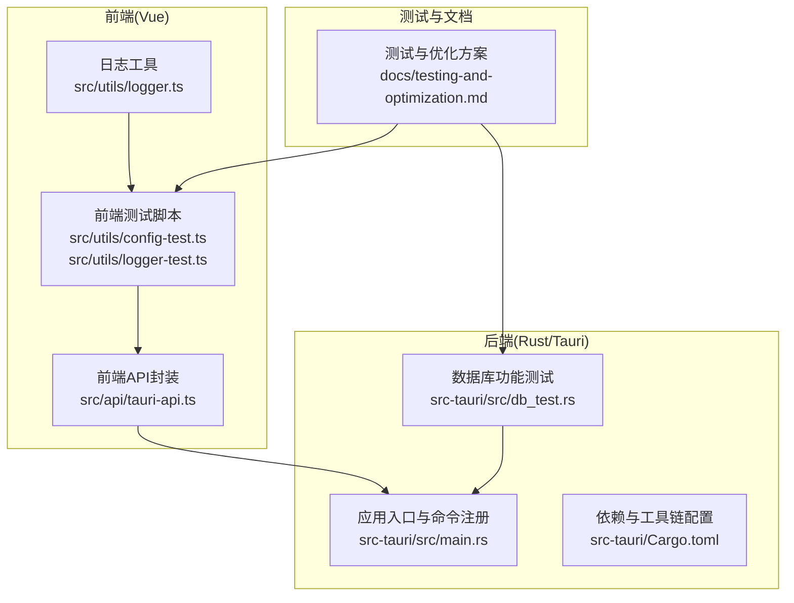
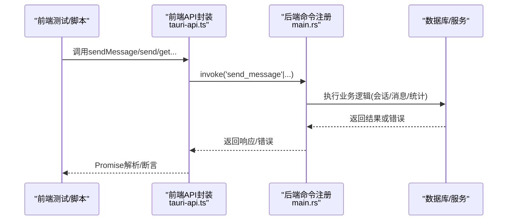
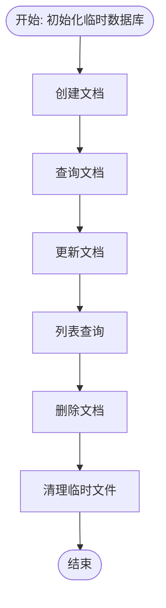
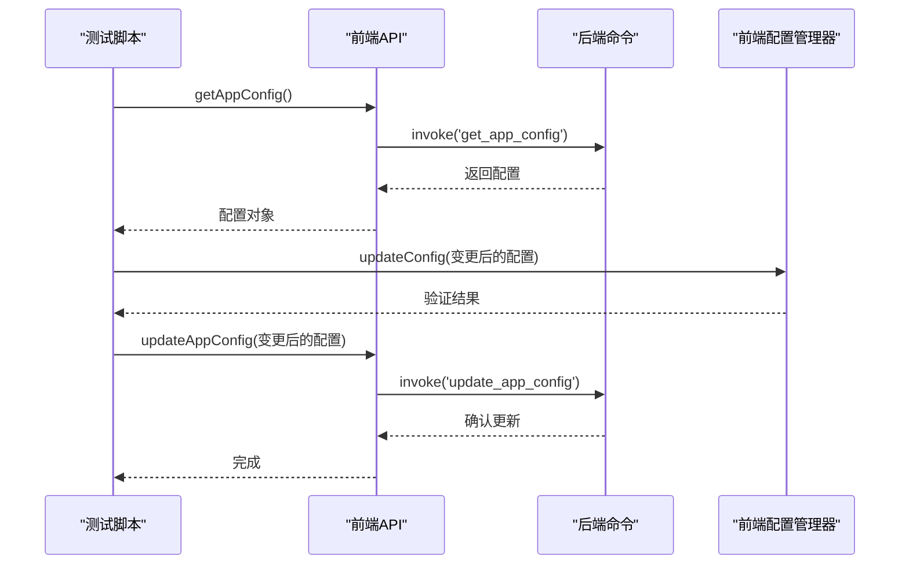
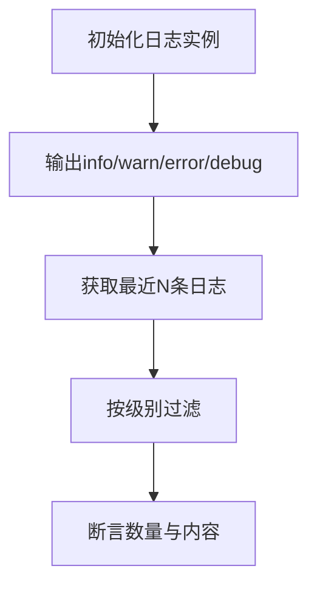
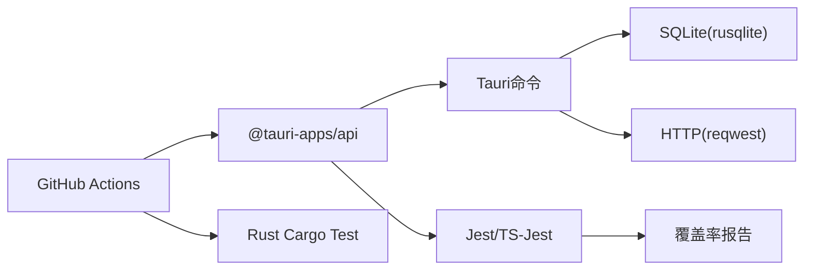

# 单元测试

<cite>
**本文引用的文件**
- [README.md](file://README.md)
- [package.json](file://package.json)
- [vite.config.ts](file://vite.config.ts)
- [src-tauri/Cargo.toml](file://src-tauri/Cargo.toml)
- [docs/testing-and-optimization.md](file://docs/testing-and-optimization.md)
- [src-tauri/src/main.rs](file://src-tauri/src/main.rs)
- [src/api/tauri-api.ts](file://src/api/tauri-api.ts)
- [src/utils/config-test.ts](file://src/utils/config-test.ts)
- [src/utils/logger-test.ts](file://src/utils/logger-test.ts)
- [src/utils/logger.ts](file://src/utils/logger.ts)
- [src-tauri/src/db_test.rs](file://src-tauri/src/db_test.rs)
</cite>

## 目录
1. [简介](#简介)
2. [项目结构](#项目结构)
3. [核心组件](#核心组件)
4. [架构总览](#架构总览)
5. [详细组件分析](#详细组件分析)
6. [依赖关系分析](#依赖关系分析)
7. [性能考量](#性能考量)
8. [故障排查指南](#故障排查指南)
9. [结论](#结论)
10. [附录](#附录)

## 简介
本文件面向Malou Agent项目，系统化梳理并输出单元测试与相关质量保障实践文档，覆盖以下重点：
- Rust后端单元测试：数据库操作测试、配置验证测试、命令接口测试与错误处理测试
- 前端Vue组件单元测试：组件渲染、事件触发、状态管理测试组织方式
- 测试数据准备、模拟对象使用与测试环境隔离的最佳实践
- 测试覆盖率分析、测试报告生成与持续集成中的单元测试执行流程

本项目采用“文档即测试”的思路，结合现有测试脚本与CI配置，形成可落地的测试策略与实施建议。

## 项目结构
Malou Agent采用前后端分离架构：
- 前端：Vue 3 + TypeScript，使用Vite构建，Pinia进行状态管理
- 后端：Rust + Tauri，SQLite作为本地数据库，提供Tauri命令供前端调用
- 测试与优化：文档中提供了Rust单元测试、前端集成/负载测试、覆盖率与CI配置示例

图表来源
- [src/api/tauri-api.ts](file://src/api/tauri-api.ts#L1-L242)
- [src-tauri/src/main.rs](file://src-tauri/src/main.rs#L242-L315)
- [src-tauri/src/db_test.rs](file://src-tauri/src/db_test.rs#L1-L58)
- [docs/testing-and-optimization.md](file://docs/testing-and-optimization.md#L1-L383)

章节来源
- [README.md](file://README.md#L1-L76)
- [package.json](file://package.json#L1-L31)
- [vite.config.ts](file://vite.config.ts#L1-L17)
- [src-tauri/Cargo.toml](file://src-tauri/Cargo.toml#L1-L25)

## 核心组件
- 前端API封装：统一暴露Tauri命令调用，便于测试与业务解耦
- 后端命令注册：集中注册会话、消息、Token统计、OpenAI配置等命令
- 日志与配置测试脚本：提供运行时验证与交互式测试入口
- 数据库测试模块：独立于主流程，验证CRUD与列表查询等核心能力

章节来源
- [src/api/tauri-api.ts](file://src/api/tauri-api.ts#L67-L176)
- [src-tauri/src/main.rs](file://src-tauri/src/main.rs#L285-L312)
- [src/utils/config-test.ts](file://src/utils/config-test.ts#L1-L66)
- [src/utils/logger-test.ts](file://src/utils/logger-test.ts#L1-L20)
- [src-tauri/src/db_test.rs](file://src-tauri/src/db_test.rs#L1-L58)

## 架构总览
前端通过invoke调用后端命令；后端命令在应用启动时注册，并在运行时由前端驱动执行。测试围绕命令行为与数据一致性展开。

图表来源
- [src/api/tauri-api.ts](file://src/api/tauri-api.ts#L108-L110)
- [src-tauri/src/main.rs](file://src-tauri/src/main.rs#L140-L161)

## 详细组件分析

### Rust后端单元测试策略
- 测试目标
  - 数据库CRUD与列表查询：验证文档生命周期与分页
  - 命令接口行为：会话管理、消息发送、Token统计、OpenAI配置
  - 错误处理：异常分支与返回值校验
- 测试方法
  - 使用独立数据库文件进行隔离测试，完成后清理
  - 通过命令注册入口触发业务逻辑，断言返回值与副作用
- 断言要点
  - ID非空、字段匹配、布尔返回值、集合长度与顺序
- 错误处理测试
  - 对不存在资源的查询应返回空/错误
  - 对非法输入触发的错误应被正确传播

图表来源
- [src-tauri/src/db_test.rs](file://src-tauri/src/db_test.rs#L5-L58)

章节来源
- [src-tauri/src/db_test.rs](file://src-tauri/src/db_test.rs#L1-L58)
- [src-tauri/src/main.rs](file://src-tauri/src/main.rs#L285-L312)

### 前端Vue组件单元测试组织方式
- 组件渲染测试
  - 使用Vue Test Utils或Jest+Vue Test Utils，挂载组件并断言DOM结构与属性
  - 对props进行参数化测试，覆盖默认值与边界值
- 事件触发测试
  - 触发用户交互（点击、输入、选择等），断言回调调用次数与参数
  - 对异步事件（如远程调用）使用fake timers或等待Promise解析
- 状态管理测试
  - 针对Pinia Store进行单元测试，断言状态变更与派生状态
  - 使用mock外部依赖（如API）以隔离网络与I/O
- 组合式函数测试
  - 对composables进行纯函数式测试，断言返回值与副作用

[本节为通用测试组织方法说明，不直接分析具体文件，故无章节来源]

### 配置验证测试
- 目标：验证配置获取、更新、前端配置管理器与验证逻辑
- 方法：通过API获取当前配置，构造变更后的配置进行更新，再验证前端配置管理器的行为
- 断言：配置字段变更生效、验证返回值符合预期

图表来源
- [src/utils/config-test.ts](file://src/utils/config-test.ts#L5-L53)
- [src/api/tauri-api.ts](file://src/api/tauri-api.ts#L306-L311)

章节来源
- [src/utils/config-test.ts](file://src/utils/config-test.ts#L1-L66)
- [src/api/tauri-api.ts](file://src/api/tauri-api.ts#L306-L311)

### 日志功能测试
- 目标：验证日志级别、过滤、最近日志获取等能力
- 方法：调用日志接口输出多级日志，断言输出数量与级别过滤结果
- 最佳实践：在测试中避免污染控制台输出，必要时重定向或屏蔽控制台

图表来源
- [src/utils/logger.ts](file://src/utils/logger.ts#L12-L77)
- [src/utils/logger-test.ts](file://src/utils/logger-test.ts#L1-L20)

章节来源
- [src/utils/logger.ts](file://src/utils/logger.ts#L1-L95)
- [src/utils/logger-test.ts](file://src/utils/logger-test.ts#L1-L20)

### 命令接口与错误处理测试
- 命令接口测试
  - 通过invoke调用后端命令，断言返回值结构与字段
  - 对不存在资源的查询断言空值或错误
- 错误处理测试
  - 捕获异常并断言错误消息或状态码
  - 对并发场景进行压力测试，验证稳定性

章节来源
- [src-tauri/src/main.rs](file://src-tauri/src/main.rs#L140-L161)
- [src/api/tauri-api.ts](file://src/api/tauri-api.ts#L108-L110)

## 依赖关系分析
- 前端依赖
  - @tauri-apps/api用于invoke命令调用
  - Vue生态与构建工具链（Vite、TypeScript）
- 后端依赖
  - Tauri框架、rusqlite、reqwest等
- 测试与文档
  - Jest/TS-Jest用于前端测试与覆盖率
  - GitHub Actions用于CI流水线

图表来源
- [package.json](file://package.json#L14-L29)
- [src-tauri/Cargo.toml](file://src-tauri/Cargo.toml#L12-L25)
- [docs/testing-and-optimization.md](file://docs/testing-and-optimization.md#L277-L292)

章节来源
- [package.json](file://package.json#L1-L31)
- [src-tauri/Cargo.toml](file://src-tauri/Cargo.toml#L1-L25)
- [docs/testing-and-optimization.md](file://docs/testing-and-optimization.md#L234-L292)

## 性能考量
- 数据库性能优化：WAL模式、同步策略、缓存与索引
- 前端性能监控：计时器、平均耗时统计与上报
- 负载测试：并发请求验证与超时控制

章节来源
- [docs/testing-and-optimization.md](file://docs/testing-and-optimization.md#L95-L127)
- [docs/testing-and-optimization.md](file://docs/testing-and-optimization.md#L199-L232)
- [docs/testing-and-optimization.md](file://docs/testing-and-optimization.md#L294-L318)

## 故障排查指南
- 前端测试失败
  - 检查API封装是否正确映射命令名称
  - 确认测试环境（JSDOM）与依赖注入（如Mock）配置
- 后端测试失败
  - 核查数据库初始化与事务提交
  - 检查命令注册与状态锁的使用
- CI执行失败
  - 确认Node.js与Rust工具链版本
  - 检查依赖安装与测试命令顺序

章节来源
- [docs/testing-and-optimization.md](file://docs/testing-and-optimization.md#L234-L275)

## 结论
Malou Agent的测试体系以“文档即测试”为核心，结合Rust单元测试、前端集成/负载测试与CI流水线，形成从单元到端到端的测试闭环。建议在后续迭代中补充：
- 更多命令接口的单元测试与边界条件覆盖
- Vue组件的快照测试与交互测试
- 配置验证的自动化回归测试
- 覆盖率阈值与质量门禁

## 附录

### 测试数据准备与模拟对象
- 测试数据
  - 使用临时数据库文件与随机ID，避免持久化污染
  - 构造最小化有效输入，覆盖典型与异常分支
- 模拟对象
  - 使用Mock拦截API调用，隔离网络与I/O
  - 对外部服务（如OpenAI）使用Fake实现或Stub

[本节为通用最佳实践说明，不直接分析具体文件，故无章节来源]

### 测试环境隔离
- 前端
  - 使用Jest的测试环境与别名解析（@）
  - 将全局状态与副作用收敛至可控范围
- 后端
  - 使用独立数据库路径与临时文件
  - 在测试前初始化状态，测试后清理

章节来源
- [vite.config.ts](file://vite.config.ts#L8-L12)
- [src-tauri/src/db_test.rs](file://src-tauri/src/db_test.rs#L8-L10)

### 测试覆盖率与报告
- 前端覆盖率
  - 收集src目录下TS/Vue文件，排除入口与路由
  - 输出HTML、文本与LCOV报告
- 后端覆盖率
  - 使用Cargo的内置测试与覆盖率工具（如tarpaulin）

章节来源
- [docs/testing-and-optimization.md](file://docs/testing-and-optimization.md#L277-L292)

### 持续集成中的执行流程
- 步骤
  - 检出代码、安装依赖
  - Rust侧构建与测试
  - 前端安装依赖、构建与测试
  - 执行集成/负载测试
  - 生成覆盖率报告

章节来源
- [docs/testing-and-optimization.md](file://docs/testing-and-optimization.md#L234-L275)