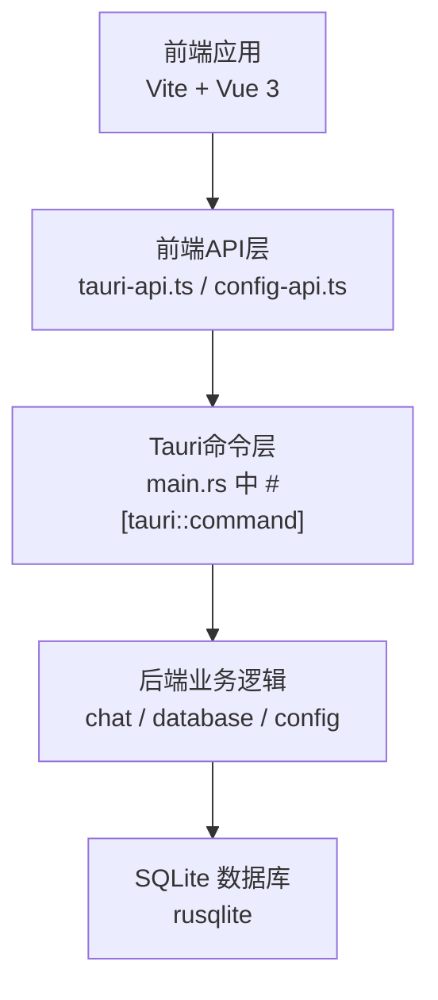
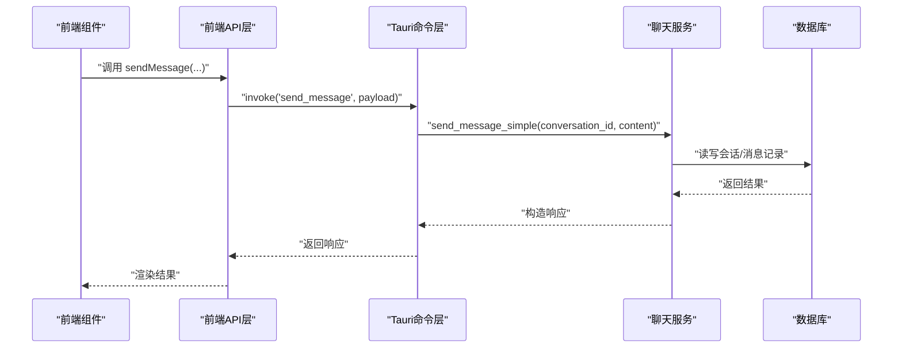
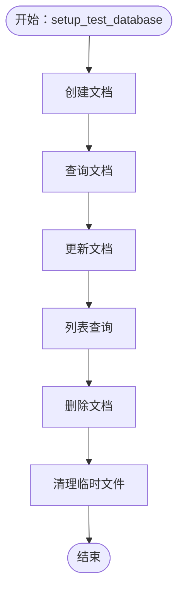
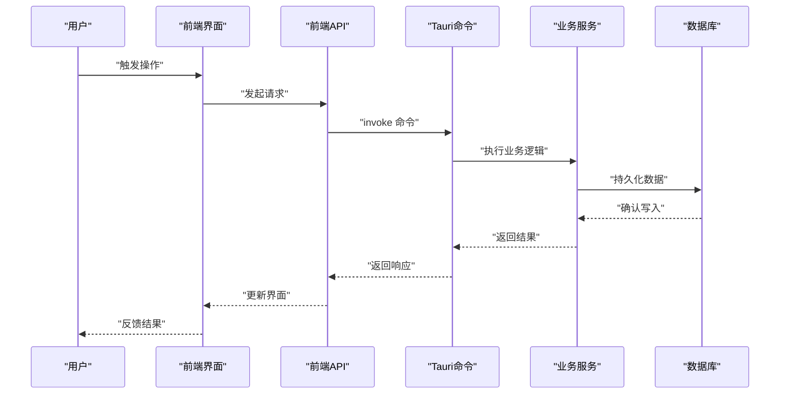
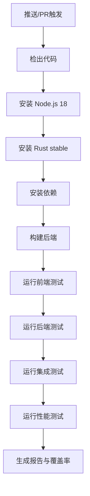
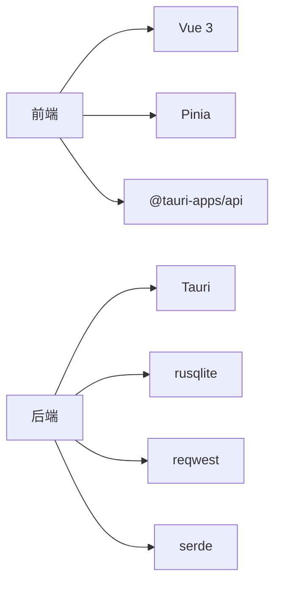

# 测试策略

<cite>
**本文引用的文件**
- [package.json](file://package.json)
- [vite.config.ts](file://vite.config.ts)
- [Cargo.toml](file://src-tauri/Cargo.toml)
- [main.rs](file://src-tauri/src/main.rs)
- [db_test.rs](file://src-tauri/src/db_test.rs)
- [logger-test.ts](file://src/utils/logger-test.ts)
- [config-test.ts](file://src/utils/config-test.ts)
- [testing-and-optimization.md](file://docs/testing-and-optimization.md)
</cite>

## 目录
1. [简介](#简介)
2. [项目结构](#项目结构)
3. [核心组件](#核心组件)
4. [架构总览](#架构总览)
5. [详细组件分析](#详细组件分析)
6. [依赖关系分析](#依赖关系分析)
7. [性能考量](#性能考量)
8. [故障排查指南](#故障排查指南)
9. [结论](#结论)
10. [附录](#附录)

## 简介
本测试策略文档面向 Malou Agent 项目，系统化阐述单元测试、集成测试与性能/兼容性测试的组织与执行方案；明确测试覆盖率要求、持续集成流程与自动化测试管道；给出测试数据准备、模拟对象使用与测试环境配置建议；并总结测试最佳实践、调试技巧与性能基准方法，以及测试报告生成、缺陷跟踪与质量保证流程。

## 项目结构
Malou Agent 采用 Tauri + Vue 3 + TypeScript 前后端分离架构：
- 前端：Vite + Vue 3 应用，位于 src/，通过 @ 标识别名指向 src 目录；构建与预览脚本由 package.json 提供。
- 后端：Rust Tauri 应用，位于 src-tauri/，包含数据库、聊天服务、配置管理等模块；通过命令暴露给前端调用。
- 测试与文档：测试与优化方案集中在 docs/testing-and-optimization.md；另有独立的测试脚本与示例测试文件用于演示功能。

图表来源
- [main.rs](file://src-tauri/src/main.rs#L259-L332)
- [Cargo.toml](file://src-tauri/Cargo.toml#L1-L25)

章节来源
- [package.json](file://package.json#L1-L31)
- [vite.config.ts](file://vite.config.ts#L1-L17)
- [Cargo.toml](file://src-tauri/Cargo.toml#L1-L25)

## 核心组件
- 前端测试能力
  - 已有日志与配置功能的测试脚本，可作为手动或半自动测试入口。
  - 文档中提供了 Jest 配置示例，用于前端测试与覆盖率收集。
- 后端测试能力
  - 存在独立的数据库测试模块，演示 CRUD 流程与断言。
  - 文档中提供了单元测试与集成测试的示例结构，涵盖数据库与消息发送命令。
- 命令与接口
  - Tauri 将后端业务封装为命令，前端通过 invoke 调用，形成统一的 API 层。

章节来源
- [logger-test.ts](file://src/utils/logger-test.ts#L1-L20)
- [config-test.ts](file://src/utils/config-test.ts#L1-L66)
- [db_test.rs](file://src-tauri/src/db_test.rs#L1-L58)
- [testing-and-optimization.md](file://docs/testing-and-optimization.md#L5-L64)

## 架构总览
以下序列图展示从前端调用到后端命令执行的关键路径，便于理解测试覆盖点与断言位置。

图表来源
- [main.rs](file://src-tauri/src/main.rs#L140-L161)

## 详细组件分析

### 单元测试策略（Rust 后端）
- 测试范围
  - 数据库模块：CRUD 操作、事务一致性、索引与性能参数。
  - 命令层：消息发送、会话管理、配置读取/保存等命令的正确性。
- 组织结构
  - 建议在 src-tauri/src 下按模块划分测试文件（如 database/tests、chat/tests）。
  - 使用 #[cfg(test)] 模块组织测试，并在 Cargo.toml 的 [dev-dependencies] 中引入测试工具链。
- 断言与隔离
  - 对数据库操作使用临时数据库文件，完成后清理。
  - 对命令进行行为断言（返回值、副作用、错误传播）。
- 示例参考
  - 数据库 CRUD 测试与命令测试示例见文档。

图表来源
- [db_test.rs](file://src-tauri/src/db_test.rs#L5-L58)

章节来源
- [db_test.rs](file://src-tauri/src/db_test.rs#L1-L58)
- [testing-and-optimization.md](file://docs/testing-and-optimization.md#L5-L64)

### Vue 组件测试策略
- 测试目标
  - 组件渲染、交互事件、状态变更、组合式函数行为。
- 推荐框架
  - 使用 Vue Test Utils 与 Jest（或 Vitest）进行单元测试。
- 模拟与夹具
  - 使用 Mock Store（Pinia）、Mock Router、Mock Tauri API。
  - 对外部依赖（API、文件系统）使用模拟对象。
- 覆盖率
  - 参考文档中的 Jest 配置，对 src/**/*.{ts,vue} 收集覆盖率，排除入口与路由文件。

章节来源
- [testing-and-optimization.md](file://docs/testing-and-optimization.md#L277-L292)

### API 测试策略
- 测试目标
  - 前端 API 与 Tauri 命令之间的契约一致性、错误处理、边界条件。
- 方法
  - 使用 Mock 或真实 Tauri 运行时，调用 invoke 并断言响应。
  - 对配置读取/更新、消息发送、会话管理等关键路径进行测试。
- 示例参考
  - 配置功能测试脚本展示了获取/更新配置与前端配置管理器的协作。

章节来源
- [config-test.ts](file://src/utils/config-test.ts#L1-L66)
- [testing-and-optimization.md](file://docs/testing-and-optimization.md#L67-L93)

### 集成测试设计
- 端到端测试
  - 覆盖从用户交互到数据库落盘的完整链路，验证命令调用、状态持久化与 UI 响应。
- 性能测试
  - 负载测试：并发请求验证系统的吞吐与稳定性。
  - 基准测试：针对关键命令（如消息发送、会话列表）进行时间与资源消耗测量。
- 兼容性测试
  - 在 Windows 环境下验证 Tauri 命令可用性与数据库兼容性。
- 示例参考
  - 文档提供了集成测试与负载测试的示例结构。

图表来源
- [main.rs](file://src-tauri/src/main.rs#L302-L329)

章节来源
- [testing-and-optimization.md](file://docs/testing-and-optimization.md#L67-L93)
- [testing-and-optimization.md](file://docs/testing-and-optimization.md#L294-L318)

### 测试覆盖率要求
- 覆盖率指标
  - 语句覆盖率、分支覆盖率、函数覆盖率、行覆盖率。
- 收集范围
  - 前端：src/**/*.{ts,vue}，排除入口与路由文件。
  - 后端：src-tauri/src/**/*.rs。
- 报告格式
  - HTML、文本、lcov 等多格式输出，便于 CI 查看与归档。

章节来源
- [testing-and-optimization.md](file://docs/testing-and-optimization.md#L277-L292)

### 持续集成与自动化测试管道
- CI 配置要点
  - 环境：Windows Runner、Node.js 18、Rust stable。
  - 步骤：安装依赖、构建后端、运行前端测试、运行后端测试、运行集成与性能测试。
- 触发条件
  - push 与 pull_request。
- 输出
  - 测试报告与覆盖率产物上传至 CI 平台。

图表来源
- [testing-and-optimization.md](file://docs/testing-and-optimization.md#L236-L275)

章节来源
- [testing-and-optimization.md](file://docs/testing-and-optimization.md#L236-L275)

### 测试数据准备与模拟对象
- 测试数据
  - 使用临时数据库文件与内存状态，避免污染生产数据。
  - 对配置项进行最小化变更，确保可重复性。
- 模拟对象
  - 前端：Mock Store、Mock Router、Mock Tauri API。
  - 后端：对第三方服务（如 OpenAI）使用 Mock 或本地回显。
- 环境隔离
  - 使用独立的测试配置文件与数据库路径，测试结束后清理。

章节来源
- [db_test.rs](file://src-tauri/src/db_test.rs#L8-L54)
- [config-test.ts](file://src/utils/config-test.ts#L1-L66)

## 依赖关系分析
- 前端依赖
  - Vue 3、Pinia、Element Plus、@tauri-apps/api 等。
- 后端依赖
  - Tauri、rusqlite、reqwest、tokio、serde 等。
- 测试依赖
  - Jest/Vitest（前端）、Tokio 测试运行器（后端）。

图表来源
- [Cargo.toml](file://src-tauri/Cargo.toml#L12-L25)
- [package.json](file://package.json#L14-L29)

章节来源
- [Cargo.toml](file://src-tauri/Cargo.toml#L1-L25)
- [package.json](file://package.json#L1-L31)

## 性能考量
- 数据库性能
  - 开启 WAL 模式、调整缓存大小、创建必要索引。
- 内存与渲染
  - 虚拟滚动、图片懒加载等前端优化策略。
- 监控与基准
  - 使用性能计时器记录关键操作耗时，建立基准阈值。

章节来源
- [testing-and-optimization.md](file://docs/testing-and-optimization.md#L95-L157)
- [testing-and-optimization.md](file://docs/testing-and-optimization.md#L199-L232)

## 故障排查指南
- 错误处理
  - 全局错误捕获与用户友好提示，结合日志记录与上报。
- 日志与诊断
  - 使用日志组件获取最近日志、按级别过滤，辅助定位问题。
- 调试技巧
  - 在浏览器控制台运行配置测试脚本，快速验证配置读取/更新链路。
  - 在 Tauri 命令层添加日志输出，定位后端异常。

章节来源
- [testing-and-optimization.md](file://docs/testing-and-optimization.md#L159-L197)
- [logger-test.ts](file://src/utils/logger-test.ts#L1-L20)
- [config-test.ts](file://src/utils/config-test.ts#L1-L66)

## 结论
本测试策略围绕“单元测试（Rust）+ 组件测试（Vue）+ API 测试 + 集成测试（E2E/性能/兼容性）”构建了完整的质量保障体系。通过 CI 自动化与覆盖率报告，确保每次提交的稳定性与可维护性。建议尽快完善 Jest/Vitest 配置与测试脚手架，补齐缺失的单元测试与模拟对象，以支撑持续演进的业务需求。

## 附录
- 快速清单
  - 前端：补齐 Jest/Vitest 配置与组件测试套件。
  - 后端：补充命令层与业务模块的单元测试。
  - 集成：完善 E2E 与负载测试，建立性能基线。
  - CI：完善测试报告与覆盖率归档流程。
- 参考文件
  - 测试与优化方案文档、数据库测试模块、配置与日志测试脚本、Tauri 主程序命令定义。