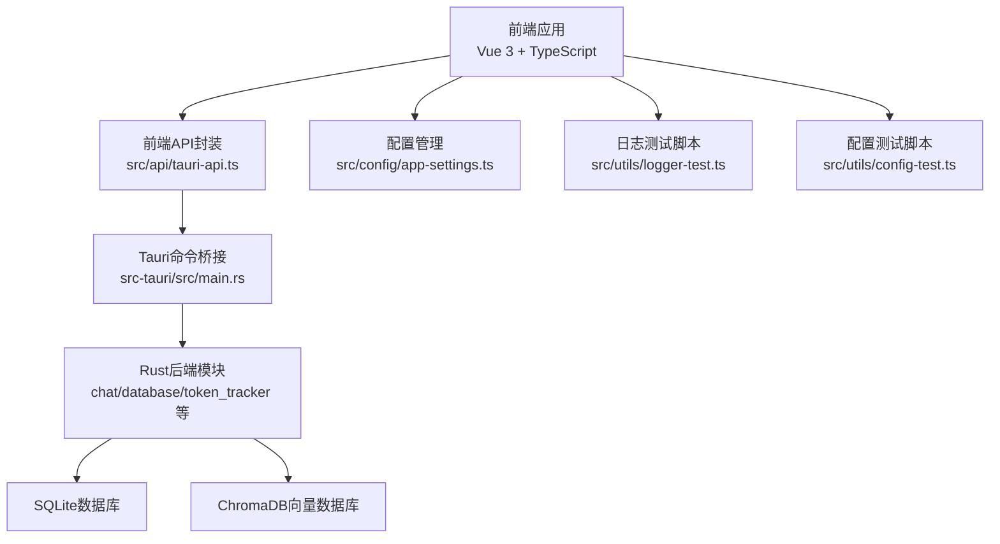
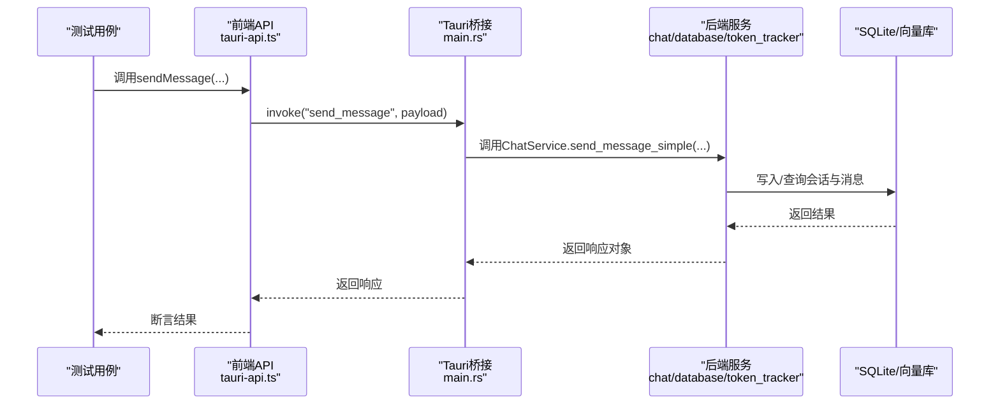
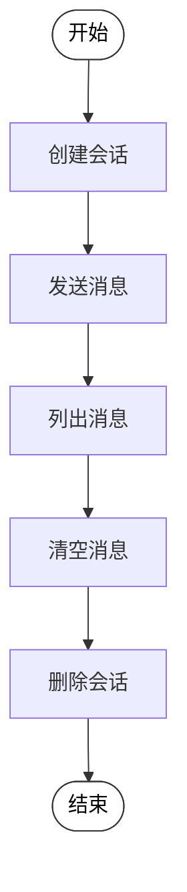
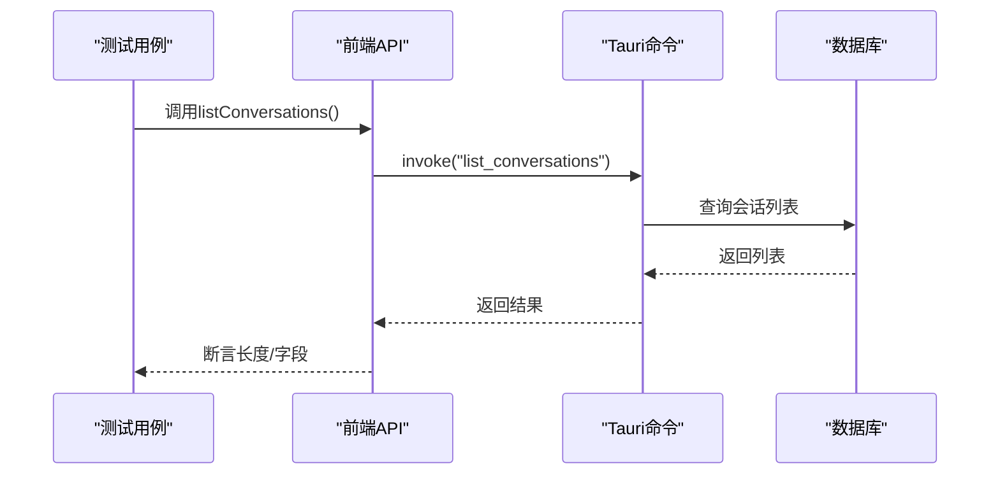
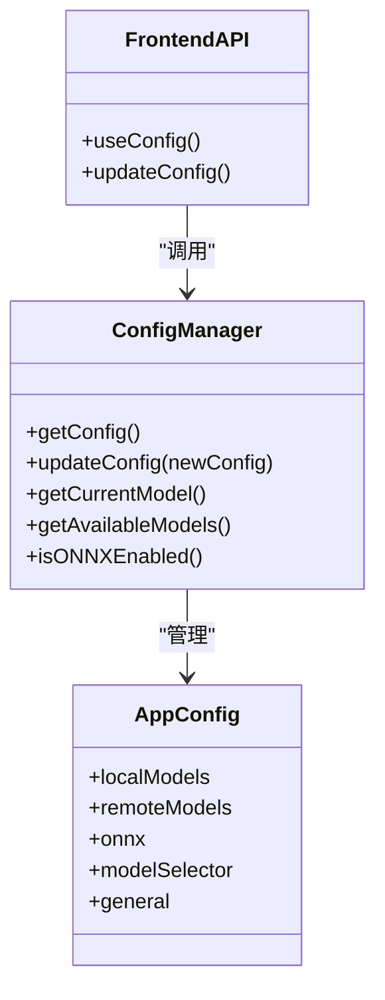
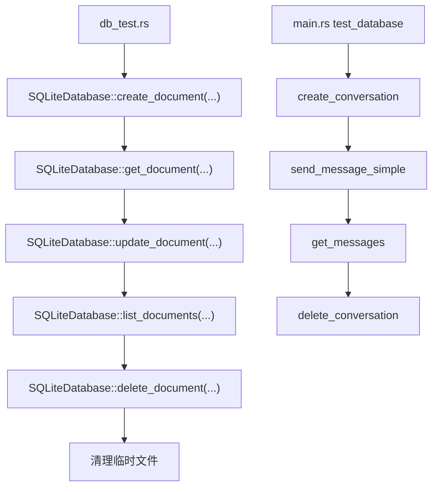
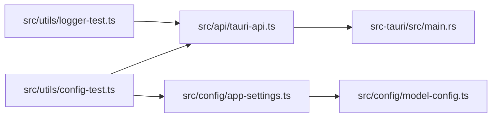

# 集成测试

<cite>
**本文引用的文件**
- [README.md](file://README.md)
- [package.json](file://package.json)
- [vite.config.ts](file://vite.config.ts)
- [docs/测试与优化方案.md](file://docs/测试与优化方案.md)
- [src/api/tauri-api.ts](file://src/api/tauri-api.ts)
- [src-tauri/Cargo.toml](file://src-tauri/Cargo.toml)
- [src-tauri/src/main.rs](file://src-tauri/src/main.rs)
- [src-tauri/src/db_test.rs](file://src-tauri/src/db_test.rs)
- [src/config/app-settings.ts](file://src/config/app-settings.ts)
- [src/config/model-config.ts](file://src/config/model-config.ts)
- [src/utils/config-test.ts](file://src/utils/config-test.ts)
- [src/utils/logger-test.ts](file://src/utils/logger-test.ts)
</cite>

## 目录
1. [简介](#简介)
2. [项目结构](#项目结构)
3. [核心组件](#核心组件)
4. [架构总览](#架构总览)
5. [详细组件分析](#详细组件分析)
6. [依赖关系分析](#依赖关系分析)
7. [性能考虑](#性能考虑)
8. [故障排查指南](#故障排查指南)
9. [结论](#结论)
10. [附录](#附录)

## 简介
本指南面向Malou Agent项目的集成测试实施，覆盖端到端用户工作流测试、API接口测试、跨组件交互测试、性能测试（响应时间、并发用户、资源使用）、兼容性测试（操作系统、浏览器版本、硬件配置）、测试环境搭建、测试数据管理、测试结果分析、自动化测试流水线、测试报告生成与缺陷跟踪流程。目标是帮助测试团队建立稳定、可重复、可扩展的集成测试体系，保障Tauri+Vue 3桌面应用的质量与稳定性。

## 项目结构
Malou Agent采用前后端分离的桌面应用架构：
- 前端：Vue 3 + TypeScript，使用Vite构建，Pinia进行状态管理，Element Plus提供UI组件。
- 后端：Rust + Tauri v2，提供原生桌面能力与系统调用；Tract ONNX用于本地推理；SQLite本地数据库；ChromaDB向量数据库（计划集成）。
- 测试相关：文档中提供了单元测试、集成测试、性能测试、负载测试、CI/CD配置与覆盖率报告示例；同时存在前端配置与日志测试脚本。

图表来源
- [src/api/tauri-api.ts](file://src/api/tauri-api.ts#L1-L242)
- [src-tauri/src/main.rs](file://src-tauri/src/main.rs#L1-L316)
- [src/config/app-settings.ts](file://src/config/app-settings.ts#L1-L195)
- [src/utils/logger-test.ts](file://src/utils/logger-test.ts#L1-L20)
- [src/utils/config-test.ts](file://src/utils/config-test.ts#L1-L66)

章节来源
- [README.md](file://README.md#L1-L76)
- [package.json](file://package.json#L1-L31)
- [vite.config.ts](file://vite.config.ts#L1-L17)

## 核心组件
- 前端API封装：统一暴露Tauri命令调用，便于测试与业务层解耦。
- Tauri命令注册：集中注册会话、消息、Token统计、OpenAI配置、数据库测试等命令。
- 配置管理：前端配置管理器与后端配置命令配合，支持主题、模型选择、ONNX开关等。
- 日志与配置测试脚本：辅助验证日志输出与配置读写链路。

章节来源
- [src/api/tauri-api.ts](file://src/api/tauri-api.ts#L66-L176)
- [src-tauri/src/main.rs](file://src-tauri/src/main.rs#L283-L312)
- [src/config/app-settings.ts](file://src/config/app-settings.ts#L6-L180)
- [src/utils/logger-test.ts](file://src/utils/logger-test.ts#L1-L20)
- [src/utils/config-test.ts](file://src/utils/config-test.ts#L1-L66)

## 架构总览
集成测试关注从前端到后端再到数据库/向量库的完整链路，确保命令调用、数据持久化、模型切换与资源限制等关键路径稳定可靠。

图表来源
- [src/api/tauri-api.ts](file://src/api/tauri-api.ts#L104-L110)
- [src-tauri/src/main.rs](file://src-tauri/src/main.rs#L140-L161)

## 详细组件分析

### 用户工作流测试设计
- 场景一：新建会话 → 发送消息 → 列表查看 → 清空消息 → 删除会话
- 场景二：配置切换（主题/模型）→ 读取配置 → 验证生效
- 场景三：数据库连通性测试 → 创建/查询/删除文档（待实现）

图表来源
- [src/api/tauri-api.ts](file://src/api/tauri-api.ts#L66-L132)
- [src-tauri/src/main.rs](file://src-tauri/src/main.rs#L70-L116)

章节来源
- [src/api/tauri-api.ts](file://src/api/tauri-api.ts#L66-L132)
- [src-tauri/src/main.rs](file://src-tauri/src/main.rs#L70-L116)

### API接口测试
- 会话管理：create/list/get/update/delete
- 消息管理：send/get/clear
- Token统计：summary/trend
- OpenAI配置：get/save
- 数据库测试：test_database

图表来源
- [src/api/tauri-api.ts](file://src/api/tauri-api.ts#L75-L80)
- [src-tauri/src/main.rs](file://src-tauri/src/main.rs#L80-L88)

章节来源
- [src/api/tauri-api.ts](file://src/api/tauri-api.ts#L66-L176)
- [src-tauri/src/main.rs](file://src-tauri/src/main.rs#L283-L312)

### 跨组件交互测试
- 前端配置管理器与后端配置命令联动：前端useConfig更新配置，后端config模块接收并持久化。
- 日志测试脚本验证日志级别与过滤功能。
- 配置测试脚本验证获取/更新/验证/前端管理器工作流。

图表来源
- [src/config/app-settings.ts](file://src/config/app-settings.ts#L6-L180)
- [src/config/model-config.ts](file://src/config/model-config.ts#L43-L116)
- [src/utils/config-test.ts](file://src/utils/config-test.ts#L27-L40)

章节来源
- [src/config/app-settings.ts](file://src/config/app-settings.ts#L6-L180)
- [src/config/model-config.ts](file://src/config/model-config.ts#L43-L116)
- [src/utils/config-test.ts](file://src/utils/config-test.ts#L1-L66)

### 数据库与向量库测试
- Rust侧数据库功能测试：创建/查询/更新/列表/删除文档，使用临时数据库文件。
- Tauri侧数据库测试命令：创建会话、发送消息、查询消息、删除会话，验证链路完整性。

图表来源
- [src-tauri/src/db_test.rs](file://src-tauri/src/db_test.rs#L1-L58)
- [src-tauri/src/main.rs](file://src-tauri/src/main.rs#L219-L238)

章节来源
- [src-tauri/src/db_test.rs](file://src-tauri/src/db_test.rs#L1-L58)
- [src-tauri/src/main.rs](file://src-tauri/src/main.rs#L219-L238)

## 依赖关系分析
- 前端对Tauri命令的依赖集中在API封装层，便于替换与测试替身。
- 后端命令注册集中于main.rs，便于统一管理与扩展。
- 配置管理前后端协同，前端负责UI与状态，后端负责持久化与校验。
- 日志与配置测试脚本作为独立入口，便于快速验证。

图表来源
- [src/api/tauri-api.ts](file://src/api/tauri-api.ts#L1-L242)
- [src-tauri/src/main.rs](file://src-tauri/src/main.rs#L283-L312)
- [src/config/app-settings.ts](file://src/config/app-settings.ts#L1-L195)
- [src/config/model-config.ts](file://src/config/model-config.ts#L1-L163)
- [src/utils/logger-test.ts](file://src/utils/logger-test.ts#L1-L20)
- [src/utils/config-test.ts](file://src/utils/config-test.ts#L1-L66)

章节来源
- [src/api/tauri-api.ts](file://src/api/tauri-api.ts#L1-L242)
- [src-tauri/src/main.rs](file://src-tauri/src/main.rs#L283-L312)
- [src/config/app-settings.ts](file://src/config/app-settings.ts#L1-L195)
- [src/config/model-config.ts](file://src/config/model-config.ts#L1-L163)
- [src/utils/logger-test.ts](file://src/utils/logger-test.ts#L1-L20)
- [src/utils/config-test.ts](file://src/utils/config-test.ts#L1-L66)

## 性能考虑
- 响应时间测试：对关键API（如sendMessage、listConversations）进行多次调用，统计平均耗时与P95/P99延迟。
- 并发用户测试：模拟多用户并发请求，观察后端命令处理队列与数据库锁竞争情况。
- 资源使用监控：结合Tauri性能监控与前端性能计时器，记录CPU、内存、磁盘I/O与网络请求。
- 数据库优化：WAL模式、索引与缓存参数调整，减少I/O等待。
- 内存管理：前端虚拟滚动、图片懒加载，降低渲染与内存峰值。

章节来源
- [docs/测试与优化方案.md](file://docs/测试与优化方案.md#L95-L157)
- [docs/测试与优化方案.md](file://docs/测试与优化方案.md#L199-L232)

## 故障排查指南
- 前端日志：通过日志测试脚本验证日志级别与过滤功能，定位异常上下文。
- 配置问题：使用配置测试脚本验证获取/更新/验证流程，确认前端配置管理器与后端命令一致。
- 数据库连通性：使用Tauri数据库测试命令快速验证会话/消息链路。
- 错误处理：参考全局错误处理与性能监控工具，收集错误堆栈与性能指标。

章节来源
- [src/utils/logger-test.ts](file://src/utils/logger-test.ts#L1-L20)
- [src/utils/config-test.ts](file://src/utils/config-test.ts#L1-L66)
- [src-tauri/src/main.rs](file://src-tauri/src/main.rs#L219-L238)
- [docs/测试与优化方案.md](file://docs/测试与优化方案.md#L159-L197)

## 结论
通过将用户工作流、API接口、跨组件交互与性能测试相结合，并辅以完善的CI/CD与测试报告机制，Malou Agent可以建立起稳健的集成测试体系。建议优先完善文档管理API与向量库集成，补齐端到端闭环测试，并持续优化数据库与前端性能监控。

## 附录

### 测试环境搭建
- 前端：安装依赖后启动开发服务器或构建生产包。
- 后端：在src-tauri目录下编译Rust后端。
- Tauri：使用Tauri CLI启动桌面应用进行端到端测试。

章节来源
- [README.md](file://README.md#L29-L43)
- [package.json](file://package.json#L6-L12)
- [src-tauri/Cargo.toml](file://src-tauri/Cargo.toml#L1-L25)

### 测试数据管理
- 使用临时数据库文件进行Rust侧测试，完成后清理。
- 前端测试可使用Mock或真实Tauri命令，避免外部依赖。
- 配置测试使用useConfig与后端配置命令双向验证。

章节来源
- [src-tauri/src/db_test.rs](file://src-tauri/src/db_test.rs#L8-L55)
- [src/utils/config-test.ts](file://src/utils/config-test.ts#L5-L52)

### 测试结果分析
- 使用Jest覆盖率报告生成HTML与LCOV报告，定位未覆盖路径。
- 性能监控记录关键操作耗时，形成趋势图与异常告警。

章节来源
- [docs/测试与优化方案.md](file://docs/测试与优化方案.md#L277-L292)
- [docs/测试与优化方案.md](file://docs/测试与优化方案.md#L199-L232)

### 自动化测试管道
- GitHub Actions工作流：安装Node.js与Rust工具链，构建前端与后端，运行单元、集成与性能测试，生成覆盖率报告。

章节来源
- [docs/测试与优化方案.md](file://docs/测试与优化方案.md#L236-L275)

### 兼容性测试方案
- 操作系统：Windows（默认）、macOS、Linux、iOS、Android（依据Tauri目标平台）。
- 浏览器版本：主要针对Electron/Webview环境，建议在CI中使用不同Node.js版本进行验证。
- 硬件配置：低配（CPU/内存受限）与高配（多核/高内存）场景下的性能回归测试。

章节来源
- [src-tauri/gen/schemas/desktop-schema.json](file://src-tauri/gen/schemas/desktop-schema.json#L2203-L2242)
- [src-tauri/gen/schemas/windows-schema.json](file://src-tauri/gen/schemas/windows-schema.json#L2203-L2242)