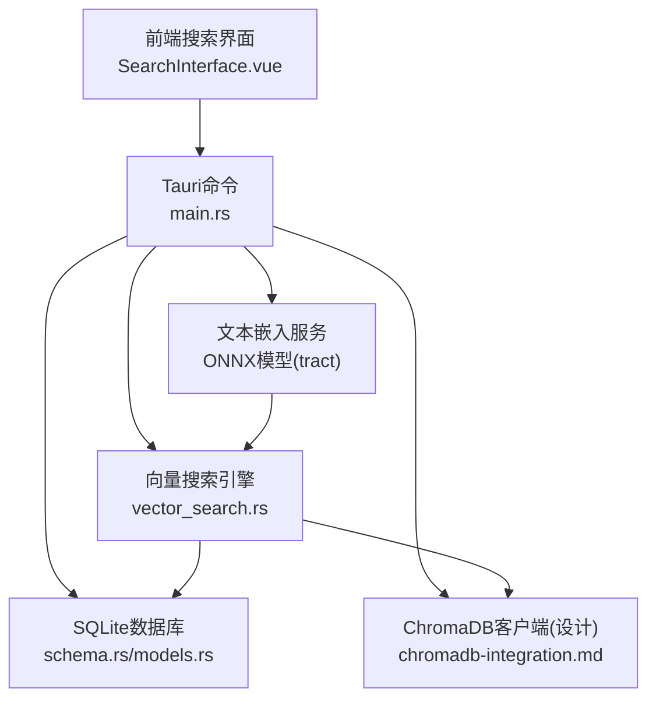
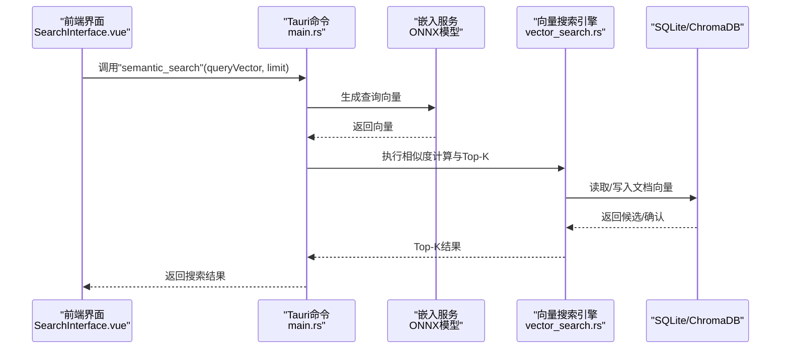
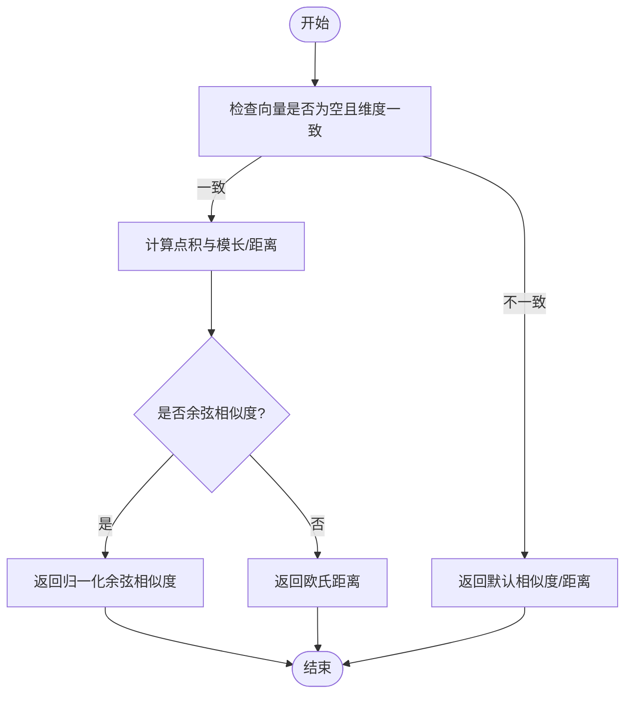
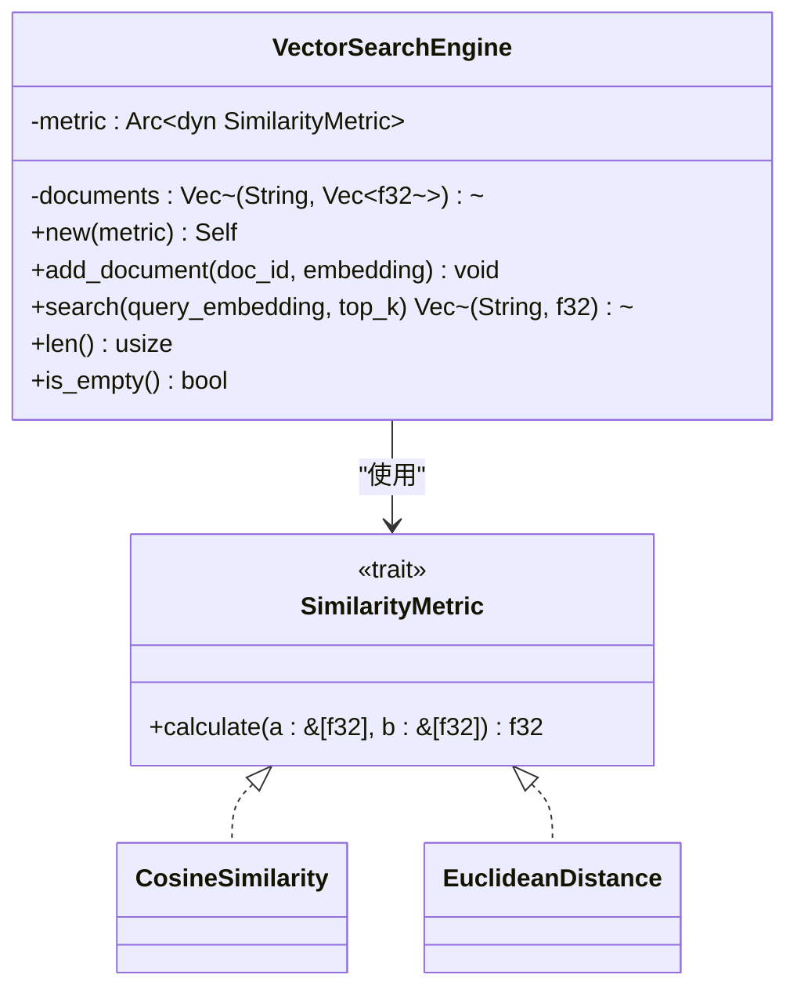
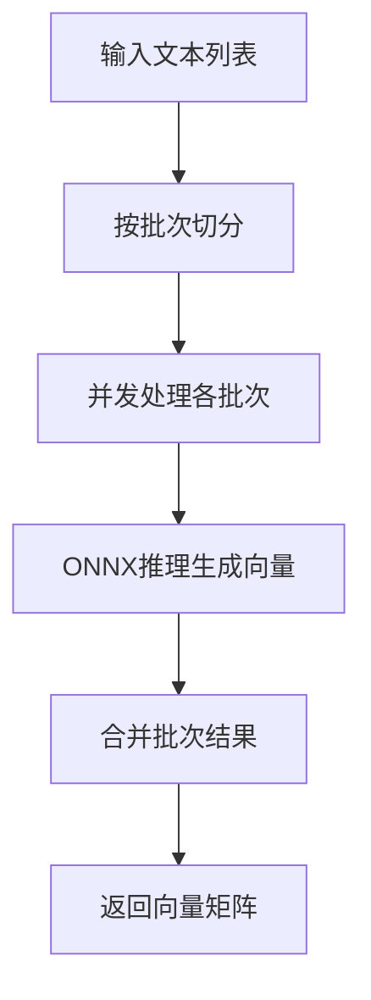
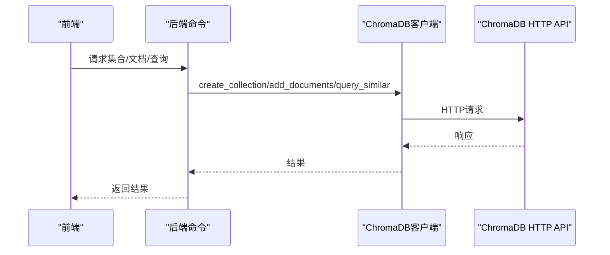
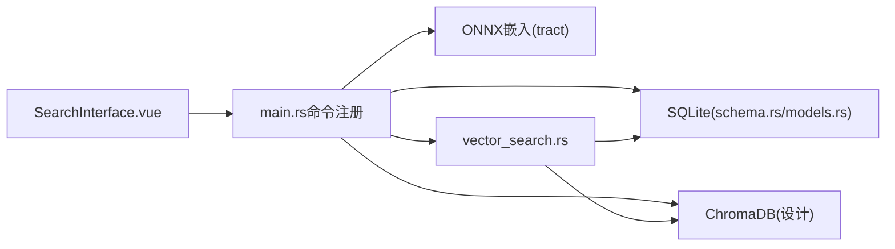

# 向量搜索引擎

<cite>
**本文引用的文件**
- [vector_search.rs](file://src-tauri/src/vector_search.rs)
- [chromadb-integration.md](file://docs/chromadb-integration.md)
- [RUST_ONNX_VECTOR_DB_INTEGRATION_SCHEME.md](file://RUST_ONNX_VECTOR_DB_INTEGRATION_SCHEME.md)
- [SearchInterface.vue](file://src/components/SearchInterface.vue)
- [main.rs](file://src-tauri/src/main.rs)
- [model-config.ts](file://src/config/model-config.ts)
- [schema.rs](file://src-tauri/src/database/schema.rs)
- [models.rs](file://src-tauri/src/database/models.rs)
- [db_test.rs](file://src-tauri/src/db_test.rs)
- [openai_client.rs](file://src-tauri/src/chat/openai_client.rs)
- [service.rs](file://src-tauri/src/chat/service.rs)
</cite>

## 目录
1. [简介](#简介)
2. [项目结构](#项目结构)
3. [核心组件](#核心组件)
4. [架构总览](#架构总览)
5. [组件详解](#组件详解)
6. [依赖关系分析](#依赖关系分析)
7. [性能考量](#性能考量)
8. [故障排查指南](#故障排查指南)
9. [结论](#结论)
10. [附录](#附录)

## 简介
本文件面向Malou Agent的向量搜索引擎，系统化阐述向量嵌入算法实现原理、文本预处理与特征提取机制、ChromaDB向量数据库集成方案（连接配置、索引创建、数据同步策略）、相似度计算方法（余弦相似度、欧几里得距离）与匹配阈值设置、搜索查询优化与结果排序、向量维度与内存优化、性能调优策略，并提供API接口规范（查询参数、返回格式、性能指标），以及批量向量化、增量更新与缓存机制的设计与实现。

## 项目结构
Malou Agent采用Tauri + Vue 3的桌面应用架构，向量搜索能力由Rust后端提供，前端通过Tauri命令调用后端能力。核心涉及以下模块：
- 向量相似度与搜索引擎：Rust实现的相似度度量与内存内向量检索引擎
- ONNX模型与向量化：基于tract的本地模型推理与批量嵌入
- ChromaDB集成：通过HTTP API对接向量数据库（设计文档）
- SQLite数据库：文档与元数据存储（含索引）
- 前端搜索界面：调用后端嵌入与搜索命令，聚合语义与传统搜索结果

图表来源
- [SearchInterface.vue](file://src/components/SearchInterface.vue#L1-L108)
- [main.rs](file://src-tauri/src/main.rs#L285-L312)
- [vector_search.rs](file://src-tauri/src/vector_search.rs#L42-L84)
- [schema.rs](file://src-tauri/src/database/schema.rs#L1-L68)
- [chromadb-integration.md](file://docs/chromadb-integration.md#L1-L124)

章节来源
- [main.rs](file://src-tauri/src/main.rs#L242-L315)
- [SearchInterface.vue](file://src/components/SearchInterface.vue#L1-L108)
- [vector_search.rs](file://src-tauri/src/vector_search.rs#L1-L84)
- [schema.rs](file://src-tauri/src/database/schema.rs#L1-L68)
- [chromadb-integration.md](file://docs/chromadb-integration.md#L1-L124)

## 核心组件
- 相似度度量接口与实现：CosineSimilarity、EuclideanDistance
- 向量搜索引擎：内存内文档向量存储与Top-K检索
- ONNX模型与批量嵌入：tract推理、分批处理、并发控制
- ChromaDB客户端（设计）：集合管理、文档导入、相似度查询
- SQLite数据库：文档与元数据持久化、索引优化
- 前端服务：嵌入与搜索调用、结果合并与展示

章节来源
- [vector_search.rs](file://src-tauri/src/vector_search.rs#L3-L84)
- [RUST_ONNX_VECTOR_DB_INTEGRATION_SCHEME.md](file://RUST_ONNX_VECTOR_DB_INTEGRATION_SCHEME.md#L28-L98)
- [chromadb-integration.md](file://docs/chromadb-integration.md#L1-L124)
- [schema.rs](file://src-tauri/src/database/schema.rs#L1-L68)
- [models.rs](file://src-tauri/src/database/models.rs#L1-L110)
- [SearchInterface.vue](file://src/components/SearchInterface.vue#L1-L108)

## 架构总览
向量搜索整体流程：
- 前端触发语义搜索，调用后端命令生成查询向量
- 后端根据所选模型进行文本嵌入（ONNX）
- 后端执行向量相似度计算与Top-K检索（内存或ChromaDB）
- 返回结果供前端展示；同时可落库或与传统全文检索结果合并

图表来源
- [SearchInterface.vue](file://src/components/SearchInterface.vue#L96-L108)
- [main.rs](file://src-tauri/src/main.rs#L285-L312)
- [vector_search.rs](file://src-tauri/src/vector_search.rs#L60-L75)
- [RUST_ONNX_VECTOR_DB_INTEGRATION_SCHEME.md](file://RUST_ONNX_VECTOR_DB_INTEGRATION_SCHEME.md#L28-L98)
- [chromadb-integration.md](file://docs/chromadb-integration.md#L53-L56)

## 组件详解

### 相似度计算与匹配阈值
- 余弦相似度：衡量向量夹角，适合语义相似；当任一向量模长为0时返回0
- 欧几里得距离：衡量向量空间中的直线距离，距离越小越相似；维度不一致返回无穷大
- 匹配阈值：可在上层业务逻辑中对相似度阈值进行裁剪（例如仅保留高于某阈值的结果）

图表来源
- [vector_search.rs](file://src-tauri/src/vector_search.rs#L10-L40)

章节来源
- [vector_search.rs](file://src-tauri/src/vector_search.rs#L3-L40)

### 向量搜索引擎（内存内）
- 接口：新增文档、相似度计算、Top-K检索、长度与判空
- 存储：(doc_id, embedding)向量列表
- 排序：按相似度降序，截断Top-K

图表来源
- [vector_search.rs](file://src-tauri/src/vector_search.rs#L3-L84)

章节来源
- [vector_search.rs](file://src-tauri/src/vector_search.rs#L42-L84)

### ONNX模型与批量向量化
- 模型加载：异步加载ONNX模型，使用Tokio任务隔离阻塞式推理
- 文本预处理与后处理：在模型推理前后进行必要的张量转换与输出规范化
- 批量嵌入：按固定批次大小切分，多批次并发处理，最终合并结果
- 内存优化：通过分批与并发控制降低峰值内存占用

图表来源
- [RUST_ONNX_VECTOR_DB_INTEGRATION_SCHEME.md](file://RUST_ONNX_VECTOR_DB_INTEGRATION_SCHEME.md#L70-L96)

章节来源
- [RUST_ONNX_VECTOR_DB_INTEGRATION_SCHEME.md](file://RUST_ONNX_VECTOR_DB_INTEGRATION_SCHEME.md#L28-L98)

### ChromaDB向量数据库集成（设计）
- 客户端设计：HTTP API封装、并发信号量控制、集合管理、文档导入、相似度查询
- 集成步骤：依赖引入、API实现、嵌入生成、前后端通信、错误处理与重试
- 配置项：向量数据库URL、API密钥、默认集合、嵌入模型

图表来源
- [chromadb-integration.md](file://docs/chromadb-integration.md#L8-L57)

章节来源
- [chromadb-integration.md](file://docs/chromadb-integration.md#L1-L124)

### SQLite数据库与索引
- 表结构：会话、消息、Token使用、模型配置等
- 索引：按更新时间、会话+时间等建立索引，提升查询效率
- 文档向量：可将向量序列化存储于BLOB字段，便于快速检索与持久化

章节来源
- [schema.rs](file://src-tauri/src/database/schema.rs#L1-L68)
- [models.rs](file://src-tauri/src/database/models.rs#L1-L110)

### 前端搜索接口与结果合并
- 嵌入调用：通过Tauri命令调用后端嵌入服务，返回向量与耗时
- 语义搜索：生成查询向量后调用后端搜索命令
- 结果合并：将语义搜索与传统文本搜索结果合并、去重、截断

章节来源
- [SearchInterface.vue](file://src/components/SearchInterface.vue#L56-L108)
- [SearchInterface.vue](file://src/components/SearchInterface.vue#L286-L307)

## 依赖关系分析
- 前端依赖Tauri命令桥接后端能力
- 后端依赖ONNX推理引擎（tract）、数据库（SQLite）、可选ChromaDB HTTP客户端
- 相似度计算与搜索逻辑解耦于具体存储介质（内存/ChromaDB/SQLite）

图表来源
- [SearchInterface.vue](file://src/components/SearchInterface.vue#L1-L108)
- [main.rs](file://src-tauri/src/main.rs#L285-L312)
- [vector_search.rs](file://src-tauri/src/vector_search.rs#L42-L84)
- [schema.rs](file://src-tauri/src/database/schema.rs#L1-L68)
- [chromadb-integration.md](file://docs/chromadb-integration.md#L1-L124)

## 性能考量
- 相似度计算复杂度
  - 余弦相似度：O(n)，n为向量维度
  - 欧几里得距离：O(n)
  - Top-K检索：若N为文档数，朴素遍历为O(N·n)，排序为O(N log N)
- 优化策略
  - 向量维度管理：统一模型输出维度，避免动态维度带来的额外校验成本
  - 内存优化：批量嵌入、分批处理、并发信号量限制、模型缓存与LRU淘汰
  - 索引与过滤：SQLite建立合适索引；ChromaDB利用其内置索引与过滤条件
  - 缓存机制：模型实例缓存、推理结果缓存、查询历史缓存
  - 预热与并发：前端预热模型、后端限流与并发控制

章节来源
- [RUST_ONNX_VECTOR_DB_INTEGRATION_SCHEME.md](file://RUST_ONNX_VECTOR_DB_INTEGRATION_SCHEME.md#L100-L158)
- [schema.rs](file://src-tauri/src/database/schema.rs#L14-L47)
- [chromadb-integration.md](file://docs/chromadb-integration.md#L113-L124)

## 故障排查指南
- 嵌入失败
  - 检查ONNX模型路径与可用性
  - 查看前端错误日志与后端异常堆栈
- 相似度计算异常
  - 确认向量维度一致且非空
  - 核对相似度实现边界条件（零向量、维度不一致）
- 数据库操作失败
  - 检查数据库连接与表结构初始化
  - 关注并发访问与事务一致性
- ChromaDB集成问题
  - 校验URL、API密钥与集合状态
  - 关注HTTP请求超时与重试策略

章节来源
- [SearchInterface.vue](file://src/components/SearchInterface.vue#L68-L71)
- [vector_search.rs](file://src-tauri/src/vector_search.rs#L12-L14)
- [db_test.rs](file://src-tauri/src/db_test.rs#L1-L39)
- [chromadb-integration.md](file://docs/chromadb-integration.md#L105-L112)

## 结论
Malou Agent的向量搜索引擎以Rust为核心，结合ONNX本地推理与SQLite/ChromaDB存储，提供了可扩展的语义检索能力。通过清晰的相似度抽象、批量嵌入与并发控制、索引与缓存策略，能够在桌面端实现高效稳定的向量搜索体验。后续可进一步完善ChromaDB集成的完整实现与阈值策略、近似最近邻索引等高级优化。

## 附录

### API接口规范（建议）
- 嵌入生成
  - 方法：POST /api/embeddings
  - 参数：text（字符串）、model_id（可选）
  - 返回：向量数组、处理耗时
- 语义搜索
  - 方法：POST /api/search
  - 参数：query（字符串）、collection（集合名，可选）、limit（数量）、filters（过滤条件，可选）
  - 返回：结果列表（包含id、内容、相似度、元数据等）
- 集合管理
  - 创建集合：POST /api/collections
  - 删除集合：DELETE /api/collections/{id}
- 文档操作
  - 导入文档：POST /api/documents/bulk
  - 更新文档：PUT /api/documents/{id}
  - 删除文档：DELETE /api/documents/{id}

章节来源
- [chromadb-integration.md](file://docs/chromadb-integration.md#L60-L86)
- [SearchInterface.vue](file://src/components/SearchInterface.vue#L96-L108)

### 配置项参考
- 向量数据库配置（示例）
  - vector_db.chroma_url
  - vector_db.api_key
  - vector_db.default_collection
  - vector_db.embedding_model
- ONNX资源限制
  - onnx.resourceLimit.maxMemoryMB
  - onnx.resourceLimit.maxThreads

章节来源
- [chromadb-integration.md](file://docs/chromadb-integration.md#L113-L124)
- [model-config.ts](file://src/config/model-config.ts#L24-L35)