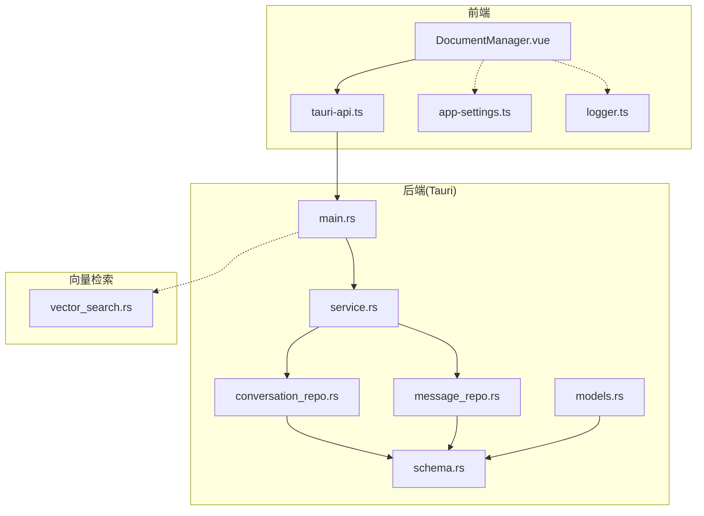
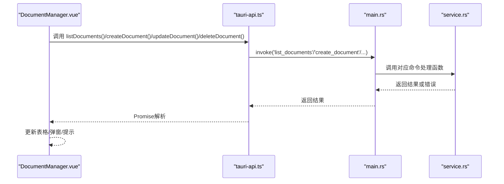
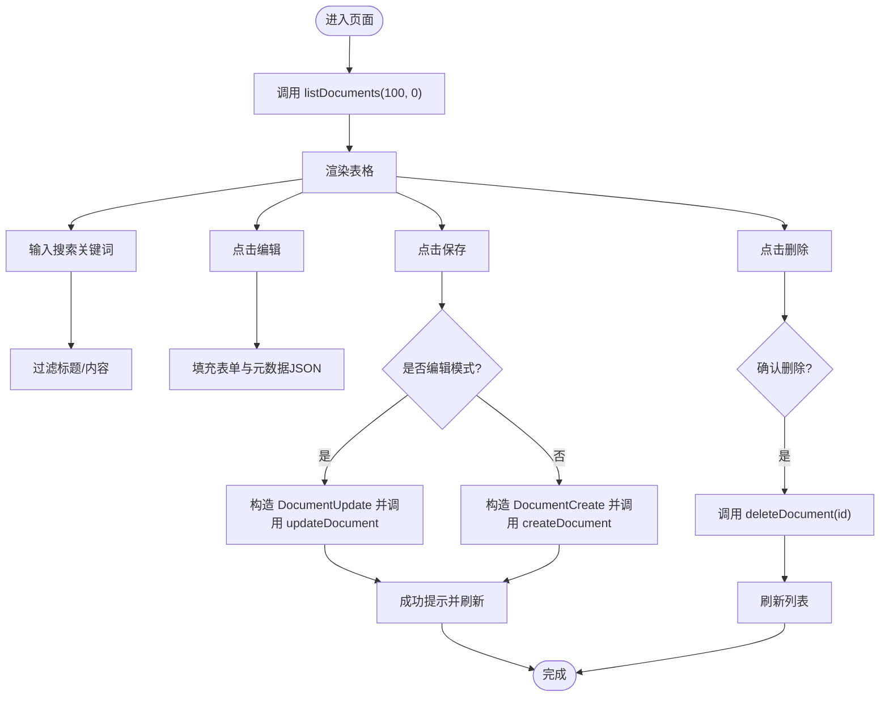
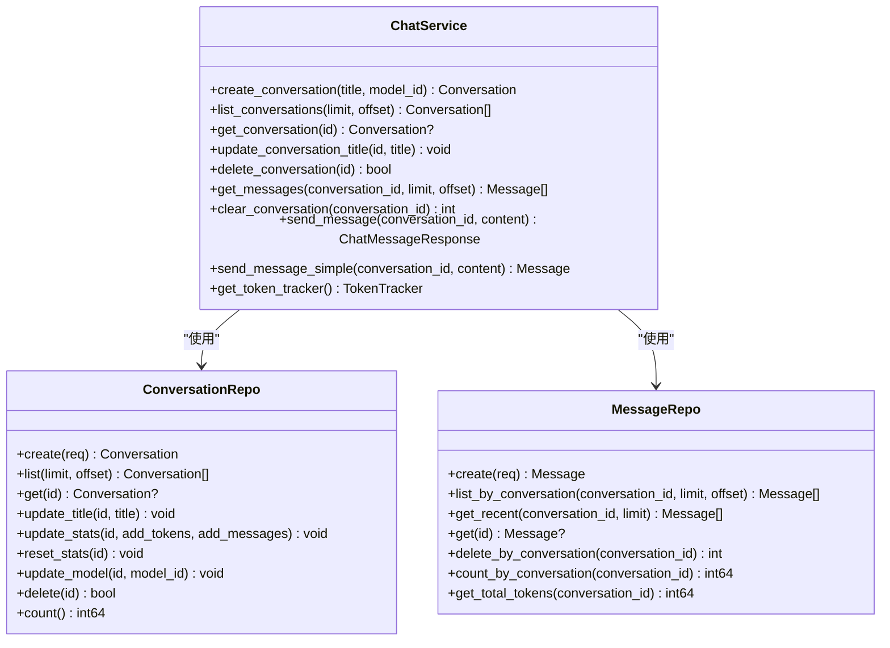
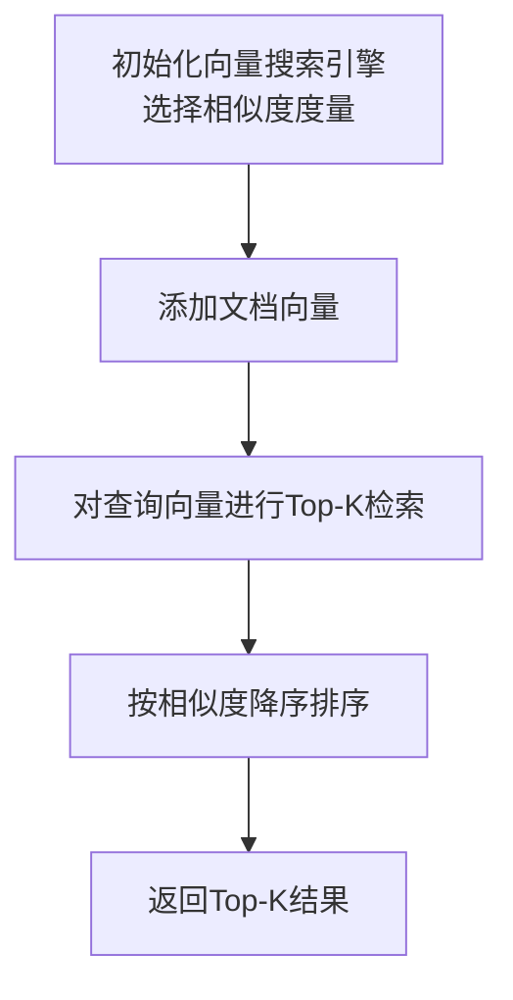
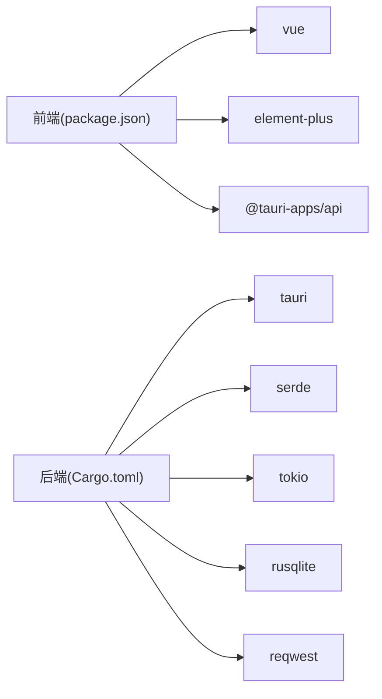

# 文档管理

<cite>
**本文引用的文件**
- [DocumentManager.vue](file://src/components/business/DocumentManager.vue)
- [tauri-api.ts](file://src/api/tauri-api.ts)
- [main.rs](file://src-tauri/src/main.rs)
- [service.rs](file://src-tauri/src/chat/service.rs)
- [conversation_repo.rs](file://src-tauri/src/chat/conversation_repo.rs)
- [message_repo.rs](file://src-tauri/src/chat/message_repo.rs)
- [models.rs](file://src-tauri/src/database/models.rs)
- [schema.rs](file://src-tauri/src/database/schema.rs)
- [vector_search.rs](file://src-tauri/src/vector_search.rs)
- [Cargo.toml](file://src-tauri/Cargo.toml)
- [app-settings.ts](file://src/config/app-settings.ts)
- [logger.ts](file://src/utils/logger.ts)
- [package.json](file://package.json)
</cite>

## 目录
1. [简介](#简介)
2. [项目结构](#项目结构)
3. [核心组件](#核心组件)
4. [架构总览](#架构总览)
5. [详细组件分析](#详细组件分析)
6. [依赖关系分析](#依赖关系分析)
7. [性能考虑](#性能考虑)
8. [故障排查指南](#故障排查指南)
9. [结论](#结论)
10. [附录](#附录)

## 简介
本文件面向Malou Agent文档管理系统，系统性梳理文档的全生命周期管理与前端交互实现，覆盖创建、编辑、删除、查询、搜索过滤、分页加载、元数据JSON处理、错误处理、状态管理与响应式绑定、以及与后端Tauri命令的集成方式。同时补充向量检索能力与数据库模型，帮助开发者快速理解与扩展。

## 项目结构
- 前端采用Vue 3 + Element Plus，文档管理UI位于业务组件目录，通过Tauri API封装调用后端命令。
- 后端基于Tauri 2，使用SQLite持久化存储，提供会话与消息管理命令；文档管理API在前端侧预留接口，尚未在后端实现。
- 向量检索引擎提供相似度计算与Top-K搜索能力，为后续知识检索与文档嵌入检索奠定基础。

图表来源
- [DocumentManager.vue](file://src/components/business/DocumentManager.vue#L1-L256)
- [tauri-api.ts](file://src/api/tauri-api.ts#L1-L242)
- [main.rs](file://src-tauri/src/main.rs#L1-L316)
- [service.rs](file://src-tauri/src/chat/service.rs#L1-L224)
- [conversation_repo.rs](file://src-tauri/src/chat/conversation_repo.rs#L1-L161)
- [message_repo.rs](file://src-tauri/src/chat/message_repo.rs#L1-L175)
- [models.rs](file://src-tauri/src/database/models.rs#L1-L110)
- [schema.rs](file://src-tauri/src/database/schema.rs#L1-L68)
- [vector_search.rs](file://src-tauri/src/vector_search.rs#L1-L84)

章节来源
- [package.json](file://package.json#L1-L31)
- [Cargo.toml](file://src-tauri/Cargo.toml#L1-L25)

## 核心组件
- 文档管理界面组件负责表格展示、搜索过滤、新增/编辑弹窗、删除确认与刷新列表。
- Tauri API封装了文档管理相关的前端调用入口，当前文档相关命令在后端未实现，抛出“尚未实现”异常。
- 后端主程序注册命令处理器，当前仅会话与消息相关命令可用，文档管理命令占位但未实现。
- 数据库层提供会话与消息的CRUD与统计能力，Schema定义了表结构与索引。
- 向量检索引擎提供余弦相似度与欧氏距离两种相似度度量，支持Top-K检索。

章节来源
- [DocumentManager.vue](file://src/components/business/DocumentManager.vue#L90-L232)
- [tauri-api.ts](file://src/api/tauri-api.ts#L180-L242)
- [main.rs](file://src-tauri/src/main.rs#L285-L312)
- [schema.rs](file://src-tauri/src/database/schema.rs#L1-L68)
- [vector_search.rs](file://src-tauri/src/vector_search.rs#L1-L84)

## 架构总览
前端通过Tauri invoke调用后端命令，后端命令在AppState中调度ChatService执行数据库操作。文档管理API在前端侧预留，后端尚未实现。

图表来源
- [DocumentManager.vue](file://src/components/business/DocumentManager.vue#L136-L221)
- [tauri-api.ts](file://src/api/tauri-api.ts#L216-L242)
- [main.rs](file://src-tauri/src/main.rs#L285-L312)
- [service.rs](file://src-tauri/src/chat/service.rs#L37-L92)

## 详细组件分析

### 文档管理界面组件（DocumentManager.vue）
- 功能要点
  - 工具栏：新建、刷新、搜索输入框。
  - 表格列：选择、标题、内容预览、创建/更新时间、操作（编辑、删除）。
  - 对话框：新建/编辑表单，含标题、内容、元数据JSON文本域。
  - 响应式：搜索查询、选中项、加载状态、编辑态标识。
  - 交互：刷新列表、编辑填充、保存（创建/更新）、删除确认、表单重置。
- 数据流
  - 列表：调用listDocuments(100, 0)获取初始数据。
  - 搜索：computed过滤，按标题/内容包含匹配。
  - 编辑：将选中行数据填充到表单与元数据JSON文本域。
  - 保存：根据是否存在编辑对象判断创建或更新；元数据为空时传undefined避免污染。
  - 删除：ElMessageBox确认后调用deleteDocument，成功后刷新。
- 错误处理
  - 列表加载失败显示错误消息并打印日志。
  - 保存失败弹出错误消息并打印日志。
  - 删除取消时忽略“cancel”错误消息。

图表来源
- [DocumentManager.vue](file://src/components/business/DocumentManager.vue#L119-L221)

章节来源
- [DocumentManager.vue](file://src/components/business/DocumentManager.vue#L1-L256)

### Tauri API封装（tauri-api.ts）
- 数据模型
  - Document/DocumentCreate/DocumentUpdate定义文档实体与变更载荷。
- 文档相关API（占位）
  - createDocument/getDocument/updateDocument/deleteDocument/listDocuments均抛出“尚未实现”异常。
- 会话/消息/统计等现有API可作为文档API实现的参考模板。

章节来源
- [tauri-api.ts](file://src/api/tauri-api.ts#L180-L242)

### 后端命令与服务（main.rs, service.rs）
- 命令注册
  - main.rs中通过invoke_handler注册了大量命令，但文档管理命令未在此处注册。
- ChatService职责
  - 会话与消息的创建、查询、统计更新、清空等。
  - Token统计追踪与回显。
- 会话/消息仓库
  - ConversationRepo/MessageRepo提供SQL CRUD与统计更新。
- Schema与模型
  - schema.rs定义了会话、消息、Token统计、模型配置等表结构与索引。
  - models.rs定义了会话、消息、Token统计等数据模型。

图表来源
- [service.rs](file://src-tauri/src/chat/service.rs#L1-L224)
- [conversation_repo.rs](file://src-tauri/src/chat/conversation_repo.rs#L1-L161)
- [message_repo.rs](file://src-tauri/src/chat/message_repo.rs#L1-L175)

章节来源
- [main.rs](file://src-tauri/src/main.rs#L285-L312)
- [service.rs](file://src-tauri/src/chat/service.rs#L37-L92)
- [conversation_repo.rs](file://src-tauri/src/chat/conversation_repo.rs#L14-L152)
- [message_repo.rs](file://src-tauri/src/chat/message_repo.rs#L14-L151)
- [schema.rs](file://src-tauri/src/database/schema.rs#L1-L68)
- [models.rs](file://src-tauri/src/database/models.rs#L1-L110)

### 向量检索引擎（vector_search.rs）
- 能力概述
  - 支持余弦相似度与欧氏距离两种相似度度量。
  - 提供添加文档向量与Top-K检索能力。
- 复杂度
  - 添加：O(1)；检索：O(n·k)，n为向量数量，k为相似度计算成本。
- 适用场景
  - 为文档嵌入检索与相似文档推荐提供基础能力。

图表来源
- [vector_search.rs](file://src-tauri/src/vector_search.rs#L42-L84)

章节来源
- [vector_search.rs](file://src-tauri/src/vector_search.rs#L1-L84)

### 配置与日志（app-settings.ts, logger.ts）
- 配置管理
  - 提供响应式配置读写、节段更新、导入导出、自动保存等能力。
- 日志服务
  - 提供info/warn/error/debug四类日志，限制最大日志条数，支持按级别筛选与最近日志获取。

章节来源
- [app-settings.ts](file://src/config/app-settings.ts#L1-L195)
- [logger.ts](file://src/utils/logger.ts#L1-L95)

## 依赖关系分析
- 前端依赖
  - Vue 3、Element Plus、@tauri-apps/api、pinia、vue-router。
- 后端依赖
  - Tauri 2、serde、tokio、uuid、chrono、rusqlite、reqwest。
- 关系图

图表来源
- [package.json](file://package.json#L14-L29)
- [Cargo.toml](file://src-tauri/Cargo.toml#L12-L25)

章节来源
- [package.json](file://package.json#L1-L31)
- [Cargo.toml](file://src-tauri/Cargo.toml#L1-L25)

## 性能考虑
- 列表加载
  - 当前一次性加载固定上限（如100条），建议在后端实现分页参数传递与索引优化。
- 搜索过滤
  - 前端过滤适合小规模数据；大规模数据建议后端模糊匹配与全文索引。
- 向量检索
  - Top-K检索复杂度与向量规模线性相关，建议引入倒排索引或近似最近邻（ANN）库优化。
- 数据库
  - 会话与消息表已建立索引，建议结合实际查询模式评估是否增加复合索引。

## 故障排查指南
- 文档列表加载失败
  - 检查后端命令是否注册；查看前端错误消息与控制台日志。
- 保存文档失败
  - 检查元数据JSON格式；确认后端文档命令是否实现。
- 删除确认无效
  - 确认ElMessageBox的确认逻辑与错误消息分支。
- 向量检索无结果
  - 检查向量维度一致性与相似度度量配置。

章节来源
- [DocumentManager.vue](file://src/components/business/DocumentManager.vue#L136-L221)
- [tauri-api.ts](file://src/api/tauri-api.ts#L216-L242)

## 结论
- 文档管理界面已完成基础交互与数据流设计，具备良好的扩展性。
- 文档管理API在前端预留，后端尚未实现，需尽快补齐命令与服务层。
- 数据库与向量检索能力为后续扩展提供了坚实基础，建议优先完善后端实现与索引优化。

## 附录

### API接口文档（占位）
- 接口定义（前端侧）
  - createDocument: 请求体为DocumentCreate；响应为Document；错误：抛出“尚未实现”。
  - getDocument: 路径参数id；响应为Document或null；错误：抛出“尚未实现”。
  - updateDocument: 路径参数id与DocumentUpdate；响应为Document或null；错误：抛出“尚未实现”。
  - deleteDocument: 路径参数id；响应为boolean；错误：抛出“尚未实现”。
  - listDocuments: 查询参数limit与offset；响应为Document[]；错误：抛出“尚未实现”。

章节来源
- [tauri-api.ts](file://src/api/tauri-api.ts#L216-L242)

### 数据模型与表结构
- 文档模型（前端）
  - 字段：id、title、content、embedding、metadata、createdAt、updatedAt。
- 数据库表（后端）
  - 会话表：id、title、model_id、total_tokens、message_count、created_at、updated_at。
  - 消息表：id、conversation_id、role、content、model_id、prompt_tokens、completion_tokens、total_tokens、created_at。
  - 索引：会话按updated_at降序；消息按conversation_id与created_at升序；Token统计按model_id与date降序。

章节来源
- [models.rs](file://src-tauri/src/database/models.rs#L1-L110)
- [schema.rs](file://src-tauri/src/database/schema.rs#L1-L68)

### 向量检索度量
- 余弦相似度：适用于方向性比较，归一化处理。
- 欧氏距离：适用于数值空间中的几何距离比较。

章节来源
- [vector_search.rs](file://src-tauri/src/vector_search.rs#L3-L40)