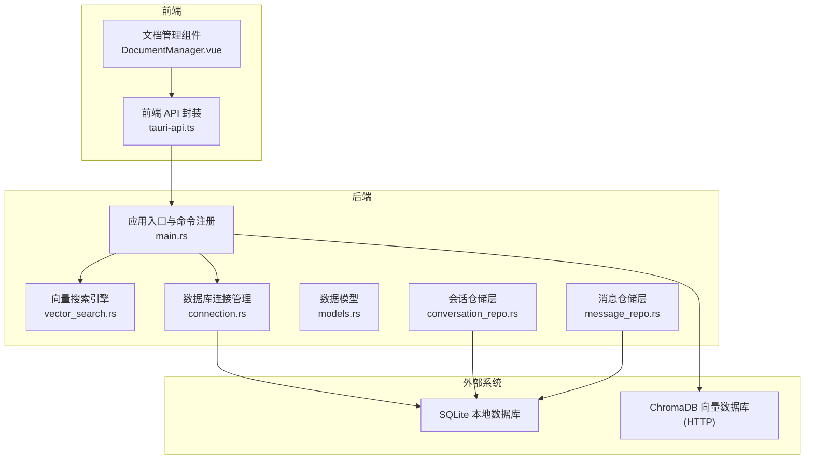
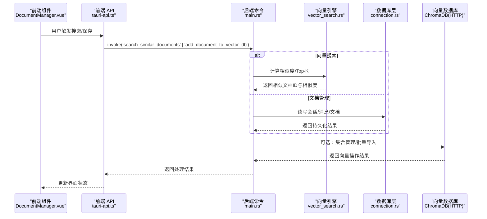
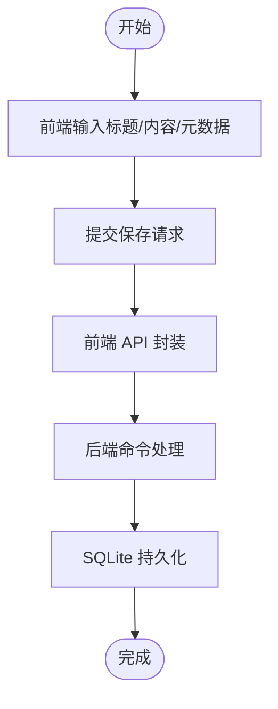
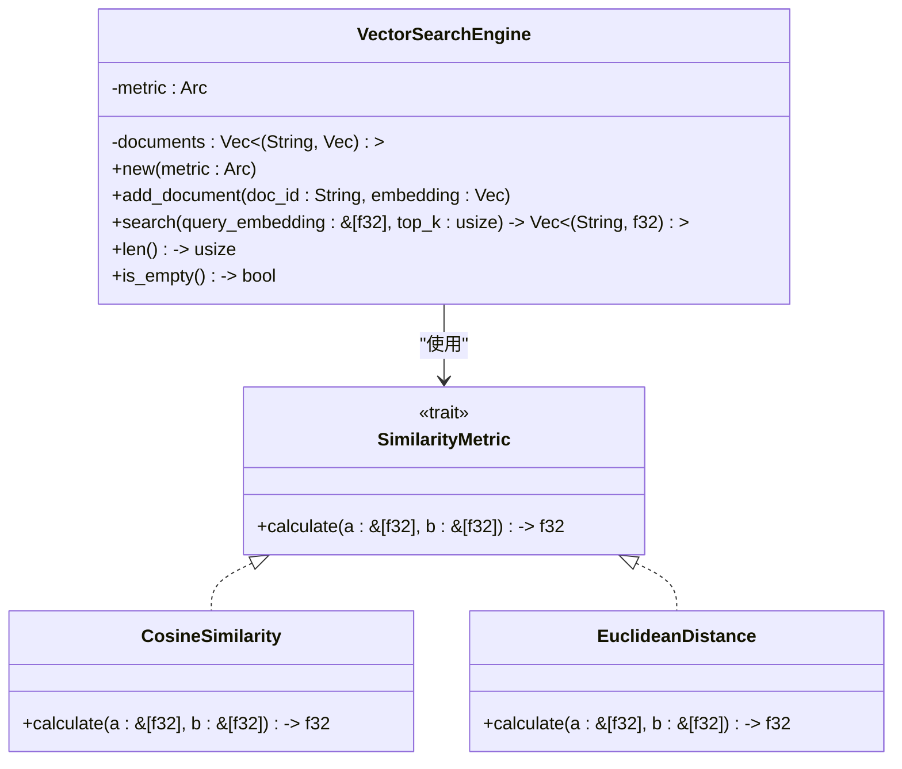
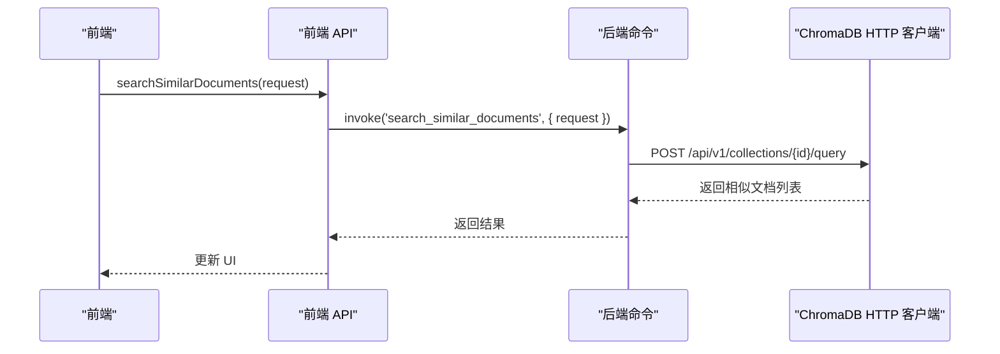
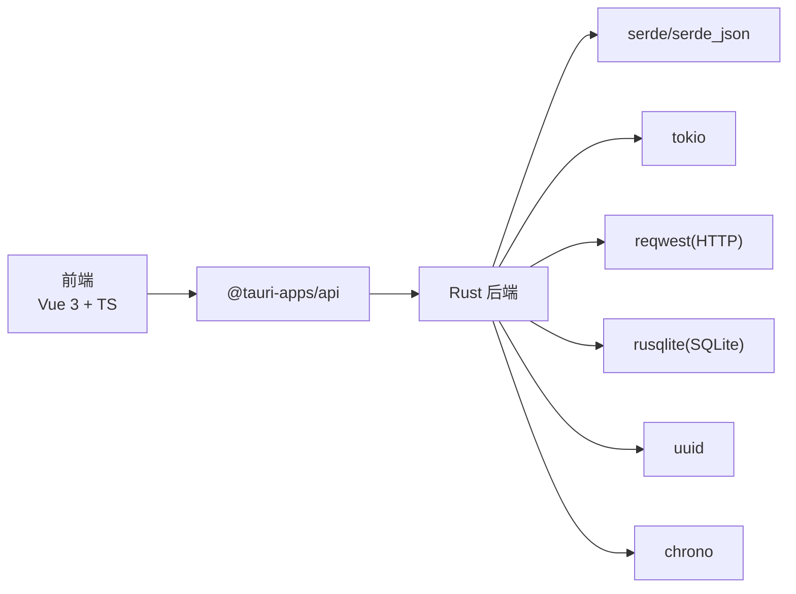

# 知识库管理系统

<cite>
**本文引用的文件**
- [README.md](file://README.md)
- [chromadb-integration.md](file://docs/chromadb-integration.md)
- [vector_search.rs](file://src-tauri/src/vector_search.rs)
- [main.rs](file://src-tauri/src/main.rs)
- [connection.rs](file://src-tauri/src/database/connection.rs)
- [models.rs](file://src-tauri/src/database/models.rs)
- [conversation_repo.rs](file://src-tauri/src/chat/conversation_repo.rs)
- [message_repo.rs](file://src-tauri/src/chat/message_repo.rs)
- [DocumentManager.vue](file://src/components/business/DocumentManager.vue)
- [tauri-api.ts](file://src/api/tauri-api.ts)
</cite>

## 目录
1. [简介](#简介)
2. [项目结构](#项目结构)
3. [核心组件](#核心组件)
4. [架构总览](#架构总览)
5. [详细组件分析](#详细组件分析)
6. [依赖关系分析](#依赖关系分析)
7. [性能考虑](#性能考虑)
8. [故障排查指南](#故障排查指南)
9. [结论](#结论)
10. [附录](#附录)

## 简介
Malou Agent 是一个基于 Tauri + Vue 3 的 Windows 桌面 AI 助手应用，具备智能聊天、文档管理与检索、本地 ONNX 模型推理、向量数据库搜索、插件化技能系统等功能。本文聚焦“知识库管理系统”的技术实现，围绕文档管理的完整流程（上传、解析、索引、存储）、向量搜索算法（相似度计算、性能优化）、ChromaDB 向量数据库集成方案（HTTP 客户端、数据迁移与同步）、文档元数据与分类标签、权限控制设计、搜索接口 API、查询优化与结果排序算法，以及文本预处理与语义理解实现进行深入说明。

## 项目结构
项目采用前端（Vue 3 + TypeScript）与后端（Rust + Tauri）分离架构，数据库使用 SQLite，向量搜索在 Rust 层实现本地向量引擎，并规划通过 HTTP 客户端对接 ChromaDB。

图表来源
- [main.rs](file://src-tauri/src/main.rs#L250-L324)
- [vector_search.rs](file://src-tauri/src/vector_search.rs#L42-L84)
- [connection.rs](file://src-tauri/src/database/connection.rs#L7-L66)
- [models.rs](file://src-tauri/src/database/models.rs#L3-L110)
- [conversation_repo.rs](file://src-tauri/src/chat/conversation_repo.rs#L4-L161)
- [message_repo.rs](file://src-tauri/src/chat/message_repo.rs#L4-L175)

章节来源
- [README.md](file://README.md#L1-L76)
- [main.rs](file://src-tauri/src/main.rs#L250-L324)

## 核心组件
- 文档管理前端组件：负责文档的增删改查、元数据编辑、本地搜索与加载状态展示。
- 向量搜索引擎：提供余弦相似度与欧氏距离两种相似度计算策略，支持本地内存向量索引与 Top-K 排序。
- 数据库层：SQLite 连接管理、会话与消息的数据模型与仓储层，提供事务与并发优化。
- 向量数据库集成：规划通过 HTTP 客户端对接 ChromaDB，提供集合管理、文档向量化入库与相似度查询能力。
- 搜索接口 API：前端通过 Tauri invoke 调用后端命令，实现向量搜索与文档管理的统一接口。

章节来源
- [DocumentManager.vue](file://src/components/business/DocumentManager.vue#L1-L256)
- [vector_search.rs](file://src-tauri/src/vector_search.rs#L3-L84)
- [connection.rs](file://src-tauri/src/database/connection.rs#L7-L66)
- [models.rs](file://src-tauri/src/database/models.rs#L3-L110)
- [chromadb-integration.md](file://docs/chromadb-integration.md#L1-L124)
- [tauri-api.ts](file://src/api/tauri-api.ts#L1-L242)

## 架构总览
系统采用“前端 UI + Tauri 命令 + Rust 后端 + SQLite + 向量搜索引擎 + ChromaDB”的分层架构。前端通过 Tauri invoke 调用后端命令；后端命令根据业务场景选择本地数据库或向量数据库；向量搜索在 Rust 层完成，支持多种相似度度量与排序。

图表来源
- [tauri-api.ts](file://src/api/tauri-api.ts#L79-L85)
- [main.rs](file://src-tauri/src/main.rs#L293-L320)
- [vector_search.rs](file://src-tauri/src/vector_search.rs#L42-L84)
- [connection.rs](file://src-tauri/src/database/connection.rs#L7-L66)
- [chromadb-integration.md](file://docs/chromadb-integration.md#L8-L58)

## 详细组件分析

### 文档管理流程（上传、解析、索引、存储）
- 前端交互：用户在文档管理组件中输入标题、内容与元数据，支持 JSON 元数据编辑与本地关键词过滤。
- API 调用：前端通过 API 封装发起创建/更新/删除/列表请求，当前实现抛出“尚未实现”异常，预留扩展点。
- 后端持久化：数据库层提供会话与消息的数据模型与仓储层，遵循 SQLite 外键约束与 WAL 模式提升并发性能。
- 向量索引（规划）：计划将文档内容转换为向量嵌入，写入 ChromaDB 集合，支持后续语义相似度检索。

图表来源
- [DocumentManager.vue](file://src/components/business/DocumentManager.vue#L136-L202)
- [tauri-api.ts](file://src/api/tauri-api.ts#L216-L235)
- [connection.rs](file://src-tauri/src/database/connection.rs#L12-L58)

章节来源
- [DocumentManager.vue](file://src/components/business/DocumentManager.vue#L1-L256)
- [tauri-api.ts](file://src/api/tauri-api.ts#L180-L235)
- [connection.rs](file://src-tauri/src/database/connection.rs#L7-L66)

### 向量搜索算法与相似度计算
- 相似度度量接口：定义可扩展的相似度度量 trait，支持余弦相似度与欧氏距离。
- 向量引擎：维护文档 ID 与向量的内存索引，遍历计算相似度并按降序排序，返回 Top-K 结果。
- 性能特征：线性扫描 O(N) 时间复杂度，适合中小规模文档集；可通过索引结构（如 IVF/PQ）进一步优化。

图表来源
- [vector_search.rs](file://src-tauri/src/vector_search.rs#L3-L84)

章节来源
- [vector_search.rs](file://src-tauri/src/vector_search.rs#L3-L84)

### ChromaDB 向量数据库集成方案
- HTTP 客户端：定义集合、查询请求与客户端结构体，提供创建集合、批量添加文档、相似度查询等接口。
- 前端集成：通过 Tauri invoke 调用后端命令，实现向量搜索与文档入库。
- 配置项：包含 ChromaDB 地址、API Key、默认集合名与嵌入模型名称等。

图表来源
- [chromadb-integration.md](file://docs/chromadb-integration.md#L60-L86)
- [chromadb-integration.md](file://docs/chromadb-integration.md#L8-L58)

章节来源
- [chromadb-integration.md](file://docs/chromadb-integration.md#L1-L124)

### 文档元数据管理与分类标签
- 元数据字段：文档对象包含元数据字段，前端支持 JSON 编辑与本地过滤显示。
- 分类标签：建议在元数据中引入标签数组字段，结合向量检索实现多维过滤与排序。

章节来源
- [DocumentManager.vue](file://src/components/business/DocumentManager.vue#L71-L78)
- [tauri-api.ts](file://src/api/tauri-api.ts#L180-L202)

### 权限控制设计
- 当前实现未见细粒度权限控制逻辑；建议在后端命令层增加用户会话与资源访问控制，结合数据库角色与行级安全策略。

章节来源
- [main.rs](file://src-tauri/src/main.rs#L293-L320)

### 搜索接口 API 文档
- 向量搜索接口：searchSimilarDocuments，支持查询字符串、集合名、限制数量与过滤条件。
- 文档入库接口：addDocumentToVectorDB，传入文档嵌入。
- 兼容旧版：searchKnowledge、embedText 等，当前为占位实现。

章节来源
- [chromadb-integration.md](file://docs/chromadb-integration.md#L60-L86)
- [tauri-api.ts](file://src/api/tauri-api.ts#L79-L85)
- [tauri-api.ts](file://src/api/tauri-api.ts#L204-L214)

### 查询优化与结果排序
- 本地向量引擎：按相似度降序排序，截取 Top-K。
- 向量数据库：建议在 ChromaDB 中启用索引（如 HNSW/IVF）与过滤条件，减少全量扫描。
- 结果排序：可结合时间戳、相关度权重与标签匹配度进行二次排序。

章节来源
- [vector_search.rs](file://src-tauri/src/vector_search.rs#L60-L75)
- [chromadb-integration.md](file://docs/chromadb-integration.md#L100-L103)

### 文本预处理、分词与语义理解
- 预处理：建议对输入文本进行清洗、去噪与标准化。
- 分词：可采用轻量分词器（如 spaCy 或本地分词模型）进行切分与停用词过滤。
- 语义理解：使用句子级嵌入模型生成固定维度向量，作为 ChromaDB 的向量表示。

章节来源
- [chromadb-integration.md](file://docs/chromadb-integration.md#L113-L124)

## 依赖关系分析
- 前端依赖：Element Plus UI、Vite、Pinia、@tauri-apps/api。
- 后端依赖：Tauri v2、serde、tokio、uuid、chrono、reqwest、rusqlite。
- 数据库：SQLite，启用外键与 WAL 模式，仓储层封装 CRUD。
- 向量搜索：本地向量引擎与规划中的 ChromaDB HTTP 客户端。

图表来源
- [main.rs](file://src-tauri/src/main.rs#L12-L24)
- [connection.rs](file://src-tauri/src/database/connection.rs#L1-L89)

章节来源
- [main.rs](file://src-tauri/src/main.rs#L12-L24)
- [connection.rs](file://src-tauri/src/database/connection.rs#L1-L89)

## 性能考虑
- 数据库性能：启用 WAL 模式与外键约束，仓储层使用参数化 SQL 与连接池复用。
- 向量搜索：本地引擎适合小规模数据；大规模场景建议使用 ChromaDB 并配置索引与过滤。
- I/O 优化：批量导入文档嵌入、缓存常用查询结果、限制返回字段大小。
- 并发控制：后端使用互斥与读写锁保护共享状态，避免竞态。

章节来源
- [connection.rs](file://src-tauri/src/database/connection.rs#L23-L26)
- [main.rs](file://src-tauri/src/main.rs#L54-L57)

## 故障排查指南
- 数据库初始化失败：检查默认数据库路径与权限，确认 WAL 模式与外键设置是否生效。
- Tauri 命令未找到：确认命令已在 invoke_handler 中注册，且前端调用的命令名一致。
- 向量搜索无结果：检查查询向量维度与嵌入模型一致性，确保 ChromaDB 集合存在且已导入文档。
- 前端 API 未实现：当前文档管理 API 仍为占位实现，需在后端完善命令与仓储层。

章节来源
- [connection.rs](file://src-tauri/src/database/connection.rs#L12-L58)
- [main.rs](file://src-tauri/src/main.rs#L293-L320)
- [tauri-api.ts](file://src/api/tauri-api.ts#L216-L235)

## 结论
Malou Agent 的知识库管理系统以“前端 + Tauri + Rust + SQLite + 向量引擎 + ChromaDB”的组合实现文档管理与语义检索。当前已完成前端文档管理组件与本地向量搜索引擎，后端命令与数据库仓储层完善中，ChromaDB 集成通过 HTTP 客户端规划实现。建议尽快补齐文档管理 API、完善权限控制与元数据标签体系，并在向量数据库中启用索引与过滤以提升大规模检索性能。

## 附录
- 开发与构建：参考项目根目录 README 的快速开始与项目结构说明。
- 文档管理：参考文档管理模块与 API 规划，逐步实现后端命令与数据库映射。
- 向量数据库：参考 ChromaDB 集成方案，完善集合管理、批量导入与查询接口。

章节来源
- [README.md](file://README.md#L29-L43)
- [chromadb-integration.md](file://docs/chromadb-integration.md#L105-L112)