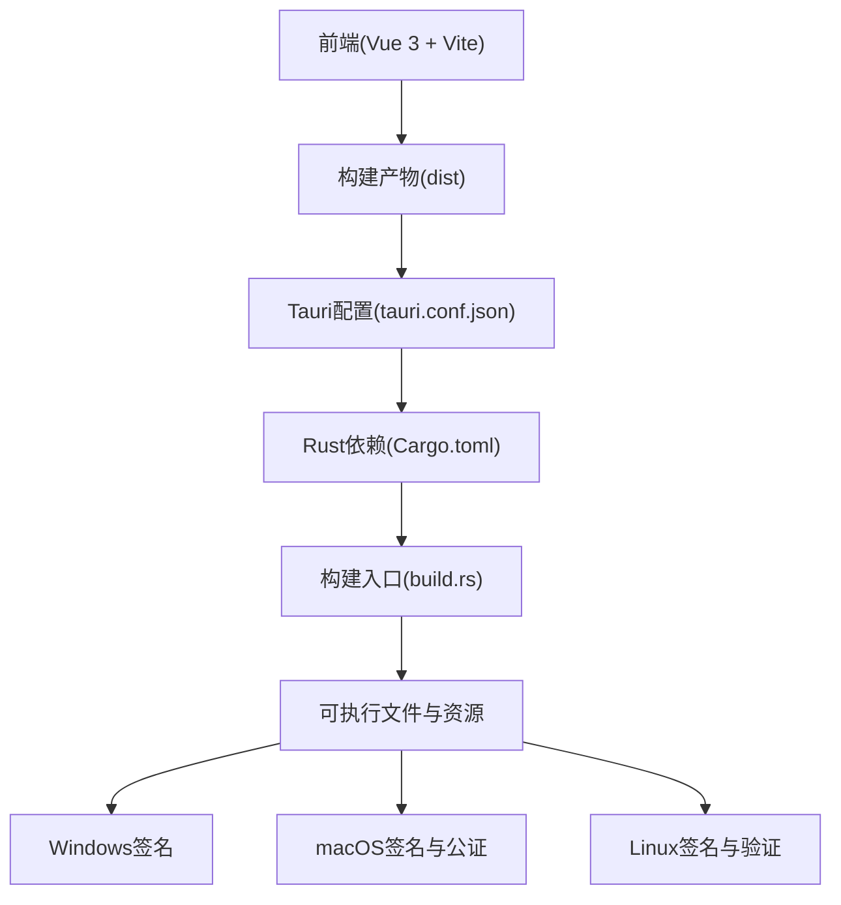
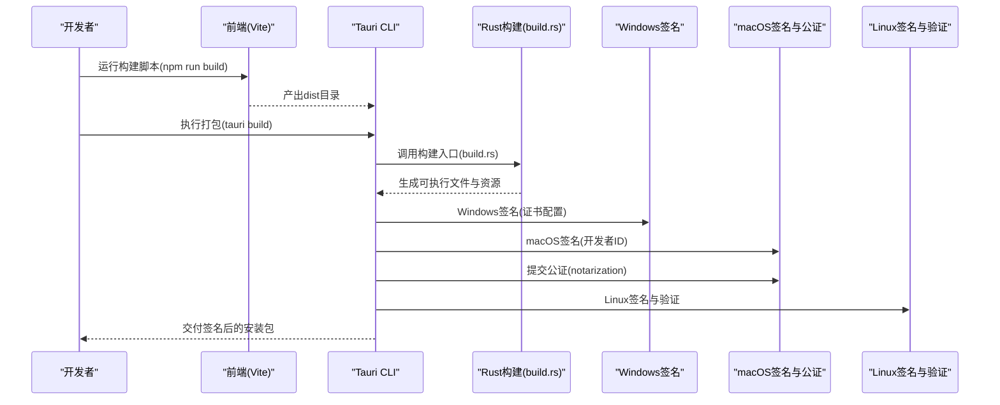
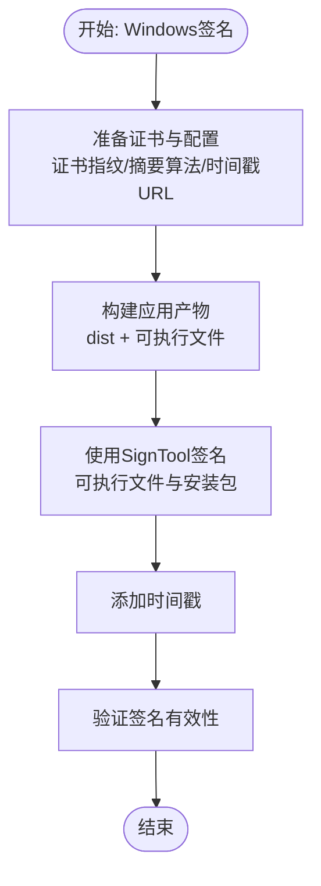
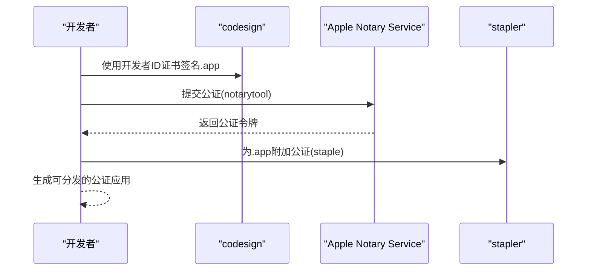
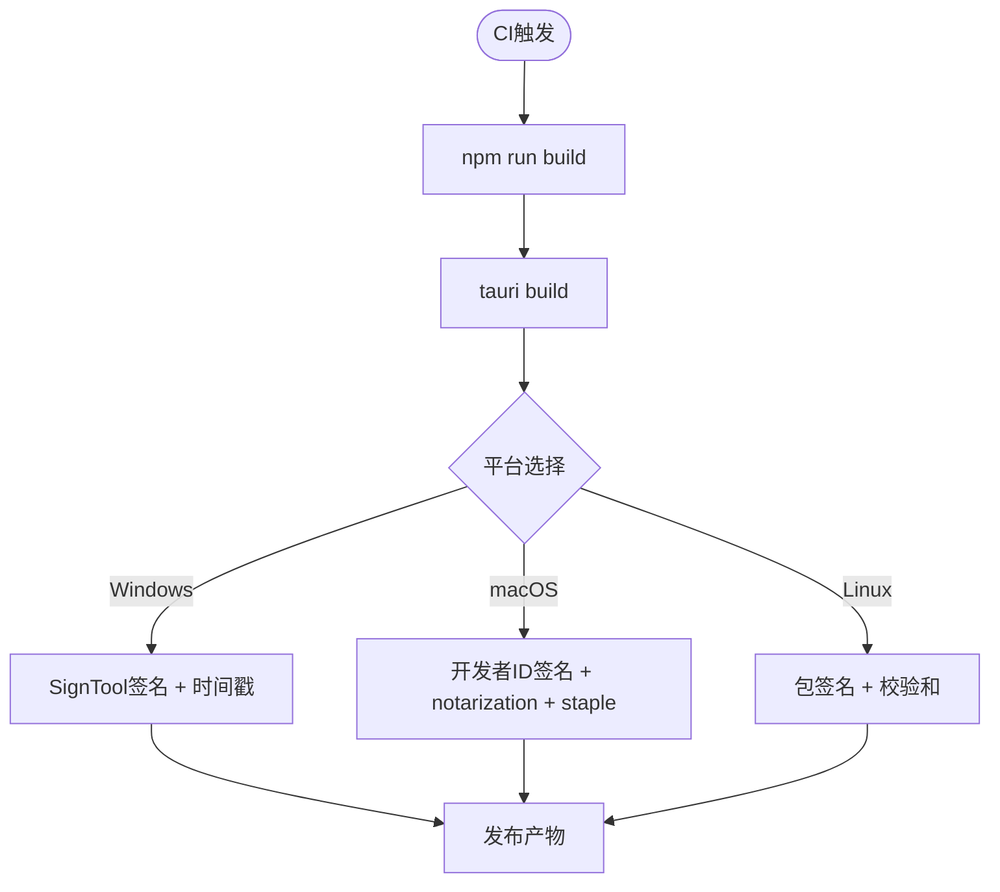
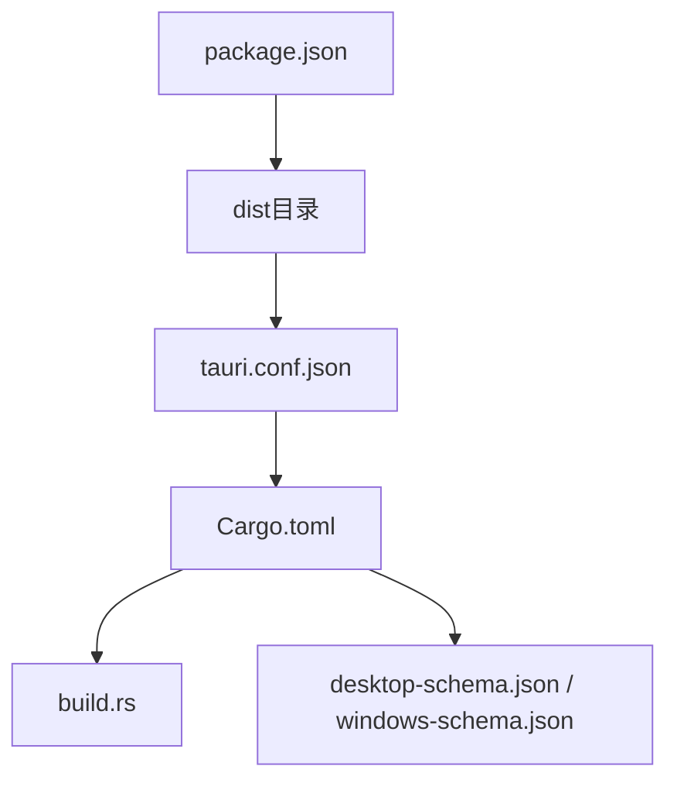

# 代码签名

<cite>
**本文引用的文件**
- [package.json](file://package.json)
- [tauri.conf.json](file://src-tauri/tauri.conf.json)
- [Cargo.toml](file://src-tauri/Cargo.toml)
- [Cargo.backup.toml](file://src-tauri/Cargo.backup.toml)
- [build.rs](file://src-tauri/build.rs)
- [main.rs](file://src-tauri/src/main.rs)
- [service.rs](file://src-tauri/src/chat/service.rs)
- [connection.rs](file://src-tauri/src/database/connection.rs)
- [package.bat](file://package.bat)
- [desktop-schema.json](file://src-tauri/gen/schemas/desktop-schema.json)
- [windows-schema.json](file://src-tauri/gen/schemas/windows-schema.json)
- [README.md](file://README.md)
- [TAURI_VUE_INTEGRATION_BEST_PRACTICES.md](file://TAURI_VUE_INTEGRATION_BEST_PRACTICES.md)
- [configuration-management.md](file://docs/configuration-management.md)
- [testing-and-optimization.md](file://docs/testing-and-optimization.md)
</cite>

## 目录
1. [简介](#简介)
2. [项目结构](#项目结构)
3. [核心组件](#核心组件)
4. [架构总览](#架构总览)
5. [详细组件分析](#详细组件分析)
6. [依赖关系分析](#依赖关系分析)
7. [性能考虑](#性能考虑)
8. [故障排除指南](#故障排除指南)
9. [结论](#结论)
10. [附录](#附录)

## 简介
本文件面向Malou Agent项目，提供跨平台代码签名与安全配置的系统性指导。内容覆盖：
- Windows平台：代码签名证书申请与配置、EV代码签名证书的获取与使用、Windows打包与签名流程。
- macOS平台：开发者ID签名与公证流程、Apple Developer账户配置、notarization服务使用。
- Linux平台：签名机制与软件包验证要点。
- 自动化签名脚本与CI/CD集成方案。
- 安全最佳实践与证书管理策略。
- 签名过期与证书更新处理。

本指南严格基于仓库现有配置与脚本进行分析，并提供可操作的实施建议与流程图示。

## 项目结构
Malou Agent采用Tauri + Vue 3架构，前端通过Vite构建，后端使用Rust与Tauri CLI进行打包与分发。签名相关的关键位置包括：
- 前端构建与脚本：package.json、package.bat
- Tauri配置：tauri.conf.json、Cargo.toml、Cargo.backup.toml
- 构建入口：build.rs
- 平台能力与目标：gen/schemas/desktop-schema.json、windows-schema.json

图表来源
- [package.json](file://package.json#L1-L31)
- [tauri.conf.json](file://src-tauri/tauri.conf.json#L1-L32)
- [Cargo.toml](file://src-tauri/Cargo.toml#L1-L25)
- [build.rs](file://src-tauri/build.rs#L1-L3)

章节来源
- [README.md](file://README.md#L1-L76)
- [package.json](file://package.json#L1-L31)
- [tauri.conf.json](file://src-tauri/tauri.conf.json#L1-L32)
- [Cargo.toml](file://src-tauri/Cargo.toml#L1-L25)
- [build.rs](file://src-tauri/build.rs#L1-L3)

## 核心组件
- 前端构建与打包：使用Vite与npm脚本，生成dist目录供Tauri消费。
- Tauri应用配置：定义产品名称、版本、bundle目标、安全策略等。
- Rust后端与构建：通过tauri-build与build.rs驱动Rust侧构建，生成多平台二进制。
- 平台能力与目标：通过生成的JSON模式文件声明支持的目标平台（Windows/macOS/Linux等）。

章节来源
- [package.json](file://package.json#L6-L12)
- [tauri.conf.json](file://src-tauri/tauri.conf.json#L1-L32)
- [Cargo.toml](file://src-tauri/Cargo.toml#L1-L25)
- [build.rs](file://src-tauri/build.rs#L1-L3)
- [desktop-schema.json](file://src-tauri/gen/schemas/desktop-schema.json#L2203-L2244)
- [windows-schema.json](file://src-tauri/gen/schemas/windows-schema.json#L2203-L2244)

## 架构总览
下图展示从前端构建到应用打包、签名与发布的整体流程，以及各平台签名与验证的关键节点。

图表来源
- [package.json](file://package.json#L6-L12)
- [tauri.conf.json](file://src-tauri/tauri.conf.json#L5-L10)
- [build.rs](file://src-tauri/build.rs#L1-L3)

## 详细组件分析

### Windows平台：代码签名与打包
- 证书与配置
  - Windows签名配置项位于Rust元数据中，包含证书指纹、摘要算法与时间戳URL等字段。
  - 该配置为后续签名流程提供必要参数。
- 打包与分发
  - package.bat负责复制可执行文件、DLL依赖与创建快捷方式，便于本地分发或进一步签名。
- 实施建议
  - 申请EV代码签名证书，确保受信任根与时间戳服务可用。
  - 在CI中使用受保护变量存储证书与密码，避免硬编码。
  - 使用SignTool对最终安装包进行签名，并启用时间戳。

图表来源
- [Cargo.backup.toml](file://src-tauri/Cargo.backup.toml#L155-L159)
- [package.bat](file://package.bat#L1-L42)

章节来源
- [Cargo.backup.toml](file://src-tauri/Cargo.backup.toml#L155-L159)
- [package.bat](file://package.bat#L1-L42)

### macOS平台：开发者ID签名与公证
- 开发者ID签名
  - 使用Apple Developer账户获取开发者ID证书，确保与应用Bundle ID匹配。
  - 在签名过程中指定正确的Team ID与证书链。
- 公证流程
  - 通过notarytool提交待公证的.dmg或.zip，等待Apple返回公证令牌。
  - 使用 stapler为应用附加公证(staple)，提升离线验证成功率。
- 实施建议
  - 在CI中使用Apple Signing凭据与Notary API密钥。
  - 将公证与staple步骤纳入构建脚本，确保每次发布都完成公证。

图表来源
- [Cargo.backup.toml](file://src-tauri/Cargo.backup.toml#L152-L153)

章节来源
- [Cargo.backup.toml](file://src-tauri/Cargo.backup.toml#L152-L153)

### Linux平台：签名机制与软件包验证
- 签名机制
  - Linux通常通过包管理器或发行渠道进行签名与验证，应用签名主要依赖于系统信任链与包签名。
- 软件包验证
  - 使用dpkg、rpm等工具验证包完整性与签名有效性。
  - 对于AppImage等便携格式，可结合GPG签名与校验和。
- 实施建议
  - 在CI中生成并签名安装包，上传至发布渠道。
  - 提供校验和文件，便于用户二次验证。

章节来源
- [Cargo.backup.toml](file://src-tauri/Cargo.backup.toml#L149-L150)

### 自动化签名脚本与CI/CD集成
- 前端构建
  - 使用npm脚本进行构建，输出dist目录供Tauri消费。
- Rust构建与打包
  - 通过Tauri CLI触发Rust侧构建，生成多平台产物。
- CI/CD建议
  - Windows：在受保护变量中存储证书与密码，使用SignTool签名并添加时间戳。
  - macOS：使用Apple Signing凭据与Notary API密钥，完成签名、公证与staple。
  - Linux：生成并签名安装包，提供校验和。
  - 测试与覆盖率：参考现有测试与覆盖率配置，确保签名前后功能稳定。

图表来源
- [package.json](file://package.json#L6-L12)
- [testing-and-optimization.md](file://docs/testing-and-optimization.md#L237-L275)

章节来源
- [package.json](file://package.json#L6-L12)
- [testing-and-optimization.md](file://docs/testing-and-optimization.md#L237-L275)

### 安全最佳实践与证书管理策略
- 密钥与证书管理
  - 使用受保护变量存储证书私钥、密码与Notary API密钥。
  - 限制访问权限，定期轮换证书与密钥。
- 签名策略
  - 为所有可执行文件与安装包启用签名与时间戳。
  - 在macOS上必须完成公证与staple，确保离线可用性。
- 验证与监控
  - 在CI中增加签名验证步骤，失败即阻断发布。
  - 监控证书到期时间，提前续期。

章节来源
- [Cargo.backup.toml](file://src-tauri/Cargo.backup.toml#L155-L159)
- [testing-and-optimization.md](file://docs/testing-and-optimization.md#L237-L275)

### 签名过期与证书更新
- 证书到期预警
  - 在CI中加入证书有效期检查任务，提前7-14天提醒续期。
- 更新流程
  - 更换新证书后，更新CI中的受保护变量与本地配置。
  - 重新签名所有历史版本与最新版本，确保一致性。
- 风险控制
  - 保留旧证书一段时间，逐步替换分发渠道中的签名。
  - 对用户公告证书更新与安全影响。

章节来源
- [Cargo.backup.toml](file://src-tauri/Cargo.backup.toml#L155-L159)

## 依赖关系分析
- 前端依赖与构建
  - package.json定义了构建脚本与依赖，为Tauri提供静态资源。
- Rust依赖与构建
  - Cargo.toml声明tauri与相关依赖；build.rs委托给tauri_build完成构建。
- 平台目标与能力
  - 生成的JSON模式文件明确支持Windows、macOS、Linux等目标平台。

图表来源
- [package.json](file://package.json#L1-L31)
- [tauri.conf.json](file://src-tauri/tauri.conf.json#L1-L32)
- [Cargo.toml](file://src-tauri/Cargo.toml#L1-L25)
- [build.rs](file://src-tauri/build.rs#L1-L3)
- [desktop-schema.json](file://src-tauri/gen/schemas/desktop-schema.json#L2203-L2244)
- [windows-schema.json](file://src-tauri/gen/schemas/windows-schema.json#L2203-L2244)

章节来源
- [package.json](file://package.json#L1-L31)
- [Cargo.toml](file://src-tauri/Cargo.toml#L1-L25)
- [build.rs](file://src-tauri/build.rs#L1-L3)
- [desktop-schema.json](file://src-tauri/gen/schemas/desktop-schema.json#L2203-L2244)
- [windows-schema.json](file://src-tauri/gen/schemas/windows-schema.json#L2203-L2244)

## 性能考虑
- 构建性能
  - 使用Rust profile优化release构建，减少不必要的调试信息与LTO设置需按平台权衡。
- 分发效率
  - 签名与公证流程应尽量自动化，避免人工干预导致延迟。
- 验证速度
  - 在CI中并行执行不同平台的签名与验证任务，缩短整体流水线时间。

章节来源
- [Cargo.backup.toml](file://src-tauri/Cargo.backup.toml#L87-L98)

## 故障排除指南
- Windows签名失败
  - 检查证书指纹、摘要算法与时间戳URL是否正确配置。
  - 确认SignTool版本与证书链完整。
- macOS公证失败
  - 确认Apple Signing凭据与Notary API密钥有效。
  - 检查应用签名是否包含必需的权限与资源。
- Linux验证失败
  - 确认包签名与校验和生成正确，且发布渠道可访问。
- CI构建中断
  - 检查受保护变量是否正确注入，日志中定位具体失败步骤。

章节来源
- [Cargo.backup.toml](file://src-tauri/Cargo.backup.toml#L155-L159)
- [testing-and-optimization.md](file://docs/testing-and-optimization.md#L237-L275)

## 结论
Malou Agent项目具备跨平台分发的基础条件。通过完善Windows EV证书、macOS开发者ID与公证、Linux签名与验证流程，并在CI/CD中自动化这些步骤，可显著提升应用的安全性与可信度。建议尽快落地证书管理策略与到期预警机制，确保持续稳定的发布质量。

## 附录
- 相关配置与脚本路径
  - 前端构建脚本：package.json
  - Tauri配置：tauri.conf.json
  - Rust构建入口：build.rs
  - 平台目标声明：desktop-schema.json、windows-schema.json
  - Windows打包脚本：package.bat
  - 测试与CI配置：testing-and-optimization.md

章节来源
- [package.json](file://package.json#L1-L31)
- [tauri.conf.json](file://src-tauri/tauri.conf.json#L1-L32)
- [build.rs](file://src-tauri/build.rs#L1-L3)
- [desktop-schema.json](file://src-tauri/gen/schemas/desktop-schema.json#L2203-L2244)
- [windows-schema.json](file://src-tauri/gen/schemas/windows-schema.json#L2203-L2244)
- [package.bat](file://package.bat#L1-L42)
- [testing-and-optimization.md](file://docs/testing-and-optimization.md#L237-L275)