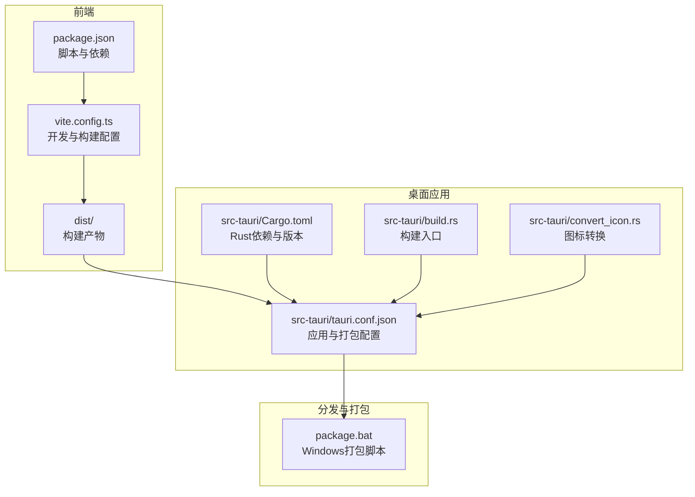
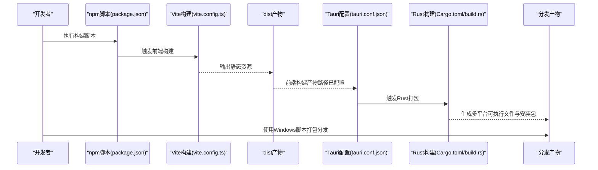
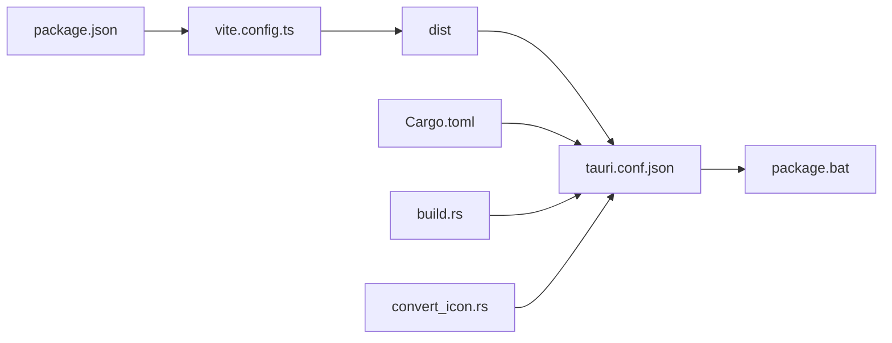

# 分发渠道

<cite>
**本文引用的文件**
- [package.json](file://package.json)
- [vite.config.ts](file://vite.config.ts)
- [src-tauri/tauri.conf.json](file://src-tauri/tauri.conf.json)
- [src-tauri/Cargo.toml](file://src-tauri/Cargo.toml)
- [src-tauri/build.rs](file://src-tauri/build.rs)
- [src-tauri/convert_icon.rs](file://src-tauri/convert_icon.rs)
- [src/api/tauri-api.ts](file://src/api/tauri-api.ts)
- [src/api/config-api.ts](file://src/api/config-api.ts)
- [src/config/app-settings.ts](file://src/config/app-settings.ts)
- [package.bat](file://package.bat)
- [README.md](file://README.md)
</cite>

## 目录
1. [简介](#简介)
2. [项目结构](#项目结构)
3. [核心组件](#核心组件)
4. [架构总览](#架构总览)
5. [详细组件分析](#详细组件分析)
6. [依赖关系分析](#依赖关系分析)
7. [性能考虑](#性能考虑)
8. [故障排除指南](#故障排除指南)
9. [结论](#结论)
10. [附录](#附录)

## 简介
本指南面向Malou Agent的应用分发场景，结合仓库中的构建与打包配置，提供从应用商店到自托管分发的完整落地建议。Malou Agent采用Tauri + Vue 3技术栈，前端通过Vite构建，后端以Rust实现，并在Tauri配置中声明了跨平台打包目标。当前仓库未包含内置的自动更新机制或版本发布流程代码，因此本指南将围绕现有配置进行扩展性设计，帮助团队建立标准化的分发与版本管理流程。

## 项目结构
Malou Agent的分发相关能力主要由以下部分构成：
- 前端构建与打包：Vite配置、Vue组件与脚本命令
- 桌面应用打包：Tauri配置、Rust依赖与构建脚本
- 版本与标识：前端与后端的版本号与产品标识
- 自动化打包：Windows平台的批处理脚本

**图表来源**
- [package.json](file://package.json#L1-L31)
- [vite.config.ts](file://vite.config.ts#L1-L17)
- [src-tauri/tauri.conf.json](file://src-tauri/tauri.conf.json#L1-L32)
- [src-tauri/Cargo.toml](file://src-tauri/Cargo.toml#L1-L25)
- [src-tauri/build.rs](file://src-tauri/build.rs#L1-L3)
- [src-tauri/convert_icon.rs](file://src-tauri/convert_icon.rs#L1-L95)
- [package.bat](file://package.bat#L1-L42)

**章节来源**
- [package.json](file://package.json#L1-L31)
- [vite.config.ts](file://vite.config.ts#L1-L17)
- [src-tauri/tauri.conf.json](file://src-tauri/tauri.conf.json#L1-L32)
- [src-tauri/Cargo.toml](file://src-tauri/Cargo.toml#L1-L25)
- [src-tauri/build.rs](file://src-tauri/build.rs#L1-L3)
- [src-tauri/convert_icon.rs](file://src-tauri/convert_icon.rs#L1-L95)
- [package.bat](file://package.bat#L1-L42)

## 核心组件
- 前端构建与脚本
  - package.json中定义了开发、构建、预览以及Tauri相关脚本，用于启动Vite开发服务器、生成生产构建以及调用Tauri CLI进行桌面应用开发与打包。
- Tauri应用配置
  - tauri.conf.json声明了产品名称、版本、应用标识符、前端构建产物路径以及打包目标为“all”，表明支持多平台打包。
- Rust后端与依赖
  - Cargo.toml定义了应用版本、许可证、依赖项（如tauri、reqwest、rusqlite等），为桌面应用提供系统级能力与本地存储。
- 图标与构建入口
  - convert_icon.rs负责将JPG转为ICO；build.rs作为Tauri构建入口，配合tauri.conf.json完成打包。
- Windows打包脚本
  - package.bat用于复制可执行文件、DLL依赖、创建快捷方式与说明文件，便于快速产出可分发的Windows安装包。

**章节来源**
- [package.json](file://package.json#L6-L12)
- [src-tauri/tauri.conf.json](file://src-tauri/tauri.conf.json#L1-L32)
- [src-tauri/Cargo.toml](file://src-tauri/Cargo.toml#L1-L25)
- [src-tauri/convert_icon.rs](file://src-tauri/convert_icon.rs#L1-L95)
- [src-tauri/build.rs](file://src-tauri/build.rs#L1-L3)
- [package.bat](file://package.bat#L1-L42)

## 架构总览
下图展示了Malou Agent从开发到分发的关键流程：前端构建产物进入Tauri配置，随后由Rust后端与构建脚本生成多平台可执行文件与安装包；Windows平台可通过批处理脚本快速产出可分发版本。

**图表来源**
- [package.json](file://package.json#L6-L12)
- [vite.config.ts](file://vite.config.ts#L1-L17)
- [src-tauri/tauri.conf.json](file://src-tauri/tauri.conf.json#L5-L9)
- [src-tauri/Cargo.toml](file://src-tauri/Cargo.toml#L1-L25)
- [src-tauri/build.rs](file://src-tauri/build.rs#L1-L3)
- [package.bat](file://package.bat#L1-L42)

## 详细组件分析

### 前端构建与分发准备
- 构建流程
  - 通过Vite配置与package.json脚本，前端在本地开发与生产构建阶段均能稳定输出静态资源，供Tauri在打包时引用。
- 版本与标识
  - package.json中的version字段用于前端版本标识；Tauri配置中的version字段用于桌面应用版本标识。两者应保持一致或遵循统一的版本策略。
- 开发与预览
  - 本地开发服务器端口与严格端口策略在vite.config.ts中定义，便于调试与联调。

**章节来源**
- [package.json](file://package.json#L6-L12)
- [vite.config.ts](file://vite.config.ts#L13-L16)
- [src-tauri/tauri.conf.json](file://src-tauri/tauri.conf.json#L2-L3)

### Tauri应用打包与多平台支持
- 打包目标
  - tauri.conf.json中bundle.targets为“all”，表示将生成多平台安装包（Windows、macOS、Linux）。实际生成的平台取决于构建环境与Tauri CLI支持情况。
- 应用元数据
  - productName、version、identifier等字段用于应用商店与系统识别。
- 前端产物路径
  - frontendDist指向dist目录，确保打包时能正确合并前端构建产物。

**章节来源**
- [src-tauri/tauri.conf.json](file://src-tauri/tauri.conf.json#L25-L31)

### Rust后端与依赖
- 依赖与功能
  - Cargo.toml中包含tauri、reqwest、rusqlite等依赖，分别提供桌面框架、HTTP客户端与SQLite本地存储能力，支撑Malou Agent的核心功能。
- 版本与许可证
  - 版本字段与许可证信息用于合规与审计。

**章节来源**
- [src-tauri/Cargo.toml](file://src-tauri/Cargo.toml#L1-L25)

### 图标与构建入口
- 图标转换
  - convert_icon.rs将JPG转换为ICO，支持多尺寸，满足不同平台与主题下的图标需求。
- 构建入口
  - build.rs调用tauri_build::build，作为Rust侧的构建入口，配合Tauri配置完成打包。

**章节来源**
- [src-tauri/convert_icon.rs](file://src-tauri/convert_icon.rs#L1-L95)
- [src-tauri/build.rs](file://src-tauri/build.rs#L1-L3)

### Windows打包脚本
- 功能概述
  - package.bat负责复制可执行文件与DLL、创建快捷方式、生成说明文件，形成可直接分发的Windows安装包。
- 使用建议
  - 在CI/CD流水线中可复用该脚本，或将其改造为更通用的打包模板。

**章节来源**
- [package.bat](file://package.bat#L1-L42)

### 版本管理与更新通知（基于现有配置的扩展建议）
- 当前状态
  - 仓库未包含内置的自动更新机制或版本发布流程代码。前端与后端的版本号分别由package.json与tauri.conf.json/Cargo.toml维护。
- 建议策略
  - 语义化版本控制：遵循主版本.次版本.修订号的规则，结合功能迭代与破坏性变更决定版本号升级维度。
  - 更新通知机制：可在应用启动时检查远程版本信息（例如通过GitHub Releases API），并在UI中提示用户更新。
  - 发布节奏：建议固定发布周期（如每月一次稳定版），并保留热修复版本以应对紧急问题。
- 注意事项
  - 由于当前未实现自动更新，建议在应用设置中提供“检查更新”按钮，并引导用户前往官网或应用商店下载最新版本。

**章节来源**
- [package.json](file://package.json#L4)
- [src-tauri/tauri.conf.json](file://src-tauri/tauri.conf.json#L3)
- [src-tauri/Cargo.toml](file://src-tauri/Cargo.toml#L3)

### 配置管理与分发（基于现有配置的扩展建议）
- 配置同步
  - 前端通过config-api.ts与后端交互，实现配置的获取、更新与事件监听；同时存在配置同步管理器，定期拉取后端配置并与前端状态保持一致。
- 分发建议
  - 在分发版本中，建议将默认配置与用户配置分离，避免覆盖用户个性化设置。
  - 对于企业内部分发，可提供“企业配置模板”并在首次运行时导入，减少初始配置成本。

**章节来源**
- [src/api/config-api.ts](file://src/api/config-api.ts#L1-L201)
- [src/config/app-settings.ts](file://src/config/app-settings.ts#L1-L195)

## 依赖关系分析
Malou Agent的分发链路涉及多个组件之间的耦合与协作，下图展示关键依赖关系：

**图表来源**
- [package.json](file://package.json#L1-L31)
- [vite.config.ts](file://vite.config.ts#L1-L17)
- [src-tauri/tauri.conf.json](file://src-tauri/tauri.conf.json#L1-L32)
- [src-tauri/Cargo.toml](file://src-tauri/Cargo.toml#L1-L25)
- [src-tauri/build.rs](file://src-tauri/build.rs#L1-L3)
- [src-tauri/convert_icon.rs](file://src-tauri/convert_icon.rs#L1-L95)
- [package.bat](file://package.bat#L1-L42)

**章节来源**
- [package.json](file://package.json#L1-L31)
- [vite.config.ts](file://vite.config.ts#L1-L17)
- [src-tauri/tauri.conf.json](file://src-tauri/tauri.conf.json#L1-L32)
- [src-tauri/Cargo.toml](file://src-tauri/Cargo.toml#L1-L25)
- [src-tauri/build.rs](file://src-tauri/build.rs#L1-L3)
- [src-tauri/convert_icon.rs](file://src-tauri/convert_icon.rs#L1-L95)
- [package.bat](file://package.bat#L1-L42)

## 性能考虑
- 构建性能
  - 前端构建与打包应尽量避免不必要的依赖与大体积资源，以缩短CI/CD时间。
- 打包体积
  - 在Tauri配置中合理选择打包目标与资源裁剪策略，有助于减小安装包体积。
- 启动速度
  - 将非关键资源延迟加载，优化首屏渲染与功能初始化顺序，提升用户体验。

## 故障排除指南
- 构建失败
  - 检查Vite与Tauri的版本兼容性，确保前端构建产物路径与tauri.conf.json一致。
- 打包异常
  - 确认Rust工具链与Tauri CLI已正确安装；核对图标转换脚本与构建入口是否正常执行。
- Windows分发问题
  - 使用package.bat确认可执行文件与依赖复制无误，快捷方式与说明文件生成正常。

**章节来源**
- [vite.config.ts](file://vite.config.ts#L1-L17)
- [src-tauri/tauri.conf.json](file://src-tauri/tauri.conf.json#L5-L9)
- [src-tauri/convert_icon.rs](file://src-tauri/convert_icon.rs#L83-L95)
- [package.bat](file://package.bat#L1-L42)

## 结论
Malou Agent具备良好的跨平台桌面应用分发基础：前端构建与Tauri打包配置清晰，Rust后端提供了必要的系统能力。当前仓库未内置自动更新与应用商店提交流程代码，建议在现有配置基础上补充版本管理策略、更新通知机制与分发脚本，以形成完整的发布与运维闭环。对于应用商店与自托管分发，可参考本指南的扩展建议，结合团队的实际合规与安全要求进行落地。

## 附录
- 快速开始与开发指引可参考项目自述文件，其中包含安装、开发与构建的基本命令与项目结构说明。

**章节来源**
- [README.md](file://README.md#L1-L76)