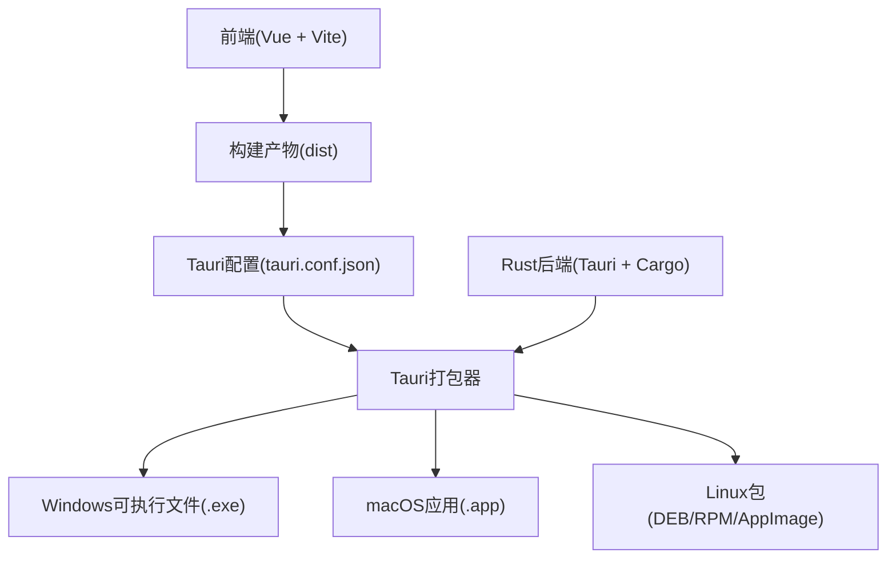
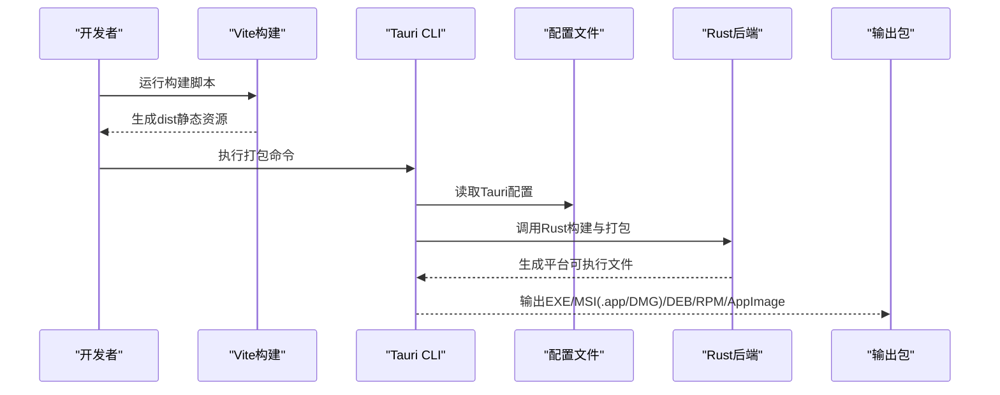
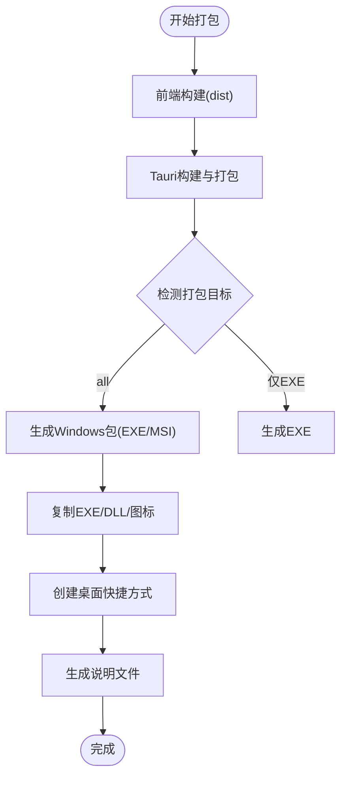
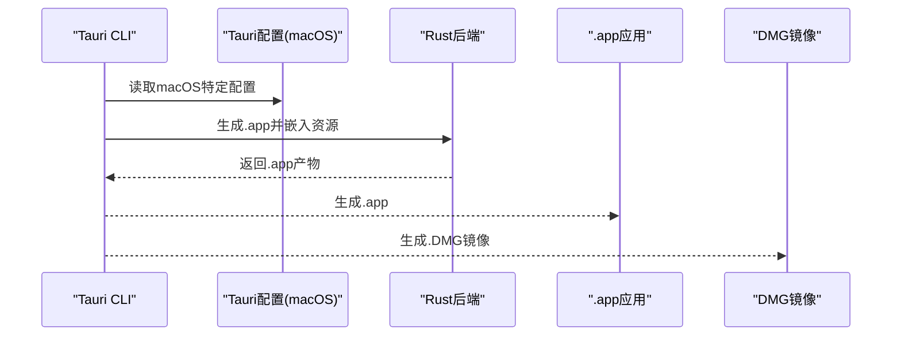
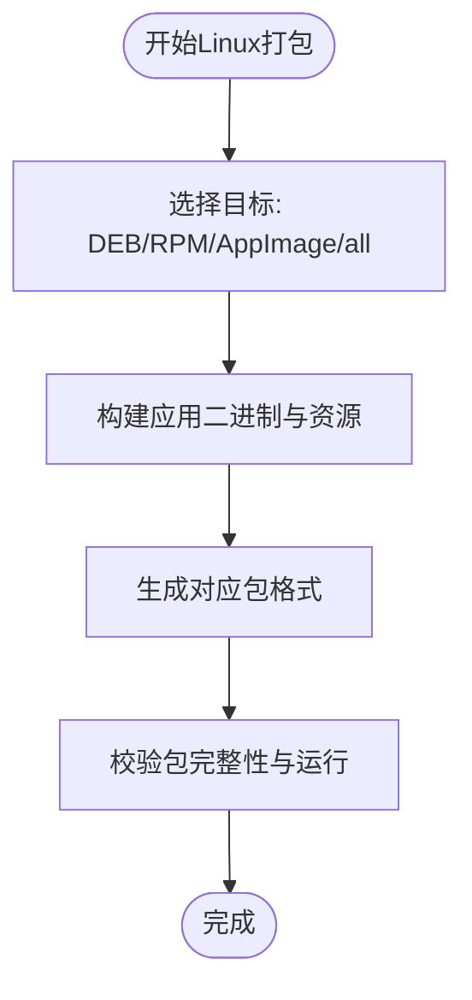
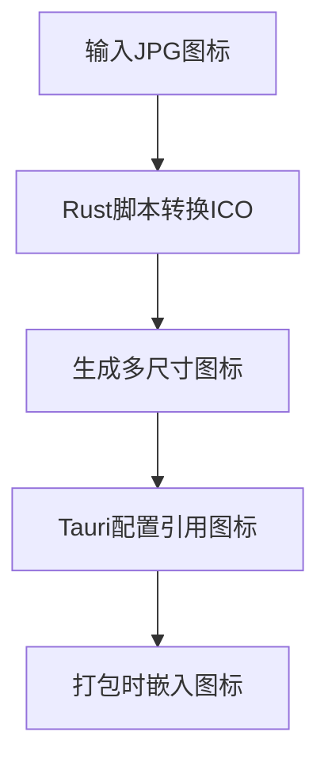
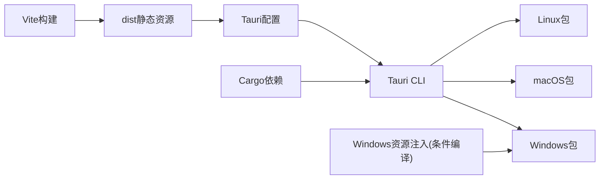

# 平台打包

<cite>
**本文引用的文件**
- [package.json](file://package.json)
- [vite.config.ts](file://vite.config.ts)
- [src-tauri/tauri.conf.json](file://src-tauri/tauri.conf.json)
- [src-tauri/Cargo.toml](file://src-tauri/Cargo.toml)
- [src-tauri/build.rs](file://src-tauri/build.rs)
- [src-tauri/convert_icon.rs](file://src-tauri/convert_icon.rs)
- [package.bat](file://package.bat)
- [README.md](file://README.md)
- [src-tauri/Cargo.backup.toml](file://src-tauri/Cargo.backup.toml)
- [src-tauri/gen/schemas/desktop-schema.json](file://src-tauri/gen/schemas/desktop-schema.json)
- [src-tauri/gen/schemas/windows-schema.json](file://src-tauri/gen/schemas/windows-schema.json)
- [@tauri-apps/cli 配置模式](file://node_modules/@tauri-apps/cli/config.schema.json)
</cite>

## 目录
1. [简介](#简介)
2. [项目结构](#项目结构)
3. [核心组件](#核心组件)
4. [架构总览](#架构总览)
5. [详细组件分析](#详细组件分析)
6. [依赖关系分析](#依赖关系分析)
7. [性能考虑](#性能考虑)
8. [故障排查指南](#故障排查指南)
9. [结论](#结论)
10. [附录](#附录)

## 简介
本指南面向Malou Agent的多平台打包需求，结合现有配置与脚本，系统说明Windows EXE/MSI、macOS .app/DMG以及Linux DEB/RPM/AppImage的打包流程、图标与系统集成配置、平台兼容性测试与验证方法，并给出交叉编译与CI/CD中的平台特定构建策略建议。Malou Agent基于Tauri v2 + Vue 3，前端通过Vite构建，后端使用Rust，最终由Tauri CLI进行跨平台打包。

## 项目结构
Malou Agent采用“前端(Vue + Vite) + 后端(Rust + Tauri)”的双层架构，打包相关的关键位置如下：
- 前端构建：Vite配置与构建脚本
- 应用配置：Tauri配置文件与Rust Cargo配置
- 打包脚本：Windows打包批处理脚本
- 图标转换：Rust图标转换工具

图表来源
- [vite.config.ts](file://vite.config.ts#L1-L17)
- [package.json](file://package.json#L6-L12)
- [src-tauri/tauri.conf.json](file://src-tauri/tauri.conf.json#L1-L32)
- [src-tauri/Cargo.toml](file://src-tauri/Cargo.toml#L1-L25)

章节来源
- [README.md](file://README.md#L1-L76)
- [vite.config.ts](file://vite.config.ts#L1-L17)
- [package.json](file://package.json#L6-L12)
- [src-tauri/tauri.conf.json](file://src-tauri/tauri.conf.json#L1-L32)
- [src-tauri/Cargo.toml](file://src-tauri/Cargo.toml#L1-L25)

## 核心组件
- 前端构建与预览：Vite提供开发服务器与生产构建；Vue组件与路由构成用户界面。
- 应用配置与打包：Tauri配置文件定义产品名称、版本、窗口属性、安全策略与打包目标；Cargo配置声明Rust依赖与条件编译。
- 打包脚本：Windows平台提供批处理脚本，复制可执行文件与DLL、生成快捷方式与说明文件。
- 图标与资源：图标转换工具支持从JPG生成ICO；Tauri配置中声明多尺寸图标与资源路径。

章节来源
- [vite.config.ts](file://vite.config.ts#L1-L17)
- [package.json](file://package.json#L6-L12)
- [src-tauri/tauri.conf.json](file://src-tauri/tauri.conf.json#L1-L32)
- [src-tauri/Cargo.toml](file://src-tauri/Cargo.toml#L1-L25)
- [package.bat](file://package.bat#L1-L42)
- [src-tauri/convert_icon.rs](file://src-tauri/convert_icon.rs#L1-L95)

## 架构总览
下图展示从前端构建到多平台打包的整体流程，以及关键配置与脚本的作用点。

图表来源
- [package.json](file://package.json#L6-L12)
- [src-tauri/tauri.conf.json](file://src-tauri/tauri.conf.json#L1-L32)
- [src-tauri/Cargo.toml](file://src-tauri/Cargo.toml#L1-L25)

## 详细组件分析

### Windows 打包（EXE/MSI）
- 可执行文件与依赖
  - 构建产物位于Rust目标目录，Windows平台默认生成可执行文件与运行时DLL。
  - 批处理脚本负责复制EXE与DLL、创建桌面快捷方式、生成说明文件。
- 安装与系统集成
  - 当前配置启用全平台打包目标，MSI属于可用目标之一。
  - 可通过Tauri配置扩展安装器元数据（如主页、许可证、图标）以提升安装体验。
- 图标与版本信息
  - Tauri配置中已声明ICO图标路径；Rust侧可通过条件编译注入版本信息与原始文件名。

图表来源
- [package.json](file://package.json#L6-L12)
- [src-tauri/tauri.conf.json](file://src-tauri/tauri.conf.json#L25-L31)
- [package.bat](file://package.bat#L1-L42)
- [src-tauri/Cargo.backup.toml](file://src-tauri/Cargo.backup.toml#L117-L120)

章节来源
- [package.json](file://package.json#L6-L12)
- [src-tauri/tauri.conf.json](file://src-tauri/tauri.conf.json#L25-L31)
- [package.bat](file://package.bat#L1-L42)
- [src-tauri/Cargo.backup.toml](file://src-tauri/Cargo.backup.toml#L117-L120)

### macOS 打包（.app/DMG）
- 应用包(.app)与DMG镜像
  - Tauri配置启用全平台打包，.app与DMG为目标之一；可进一步通过平台特定配置完善Info.plist与沙盒权限。
- Info.plist与沙盒权限
  - 可在平台特定配置中设置CFBundle标识、版本号、权限描述与沙盒策略，确保应用通过审核与系统信任。
- 图标与资源
  - Tauri配置中声明了ICNS图标路径，配合Rust侧资源打包，保证应用商店与Finder显示一致。

图表来源
- [src-tauri/tauri.conf.json](file://src-tauri/tauri.conf.json#L25-L31)
- [src-tauri/Cargo.backup.toml](file://src-tauri/Cargo.backup.toml#L127-L133)
- [@tauri-apps/cli 配置模式](file://node_modules/@tauri-apps/cli/config.schema.json#L2082-L2083)

章节来源
- [src-tauri/tauri.conf.json](file://src-tauri/tauri.conf.json#L25-L31)
- [src-tauri/Cargo.backup.toml](file://src-tauri/Cargo.backup.toml#L127-L133)
- [@tauri-apps/cli 配置模式](file://node_modules/@tauri-apps/cli/config.schema.json#L2082-L2083)

### Linux 打包（DEB/RPM/AppImage）
- 包类型与目标
  - Tauri配置支持DEB、RPM、AppImage等目标；也可选择“all”自动输出全部可用包。
- 资源与依赖
  - 可通过资源列表嵌入模型与配置文件，确保应用启动时具备必要资源。
- 交叉编译与发行版适配
  - 建议在CI中针对不同Linux发行版分别构建，或使用AppImage以降低发行版差异影响。

图表来源
- [src-tauri/tauri.conf.json](file://src-tauri/tauri.conf.json#L25-L31)
- [@tauri-apps/cli 配置模式](file://node_modules/@tauri-apps/cli/config.schema.json#L2082-L2083)
- [@tauri-apps/cli 配置模式](file://node_modules/@tauri-apps/cli/config.schema.json#L2123-L2148)

章节来源
- [src-tauri/tauri.conf.json](file://src-tauri/tauri.conf.json#L25-L31)
- [@tauri-apps/cli 配置模式](file://node_modules/@tauri-apps/cli/config.schema.json#L2082-L2083)
- [@tauri-apps/cli 配置模式](file://node_modules/@tauri-apps/cli/config.schema.json#L2123-L2148)

### 图标与资源
- 图标生成
  - 提供Rust脚本将JPG转为ICO，支持多尺寸；可在构建前生成所需图标集。
- 资源打包
  - Tauri配置中声明资源路径，Rust侧可按需嵌入模型与配置文件，确保应用运行时可用。

图表来源
- [src-tauri/convert_icon.rs](file://src-tauri/convert_icon.rs#L1-L95)
- [src-tauri/tauri.conf.json](file://src-tauri/tauri.conf.json#L28-L30)
- [src-tauri/Cargo.backup.toml](file://src-tauri/Cargo.backup.toml#L136-L139)

章节来源
- [src-tauri/convert_icon.rs](file://src-tauri/convert_icon.rs#L1-L95)
- [src-tauri/tauri.conf.json](file://src-tauri/tauri.conf.json#L28-L30)
- [src-tauri/Cargo.backup.toml](file://src-tauri/Cargo.backup.toml#L136-L139)

### 平台兼容性测试与验证
- 平台目标枚举
  - Tauri配置中包含平台目标枚举，用于约束与识别支持的平台。
- 建议的测试策略
  - 在各目标平台运行应用，验证窗口尺寸、图标显示、资源加载与基本功能。
  - 对Windows安装器进行静默安装与卸载测试，对macOS DMG进行挂载与拖拽安装验证，对Linux包进行依赖冲突检查。

章节来源
- [src-tauri/gen/schemas/desktop-schema.json](file://src-tauri/gen/schemas/desktop-schema.json#L2203-L2244)
- [src-tauri/gen/schemas/windows-schema.json](file://src-tauri/gen/schemas/windows-schema.json#L2203-L2244)

## 依赖关系分析
- 前端依赖于Vite与Vue生态；后端依赖于Tauri与Rust标准库及第三方库。
- Tauri配置决定打包目标与资源嵌入；Rust条件编译影响Windows资源注入。
- 打包脚本与配置共同决定Windows产物形态。

图表来源
- [package.json](file://package.json#L6-L12)
- [src-tauri/tauri.conf.json](file://src-tauri/tauri.conf.json#L1-L32)
- [src-tauri/Cargo.toml](file://src-tauri/Cargo.toml#L1-L25)
- [src-tauri/Cargo.backup.toml](file://src-tauri/Cargo.backup.toml#L117-L120)

章节来源
- [package.json](file://package.json#L6-L12)
- [src-tauri/tauri.conf.json](file://src-tauri/tauri.conf.json#L1-L32)
- [src-tauri/Cargo.toml](file://src-tauri/Cargo.toml#L1-L25)
- [src-tauri/Cargo.backup.toml](file://src-tauri/Cargo.backup.toml#L117-L120)

## 性能考虑
- 构建优化
  - 前端构建使用Vite，具备快速热更新与生产优化能力；建议在CI中缓存依赖与构建产物以缩短时间。
  - Rust发布配置采用薄链接与单代码单元，有利于减小体积与提升启动速度。
- 打包体积
  - 通过资源嵌入与图标尺寸控制，避免冗余资源进入包体；对模型与配置文件按需打包。
- 平台差异
  - 不同平台的打包器与安装器对体积与启动时间存在差异，建议在各平台进行基准测试。

章节来源
- [vite.config.ts](file://vite.config.ts#L1-L17)
- [src-tauri/Cargo.toml](file://src-tauri/Cargo.toml#L1-L25)
- [src-tauri/Cargo.backup.toml](file://src-tauri/Cargo.backup.toml#L87-L97)

## 故障排查指南
- Windows打包问题
  - 若缺少运行时DLL，检查批处理脚本是否正确复制；确认Rust目标目录产物完整。
  - 安装器无法生成：确认Tauri配置targets包含MSI，或在CI中安装对应打包依赖。
- macOS签名与沙盒
  - 若应用无法通过Gatekeeper或沙盒限制导致功能异常，检查Info.plist与权限配置。
- Linux包冲突
  - DEB/RPM可能因系统依赖缺失导致安装失败，建议在CI中使用容器镜像进行多发行版测试。
- 资源加载失败
  - 确认资源路径与嵌入规则一致；检查Tauri配置中的资源列表与Rust侧打包逻辑。

章节来源
- [package.bat](file://package.bat#L1-L42)
- [src-tauri/tauri.conf.json](file://src-tauri/tauri.conf.json#L25-L31)
- [@tauri-apps/cli 配置模式](file://node_modules/@tauri-apps/cli/config.schema.json#L2123-L2148)

## 结论
Malou Agent已具备跨平台打包的基础能力：前端通过Vite构建，后端通过Tauri与Rust打包，配置文件统一管理打包目标与资源。建议在现有基础上补充平台特定配置（如macOS Info.plist与沙盒权限、Linux资源清单），并在CI中实施多平台构建与测试，以确保各平台的稳定性与一致性。

## 附录
- 关键命令与路径
  - 前端构建：参考脚本路径与Vite配置
  - 应用开发/构建：参考Tauri CLI命令
  - Windows打包：参考批处理脚本
  - 配置文件：参考Tauri配置与Cargo配置
- 平台特定配置要点
  - Windows：安装器目标、版本信息注入、图标路径
  - macOS：应用标识、版本号、沙盒权限、ICNS图标
  - Linux：包类型、资源嵌入、许可证与主页

章节来源
- [package.json](file://package.json#L6-L12)
- [vite.config.ts](file://vite.config.ts#L1-L17)
- [package.bat](file://package.bat#L1-L42)
- [src-tauri/tauri.conf.json](file://src-tauri/tauri.conf.json#L1-L32)
- [src-tauri/Cargo.toml](file://src-tauri/Cargo.toml#L1-L25)
- [src-tauri/Cargo.backup.toml](file://src-tauri/Cargo.backup.toml#L117-L139)
- [@tauri-apps/cli 配置模式](file://node_modules/@tauri-apps/cli/config.schema.json#L2082-L2083)