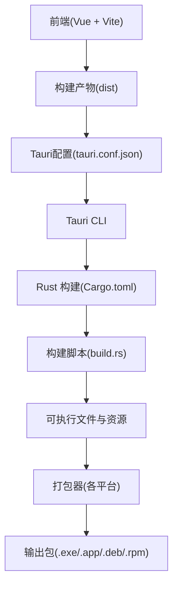
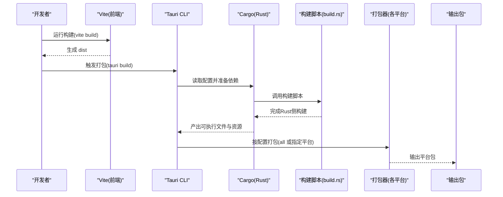
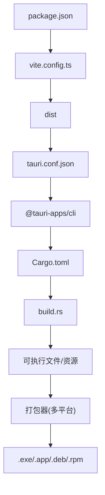

# 打包与分发

<cite>
**本文引用的文件**
- [package.json](file://package.json)
- [vite.config.ts](file://vite.config.ts)
- [src-tauri/tauri.conf.json](file://src-tauri/tauri.conf.json)
- [src-tauri/Cargo.toml](file://src-tauri/Cargo.toml)
- [src-tauri/build.rs](file://src-tauri/build.rs)
- [src-tauri/convert_icon.rs](file://src-tauri/convert_icon.rs)
- [package.bat](file://package.bat)
- [src-tauri/Cargo.backup.toml](file://src-tauri/Cargo.backup.toml)
- [@tauri-apps/cli 配置模式](file://node_modules/@tauri-apps/cli/config.schema.json)
</cite>

## 目录
1. [简介](#简介)
2. [项目结构](#项目结构)
3. [核心组件](#核心组件)
4. [架构总览](#架构总览)
5. [详细组件分析](#详细组件分析)
6. [依赖关系分析](#依赖关系分析)
7. [性能考量](#性能考量)
8. [故障排查指南](#故障排查指南)
9. [结论](#结论)
10. [附录](#附录)

## 简介
本指南面向Malou Agent的打包与分发，围绕Tauri应用的跨平台打包流程展开，覆盖多平台配置、图标与元数据管理、签名机制、自动化脚本与CI/CD集成、分发渠道选择以及版本与更新策略。文档基于仓库中的现有配置与脚本进行说明，并提供可落地的操作步骤与最佳实践。

## 项目结构
Malou Agent采用前端（Vue + Vite）与后端（Rust + Tauri）分离的结构，打包与分发主要由Tauri CLI驱动，前端产物通过Vite构建生成，随后由Tauri打包为各平台安装包或应用包。

图表来源
- [vite.config.ts](file://vite.config.ts#L1-L17)
- [package.json](file://package.json#L1-L31)
- [src-tauri/tauri.conf.json](file://src-tauri/tauri.conf.json#L1-L32)
- [src-tauri/Cargo.toml](file://src-tauri/Cargo.toml#L1-L25)
- [src-tauri/build.rs](file://src-tauri/build.rs#L1-L3)

章节来源
- [vite.config.ts](file://vite.config.ts#L1-L17)
- [package.json](file://package.json#L1-L31)
- [src-tauri/tauri.conf.json](file://src-tauri/tauri.conf.json#L1-L32)
- [src-tauri/Cargo.toml](file://src-tauri/Cargo.toml#L1-L25)
- [src-tauri/build.rs](file://src-tauri/build.rs#L1-L3)

## 核心组件
- 前端构建与开发服务器：Vite配置负责别名、端口与开发服务器启动。
- 应用元数据与打包配置：Tauri配置文件定义产品名称、版本、窗口属性、打包目标与图标等。
- Rust后端与构建：Cargo清单定义依赖与特性；构建脚本触发Tauri构建流程。
- 图标转换工具：将JPG转为ICO，供Windows平台使用。
- Windows自动化打包脚本：复制二进制与DLL、创建快捷方式与说明文件。

章节来源
- [vite.config.ts](file://vite.config.ts#L1-L17)
- [src-tauri/tauri.conf.json](file://src-tauri/tauri.conf.json#L1-L32)
- [src-tauri/Cargo.toml](file://src-tauri/Cargo.toml#L1-L25)
- [src-tauri/build.rs](file://src-tauri/build.rs#L1-L3)
- [src-tauri/convert_icon.rs](file://src-tauri/convert_icon.rs#L1-L95)
- [package.bat](file://package.bat#L1-L42)

## 架构总览
下图展示从前端构建到多平台打包的整体流程，以及关键配置与脚本的作用点。

图表来源
- [package.json](file://package.json#L6-L12)
- [src-tauri/tauri.conf.json](file://src-tauri/tauri.conf.json#L5-L31)
- [src-tauri/Cargo.toml](file://src-tauri/Cargo.toml#L1-L25)
- [src-tauri/build.rs](file://src-tauri/build.rs#L1-L3)

## 详细组件分析

### 前端构建与开发服务器
- 别名与端口：通过Vite配置设置路径别名与开发服务器端口，便于统一开发体验。
- 开发与预览：提供开发与预览命令，确保前端资源正确加载。

章节来源
- [vite.config.ts](file://vite.config.ts#L1-L17)
- [package.json](file://package.json#L6-L12)

### 应用元数据与打包配置
- 产品与版本：在Tauri配置中设置产品名称、版本与应用标识符，用于各平台包的元数据。
- 前端资源：通过构建配置指向dist目录，使打包时嵌入前端静态资源。
- 窗口与安全：定义主窗口尺寸、可调整性与安全策略（如CSP）。
- 打包目标：当前配置为“全部平台”，可按需改为具体目标（如“all”、“nsis”、“appimage”、“deb”、“rpm”）。
- 图标：配置图标数组，包含Windows ICO与macOS ICNS等格式。

章节来源
- [src-tauri/tauri.conf.json](file://src-tauri/tauri.conf.json#L1-L32)

### Rust后端与构建
- 依赖与特性：Cargo清单声明Tauri、数据库、HTTP客户端等依赖，以及SQLite捆绑特性。
- 构建脚本：调用Tauri构建流程，生成平台相关二进制与资源。
- 版本与描述：Cargo清单中的版本与描述用于包元数据。

章节来源
- [src-tauri/Cargo.toml](file://src-tauri/Cargo.toml#L1-L25)
- [src-tauri/build.rs](file://src-tauri/build.rs#L1-L3)

### 图标转换工具
- 功能：将JPG图像转换为ICO，包含多尺寸以适配不同显示密度。
- 位置：生成图标文件至icons目录，供打包配置引用。

章节来源
- [src-tauri/convert_icon.rs](file://src-tauri/convert_icon.rs#L1-L95)

### Windows自动化打包脚本
- 目标：复制可执行文件与DLL、创建桌面快捷方式、生成说明文件，形成可分发的最小集合。
- 使用：在本地或CI中运行批处理脚本，快速产出Windows可执行包。

章节来源
- [package.bat](file://package.bat#L1-L42)

### 平台差异与打包目标
- Windows：默认生成EXE安装包（NSIS），也可生成MSI；可配置证书指纹与时间戳。
- macOS：默认生成.app应用包，可配置框架、最低系统版本等。
- Linux：可生成DEB、RPM、AppImage等，可配置系统依赖（如GTK/WebKit库）。

章节来源
- [@tauri-apps/cli 配置模式](file://node_modules/@tauri-apps/cli/config.schema.json#L2083-L2083)
- [src-tauri/Cargo.backup.toml](file://src-tauri/Cargo.backup.toml#L149-L159)

### 应用签名机制
- Windows签名：可通过证书指纹与摘要算法配置签名；可选自定义签名命令。
- macOS签名：通常需要Apple开发者账号与证书，配置最低系统版本与框架。
- Linux签名：一般不强制签名，但可对DEB/RPM包进行校验与发布。

章节来源
- [@tauri-apps/cli 配置模式](file://node_modules/@tauri-apps/cli/config.schema.json#L131-L134)
- [src-tauri/Cargo.backup.toml](file://src-tauri/Cargo.backup.toml#L155-L159)

### 自动化打包脚本与CI/CD集成
- 前端构建：在CI中先执行前端构建，生成dist。
- Tauri打包：调用Tauri CLI进行多平台打包，或针对特定平台生成包。
- 资源与元数据：确保图标、版本、描述、许可证等在配置中正确维护。
- 产物归档：将生成的安装包上传至制品库或发布页面。

章节来源
- [package.json](file://package.json#L6-L12)
- [@tauri-apps/cli 配置模式](file://node_modules/@tauri-apps/cli/config.schema.json#L2078-L2083)

### 分发渠道与版本管理
- 应用商店：macOS可通过Mac App Store、Windows可通过Microsoft Store等渠道提交；需满足对应审核要求。
- 自托管分发：提供下载链接、变更日志与校验值，便于用户直接下载安装。
- 版本号策略：建议采用语义化版本（MAJOR.MINOR.PATCH），在Tauri配置与Cargo清单中同步维护。
- 更新机制：可结合Tauri Updater插件实现自动更新，或通过外部渠道推送新版本。

章节来源
- [@tauri-apps/cli 配置模式](file://node_modules/@tauri-apps/cli/config.schema.json#L33-L40)
- [src-tauri/Cargo.backup.toml](file://src-tauri/Cargo.backup.toml#L141-L147)

## 依赖关系分析
下图展示前端、Tauri配置、Rust构建与打包器之间的依赖关系。

图表来源
- [package.json](file://package.json#L1-L31)
- [vite.config.ts](file://vite.config.ts#L1-L17)
- [src-tauri/tauri.conf.json](file://src-tauri/tauri.conf.json#L1-L32)
- [src-tauri/Cargo.toml](file://src-tauri/Cargo.toml#L1-L25)
- [src-tauri/build.rs](file://src-tauri/build.rs#L1-L3)

章节来源
- [package.json](file://package.json#L1-L31)
- [vite.config.ts](file://vite.config.ts#L1-L17)
- [src-tauri/tauri.conf.json](file://src-tauri/tauri.conf.json#L1-L32)
- [src-tauri/Cargo.toml](file://src-tauri/Cargo.toml#L1-L25)
- [src-tauri/build.rs](file://src-tauri/build.rs#L1-L3)

## 性能考量
- 构建优化：在Rust配置中合理设置发布配置（如LTO、代码单元数、panic策略），以平衡体积与性能。
- 前端资源：控制dist体积，避免不必要的大文件进入打包范围。
- 打包目标：根据目标平台选择合适的目标（如Linux的AppImage可减少依赖打包）。

章节来源
- [src-tauri/Cargo.backup.toml](file://src-tauri/Cargo.backup.toml#L87-L98)

## 故障排查指南
- 前端构建失败：检查Vite配置与依赖安装，确认端口未被占用。
- Tauri打包失败：核对Tauri配置中的前端资源路径、图标路径与打包目标；确保Rust工具链与平台依赖已安装。
- Windows签名问题：确认证书指纹、摘要算法与时间戳URL配置正确；若使用自定义签名命令，确保命令可用且参数正确。
- Linux依赖缺失：在Cargo备份配置中检查系统依赖列表，确保目标机器具备相应库。

章节来源
- [vite.config.ts](file://vite.config.ts#L13-L16)
- [src-tauri/tauri.conf.json](file://src-tauri/tauri.conf.json#L8-L9)
- [src-tauri/Cargo.backup.toml](file://src-tauri/Cargo.backup.toml#L155-L159)

## 结论
Malou Agent的打包与分发以Tauri为核心，结合Vite前端构建与Rust后端，能够高效生成多平台安装包。通过规范化的配置与脚本，可实现自动化打包与分发。建议在CI/CD中固化流程，完善签名与版本管理，并根据目标平台选择合适的分发渠道。

## 附录
- 快速打包步骤（本地）
  1) 前端构建：执行前端构建命令生成dist。
  2) Tauri打包：执行Tauri打包命令，生成多平台包。
  3) Windows本地打包：运行Windows打包脚本，生成可分发集合。
- CI/CD建议
  - 前端构建阶段：安装依赖并构建dist。
  - 打包阶段：安装Rust工具链与平台依赖，执行Tauri打包。
  - 归档阶段：上传安装包与校验文件至制品库或发布页。

章节来源
- [package.json](file://package.json#L6-L12)
- [package.bat](file://package.bat#L1-L42)