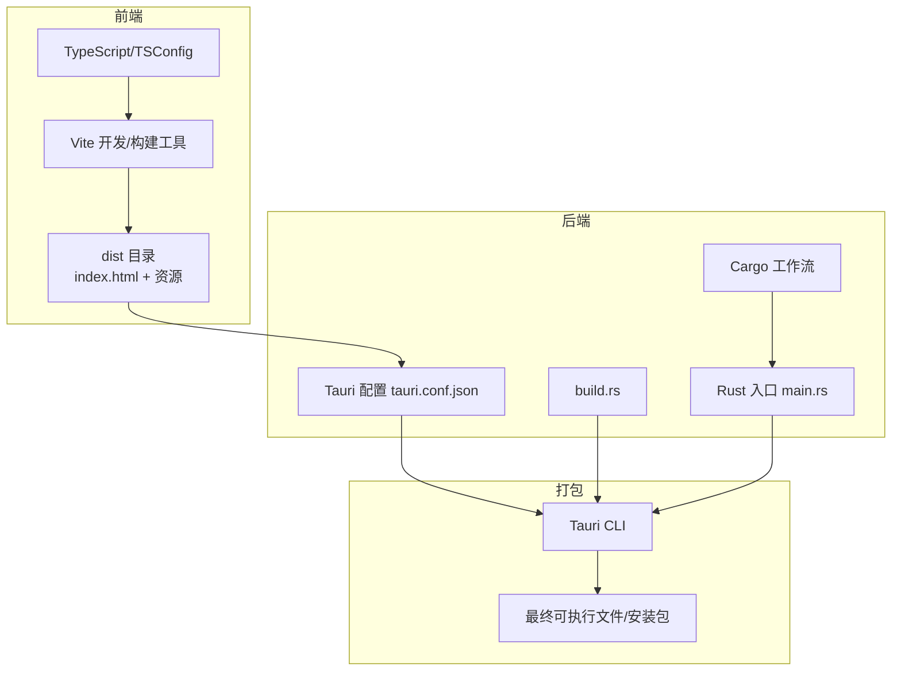
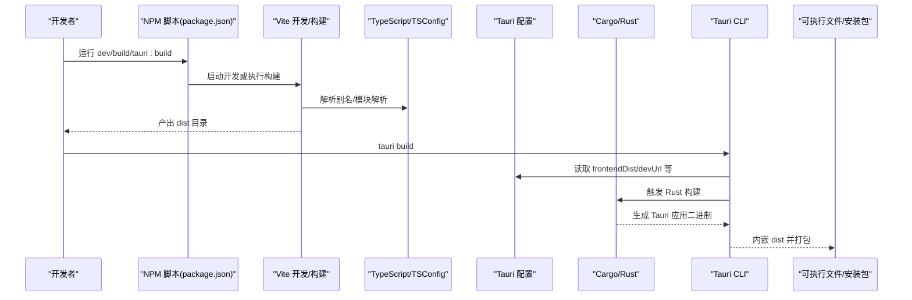
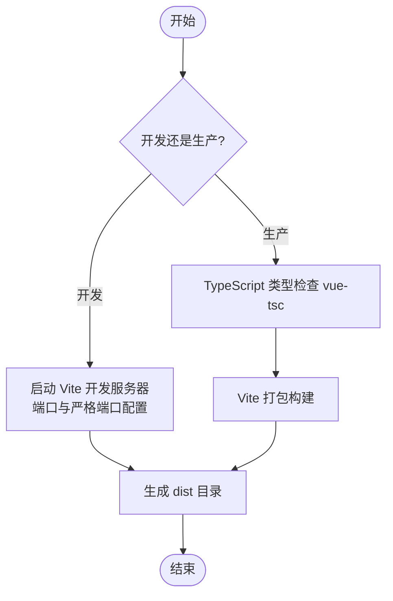
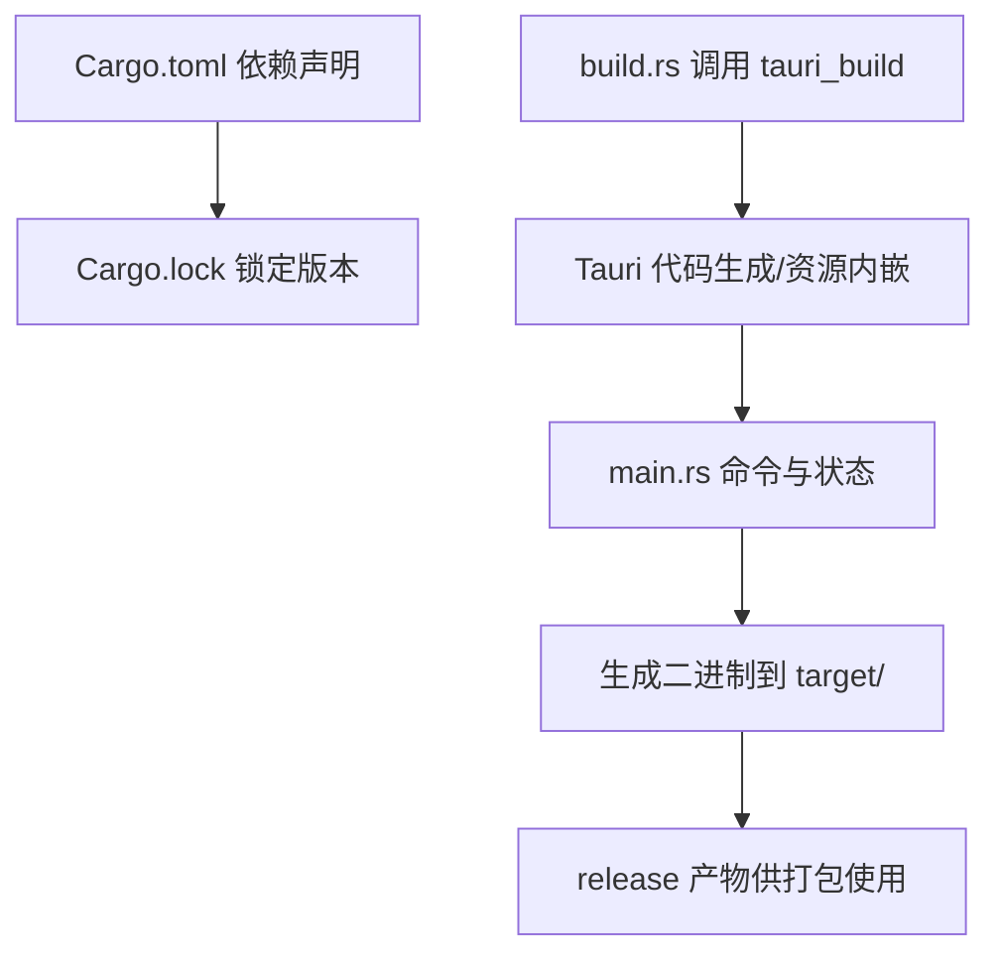
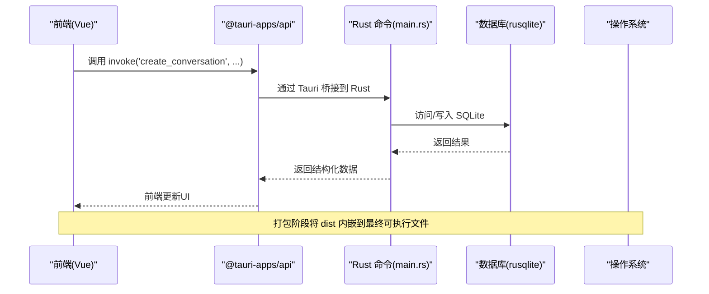
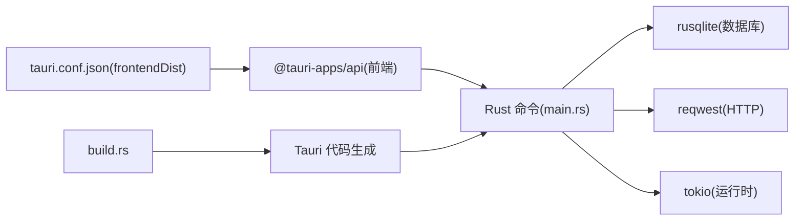

# 构建流程

<cite>
**本文引用的文件**
- [package.json](file://package.json)
- [vite.config.ts](file://vite.config.ts)
- [tsconfig.json](file://tsconfig.json)
- [tsconfig.node.json](file://tsconfig.node.json)
- [src-tauri/Cargo.toml](file://src-tauri/Cargo.toml)
- [src-tauri/Cargo.lock](file://src-tauri/Cargo.lock)
- [src-tauri/tauri.conf.json](file://src-tauri/tauri.conf.json)
- [src-tauri/build.rs](file://src-tauri/build.rs)
- [src-tauri/src/main.rs](file://src-tauri/src/main.rs)
- [.gitignore](file://.gitignore)
- [package.bat](file://package.bat)
- [docs/development-setup.md](file://docs/development-setup.md)
- [docs/configuration-management.md](file://docs/configuration-management.md)
- [docs/testing-and-optimization.md](file://docs/testing-and-optimization.md)
- [TAURI_VUE_INTEGRATION_BEST_PRACTICES.md](file://TAURI_VUE_INTEGRATION_BEST_PRACTICES.md)
</cite>

## 目录
1. [简介](#简介)
2. [项目结构](#项目结构)
3. [核心组件](#核心组件)
4. [架构总览](#架构总览)
5. [详细组件分析](#详细组件分析)
6. [依赖关系分析](#依赖关系分析)
7. [性能考虑](#性能考虑)
8. [故障排查指南](#故障排查指南)
9. [结论](#结论)
10. [附录](#附录)

## 简介
本文件面向Malou Agent项目的构建流程，覆盖前端（Vue 3 + Vite）、后端（Rust + Tauri）以及打包（Tauri bundle）的完整链路。内容包括：
- 前端构建：Vite配置、资源打包与静态文件生成
- 后端编译：Cargo配置、依赖锁定与二进制产物
- Tauri打包：前端资源嵌入、原生API集成与最终可执行文件生成
- 开发与生产构建差异
- 构建优化、缓存与增量构建策略
- 常见问题与排障建议

## 项目结构
Malou Agent采用“前端工程 + Rust后端 + Tauri桥接”的双层架构。前端通过Vite进行开发与构建，产物输出至dist目录；Tauri配置指向该目录作为前端分发源，并在构建时将前端资源内嵌到最终可执行文件中。

图表来源
- [vite.config.ts](file://vite.config.ts#L1-L17)
- [tsconfig.json](file://tsconfig.json#L1-L24)
- [src-tauri/tauri.conf.json](file://src-tauri/tauri.conf.json#L1-L32)
- [src-tauri/build.rs](file://src-tauri/build.rs#L1-L3)
- [src-tauri/src/main.rs](file://src-tauri/src/main.rs#L242-L315)

章节来源
- [package.json](file://package.json#L1-L31)
- [vite.config.ts](file://vite.config.ts#L1-L17)
- [tsconfig.json](file://tsconfig.json#L1-L24)
- [tsconfig.node.json](file://tsconfig.node.json#L1-L11)
- [src-tauri/tauri.conf.json](file://src-tauri/tauri.conf.json#L1-L32)

## 核心组件
- 前端构建工具链
  - Vite：开发服务器、热更新、打包
  - TypeScript：类型检查与编译
  - 脚本入口：package.json中的dev/build/preview/tauri系列命令
- 后端编译与运行
  - Cargo：依赖解析、编译、生成二进制
  - Tauri：窗口、系统集成、命令暴露
  - Rust入口：src-tauri/src/main.rs
- 打包与分发
  - Tauri CLI：根据配置将前端dist内嵌并生成可执行文件
  - 构建脚本：Windows批处理脚本用于复制产物与生成快捷方式

章节来源
- [package.json](file://package.json#L6-L12)
- [src-tauri/src/main.rs](file://src-tauri/src/main.rs#L242-L315)
- [src-tauri/tauri.conf.json](file://src-tauri/tauri.conf.json#L5-L10)
- [package.bat](file://package.bat#L1-L42)

## 架构总览
下图展示从开发到打包的关键步骤与交互：

图表来源
- [package.json](file://package.json#L6-L12)
- [vite.config.ts](file://vite.config.ts#L8-L16)
- [tsconfig.json](file://tsconfig.json#L18-L20)
- [src-tauri/tauri.conf.json](file://src-tauri/tauri.conf.json#L5-L10)
- [src-tauri/src/main.rs](file://src-tauri/src/main.rs#L242-L315)

## 详细组件分析

### 前端构建流程（Vite + TypeScript）
- 开发模式
  - 启动Vite开发服务器，监听端口并提供热更新
  - 别名映射@指向src目录，便于模块导入
- 生产构建
  - 先执行类型检查（vue-tsc），再进行打包（vite build）
  - 输出目录为dist，供Tauri在打包时引用
- TypeScript配置
  - tsconfig.json启用严格模式、模块解析bundler、路径别名
  - tsconfig.node.json用于Vite配置文件的类型检查

图表来源
- [package.json](file://package.json#L6-L12)
- [vite.config.ts](file://vite.config.ts#L13-L16)
- [tsconfig.json](file://tsconfig.json#L1-L24)
- [tsconfig.node.json](file://tsconfig.node.json#L1-L11)

章节来源
- [package.json](file://package.json#L6-L12)
- [vite.config.ts](file://vite.config.ts#L1-L17)
- [tsconfig.json](file://tsconfig.json#L1-L24)
- [tsconfig.node.json](file://tsconfig.node.json#L1-L11)

### Rust后端编译流程（Cargo + Tauri）
- 依赖与特性
  - 顶层依赖：tauri、serde、tokio、uuid、chrono、image、dirs、rusqlite、reqwest
  - 构建依赖：tauri-build
- 构建入口
  - build.rs调用tauri_build::build，驱动Tauri代码生成与资源内嵌
  - main.rs定义命令处理器、应用状态与窗口配置
- 产物与缓存
  - 目标产物位于src-tauri/target/{debug,release}
  - .gitignore排除target与调试符号，避免提交无关文件

图表来源
- [src-tauri/Cargo.toml](file://src-tauri/Cargo.toml#L1-L25)
- [src-tauri/Cargo.lock](file://src-tauri/Cargo.lock#L1-L200)
- [src-tauri/build.rs](file://src-tauri/build.rs#L1-L3)
- [src-tauri/src/main.rs](file://src-tauri/src/main.rs#L242-L315)
- [.gitignore](file://.gitignore#L1-L5)

章节来源
- [src-tauri/Cargo.toml](file://src-tauri/Cargo.toml#L1-L25)
- [src-tauri/Cargo.lock](file://src-tauri/Cargo.lock#L1-L200)
- [src-tauri/build.rs](file://src-tauri/build.rs#L1-L3)
- [src-tauri/src/main.rs](file://src-tauri/src/main.rs#L242-L315)
- [.gitignore](file://.gitignore#L1-L5)

### Tauri 打包机制
- 前端资源嵌入
  - tauri.conf.json中frontendDist指向../dist，打包时将dist内嵌
  - devUrl用于开发模式下前端开发服务器地址
- 原生API集成
  - main.rs中通过#[tauri::command]暴露命令，供前端通过@tauri-apps/api调用
  - 配置管理、数据库操作、会话与消息管理等命令在此注册
- 最终可执行文件生成
  - tauri build触发Rust编译与前端资源内嵌，生成平台对应的应用程序

图表来源
- [src-tauri/tauri.conf.json](file://src-tauri/tauri.conf.json#L5-L10)
- [src-tauri/src/main.rs](file://src-tauri/src/main.rs#L285-L312)

章节来源
- [src-tauri/tauri.conf.json](file://src-tauri/tauri.conf.json#L1-L32)
- [src-tauri/src/main.rs](file://src-tauri/src/main.rs#L60-L312)

### 开发环境与生产环境构建差异
- 开发环境
  - 前端：npm run dev 启动Vite开发服务器，端口3002
  - 后端：在新终端中执行 cargo tauri dev（参考开发文档）
  - 配置：开发文档提供环境变量与调试建议
- 生产环境
  - 前端：npm run build 先类型检查再打包，产物位于dist
  - 后端：tauri build 触发Rust编译与资源内嵌
  - 分发：Windows批处理脚本复制release产物并生成快捷方式与说明

章节来源
- [docs/development-setup.md](file://docs/development-setup.md#L26-L33)
- [package.json](file://package.json#L6-L12)
- [package.bat](file://package.bat#L1-L42)

### 构建优化与性能调优
- 前端侧
  - 使用严格的TS配置与bundler模块解析，减少运行时开销
  - 虚拟滚动与图片懒加载等前端优化策略可降低渲染压力
- 后端侧
  - 合理选择rusqlite的bundled特性，平衡体积与兼容性
  - tokio全栈特性适合高并发IO场景（如HTTP请求）
- 缓存与增量构建
  - Vite具备内置缓存与按需编译能力
  - Cargo通过Cargo.lock固定依赖版本，提升可重复性与增量构建效率
  - .gitignore排除target与调试符号，避免无意义文件进入缓存

章节来源
- [tsconfig.json](file://tsconfig.json#L1-L24)
- [src-tauri/Cargo.toml](file://src-tauri/Cargo.toml#L22-L24)
- [docs/testing-and-optimization.md](file://docs/testing-and-optimization.md#L129-L156)
- [.gitignore](file://.gitignore#L1-L5)

## 依赖关系分析
- 前端对后端的依赖
  - 前端通过@tauri-apps/api调用Rust命令，形成松耦合的桥接层
- 后端对系统的依赖
  - rusqlite负责本地数据库；reqwest负责外部API调用；tokio提供异步运行时
- 打包期依赖
  - tauri.conf.json声明前端分发目录；build.rs驱动Tauri代码生成

图表来源
- [src-tauri/src/main.rs](file://src-tauri/src/main.rs#L285-L312)
- [src-tauri/Cargo.toml](file://src-tauri/Cargo.toml#L12-L24)
- [src-tauri/tauri.conf.json](file://src-tauri/tauri.conf.json#L9-L9)
- [src-tauri/build.rs](file://src-tauri/build.rs#L1-L3)

章节来源
- [src-tauri/src/main.rs](file://src-tauri/src/main.rs#L285-L312)
- [src-tauri/Cargo.toml](file://src-tauri/Cargo.toml#L12-L24)
- [src-tauri/tauri.conf.json](file://src-tauri/tauri.conf.json#L5-L10)
- [src-tauri/build.rs](file://src-tauri/build.rs#L1-L3)

## 性能考虑
- 前端
  - 启用严格TS配置，提前发现类型问题，减少运行时错误
  - 使用别名与模块解析优化，缩短路径查找时间
- 后端
  - 选择合适的Tokio特性与线程池大小，避免过度并发导致上下文切换开销
  - 数据库访问尽量批量化与索引化，减少查询次数
- 打包
  - 将dist内嵌到二进制，减少部署时的文件数量与网络传输
  - Windows批处理脚本仅复制必要文件，避免冗余

[本节为通用指导，无需列出章节来源]

## 故障排查指南
- 常见问题
  - 编译错误：清理缓存后重新安装依赖
  - 数据库问题：删除用户目录下的数据库文件后重启应用
  - Tauri相关问题：更新tauri-cli至最新版本
- 日志与定位
  - 后端控制台日志输出有助于定位Rust侧异常
  - 前端浏览器开发者工具与Vue DevTools辅助定位UI与API调用问题

章节来源
- [docs/development-setup.md](file://docs/development-setup.md#L59-L82)

## 结论
Malou Agent的构建流程清晰地分离了前端与后端职责：前端通过Vite高效产出静态资源，后端通过Tauri桥接原生能力并统一打包。借助严格的TS配置、Cargo锁版本与合理的缓存策略，项目在开发与生产环境下均可获得稳定且可重复的构建体验。后续可在保持现有架构的前提下，进一步探索Vite的预构建与Tauri的权限模型优化，以获得更佳的性能与安全性。

[本节为总结性内容，无需列出章节来源]

## 附录
- 开发与生产命令速查
  - 开发：前端开发服务器、后端开发模式
  - 生产：前端构建、后端打包
- 配置要点
  - 前端别名与端口
  - Tauri前端分发目录与开发URL
  - Rust依赖与构建特性

章节来源
- [package.json](file://package.json#L6-L12)
- [vite.config.ts](file://vite.config.ts#L8-L16)
- [src-tauri/tauri.conf.json](file://src-tauri/tauri.conf.json#L5-L10)
- [src-tauri/Cargo.toml](file://src-tauri/Cargo.toml#L12-L24)