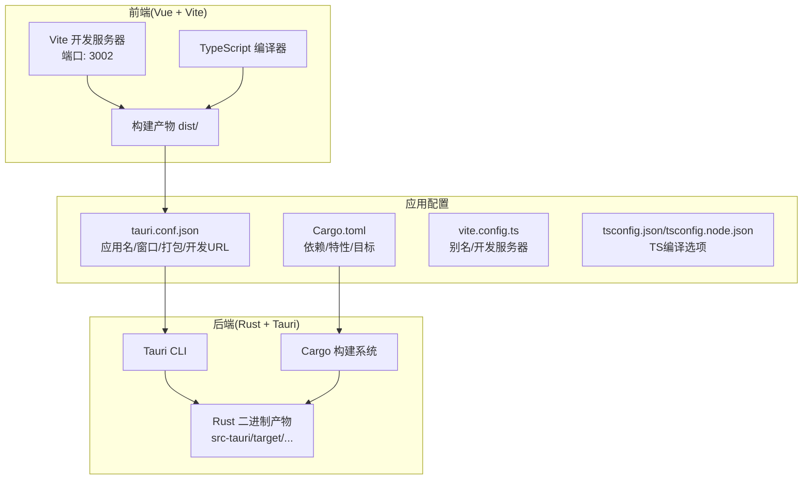
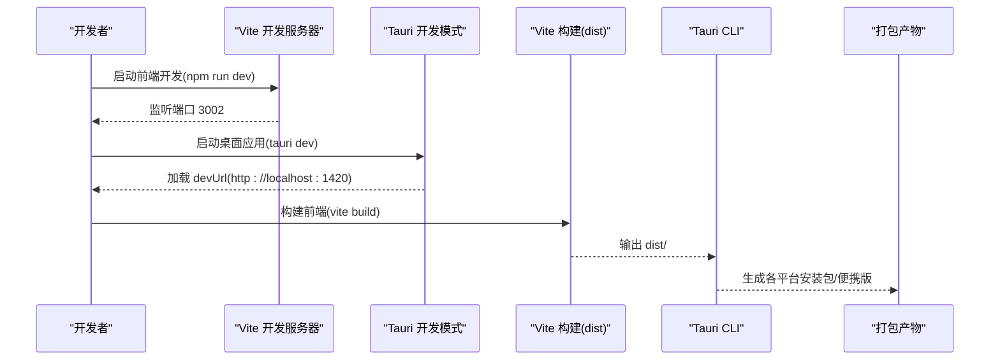
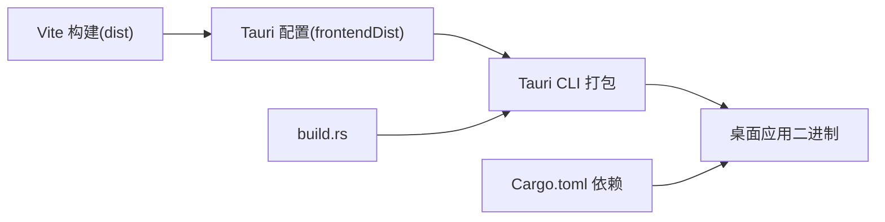

# 构建配置

<cite>
**本文引用的文件**
- [package.json](file://package.json)
- [vite.config.ts](file://vite.config.ts)
- [tsconfig.json](file://tsconfig.json)
- [tsconfig.node.json](file://tsconfig.node.json)
- [src-tauri/tauri.conf.json](file://src-tauri/tauri.conf.json)
- [src-tauri/Cargo.toml](file://src-tauri/Cargo.toml)
- [src-tauri/Cargo.simple.toml](file://src-tauri/Cargo.simple.toml)
- [src-tauri/Cargo.backup.toml](file://src-tauri/Cargo.backup.toml)
- [src-tauri/build.rs](file://src-tauri/build.rs)
- [src-tauri/package.bat](file://src-tauri/package.bat)
- [docs/development-setup.md](file://docs/development-setup.md)
- [src/main.ts](file://src/main.ts)
- [src/App.vue](file://src/App.vue)
- [src/config/app-settings.ts](file://src/config/app-settings.ts)
- [src/config/model-config.ts](file://src/config/model-config.ts)
</cite>

## 目录
1. [简介](#简介)
2. [项目结构](#项目结构)
3. [核心组件](#核心组件)
4. [架构总览](#架构总览)
5. [详细组件分析](#详细组件分析)
6. [依赖关系分析](#依赖关系分析)
7. [性能考虑](#性能考虑)
8. [故障排查指南](#故障排查指南)
9. [结论](#结论)
10. [附录](#附录)

## 简介
本文件面向Malou Agent项目的构建配置，系统性梳理前端Vite与TypeScript配置、Rust后端Cargo配置以及Tauri应用配置，并给出开发、测试与生产环境的差异要点与常见问题排查方案。文档同时提供可视化图示帮助理解构建流程与组件交互。

## 项目结构
Malou Agent采用“前端Vue + 后端Rust + Tauri桥接”的桌面应用架构。前端通过Vite进行开发与打包，Rust通过Tauri CLI集成到最终桌面应用中；Tauri配置文件统一管理应用元信息、窗口行为、打包目标与前后端URL绑定。

图表来源
- [vite.config.ts](file://vite.config.ts#L1-L17)
- [tsconfig.json](file://tsconfig.json#L1-L24)
- [tsconfig.node.json](file://tsconfig.node.json#L1-L11)
- [src-tauri/tauri.conf.json](file://src-tauri/tauri.conf.json#L1-L32)
- [src-tauri/Cargo.toml](file://src-tauri/Cargo.toml#L1-L25)

章节来源
- [package.json](file://package.json#L1-L31)
- [vite.config.ts](file://vite.config.ts#L1-L17)
- [tsconfig.json](file://tsconfig.json#L1-L24)
- [tsconfig.node.json](file://tsconfig.node.json#L1-L11)
- [src-tauri/tauri.conf.json](file://src-tauri/tauri.conf.json#L1-L32)
- [src-tauri/Cargo.toml](file://src-tauri/Cargo.toml#L1-L25)

## 核心组件
- 前端构建与开发服务器
  - Vite开发服务器端口与严格端口策略，路径别名配置，Vue插件集成。
  - TypeScript编译选项与模块解析策略，确保与Vite bundler配合。
- Rust后端与Tauri集成
  - Cargo.toml声明Tauri核心依赖、序列化库、异步运行时、数据库与HTTP客户端等。
  - build.rs调用Tauri构建流程，生成安全清单与资源绑定。
- Tauri应用配置
  - 应用产品名、版本、标识符、开发URL与前端产物目录。
  - 窗口尺寸、可调整性与安全策略（CSP）。
  - 打包目标与图标资源，跨平台特性开关。

章节来源
- [vite.config.ts](file://vite.config.ts#L1-L17)
- [tsconfig.json](file://tsconfig.json#L1-L24)
- [tsconfig.node.json](file://tsconfig.node.json#L1-L11)
- [src-tauri/Cargo.toml](file://src-tauri/Cargo.toml#L1-L25)
- [src-tauri/build.rs](file://src-tauri/build.rs#L1-L3)
- [src-tauri/tauri.conf.json](file://src-tauri/tauri.conf.json#L1-L32)

## 架构总览
下图展示从开发到打包的关键流程：前端Vite开发服务器与Tauri开发模式联动，构建阶段将dist产物注入Tauri，最终生成多平台安装包或便携版。

图表来源
- [package.json](file://package.json#L6-L12)
- [vite.config.ts](file://vite.config.ts#L13-L16)
- [src-tauri/tauri.conf.json](file://src-tauri/tauri.conf.json#L5-L9)

## 详细组件分析

### 前端构建配置（Vite + TypeScript）
- Vite配置要点
  - 插件：Vue插件用于单文件组件与模板编译。
  - 路径别名：根目录别名为“@”，便于统一导入。
  - 开发服务器：端口3002且严格端口，避免端口冲突。
- TypeScript配置要点
  - 目标与模块：ES2020与ESNext，适配现代浏览器与打包器。
  - 模块解析：bundler策略，与Vite生态兼容。
  - 严格模式：开启严格检查、未使用变量/参数检测、switch穷举校验。
  - 路径映射：与Vite别名一致，保证类型检查与IDE跳转一致。
- 与应用入口的关系
  - 入口文件注册Pinia与Element Plus，确保UI与状态管理在构建后正常工作。

章节来源
- [vite.config.ts](file://vite.config.ts#L1-L17)
- [tsconfig.json](file://tsconfig.json#L1-L24)
- [tsconfig.node.json](file://tsconfig.node.json#L1-L11)
- [src/main.ts](file://src/main.ts#L1-L13)

### Rust后端构建配置（Cargo）
- 依赖与特性
  - Tauri核心、序列化与JSON处理、Tokio全功能异步运行时、UUID与时间处理、图像处理、用户目录访问、SQLite绑定、HTTP客户端等。
  - 特性开关：默认启用自定义协议特性，便于应用内协议处理。
- 构建与打包
  - build.rs调用Tauri构建流程，生成安全清单与资源绑定。
  - Cargo.backup.toml展示了更丰富的特性集（如ONNX推理、并发与SIMD优化、系统库依赖、交叉编译与签名配置等），可用于高级场景或历史参考。
- 性能与特性配置
  - dev/release/profile配置覆盖优化等级、调试符号、溢出检查、LTO、panic策略与并行编译单元，指导不同阶段的构建策略。

章节来源
- [src-tauri/Cargo.toml](file://src-tauri/Cargo.toml#L1-L25)
- [src-tauri/Cargo.simple.toml](file://src-tauri/Cargo.simple.toml#L1-L22)
- [src-tauri/Cargo.backup.toml](file://src-tauri/Cargo.backup.toml#L1-L160)
- [src-tauri/build.rs](file://src-tauri/build.rs#L1-L3)

### Tauri应用配置（tauri.conf.json）
- 应用基本信息
  - 产品名、版本、标识符，用于打包与系统识别。
- 构建命令与开发服务器
  - beforeDevCommand/beforeBuildCommand留空，由CLI驱动。
  - devUrl指向独立的前端开发服务器地址，便于热重载联调。
  - frontendDist指向构建后的dist目录，确保打包时包含最新前端产物。
- 窗口与安全
  - 窗口标题、尺寸、可调整性与全屏开关。
  - 安全策略CSP设为null，表示不强制限制内容策略，需结合实际安全需求评估。
- 打包与图标
  - targets设为all，生成多平台包；图标路径指向项目内资源。

章节来源
- [src-tauri/tauri.conf.json](file://src-tauri/tauri.conf.json#L1-L32)

### 开发脚本与环境差异
- 开发环境
  - 前端：Vite开发服务器端口3002；Tauri devUrl为1420；两者通过Tauri CLI协同。
  - 环境变量：建议在开发时通过.env文件注入API基础地址等配置项。
- 测试/生产环境
  - 生产构建：先执行Vite构建生成dist，再由Tauri CLI打包。
  - 便携版/发布版：可通过脚本复制二进制与DLL，生成Windows便携包。

章节来源
- [package.json](file://package.json#L6-L12)
- [vite.config.ts](file://vite.config.ts#L13-L16)
- [src-tauri/tauri.conf.json](file://src-tauri/tauri.conf.json#L5-L9)
- [docs/development-setup.md](file://docs/development-setup.md#L26-L42)
- [src-tauri/package.bat](file://src-tauri/package.bat#L1-L42)

### 配置管理与数据流（与构建相关）
- 前端配置模型
  - 提供模型选择、远程/本地模型、ONNX能力与资源限制等配置项，默认值集中于模型配置文件。
  - 应用设置管理器负责读取/保存到localStorage，并在变更时触发自动保存。
- 与构建产物的关系
  - 配置项影响运行时行为，构建后不会改变其逻辑；但若新增配置字段，需确保类型与默认值在TS层面保持一致，避免构建期类型错误。

章节来源
- [src/config/model-config.ts](file://src/config/model-config.ts#L1-L163)
- [src/config/app-settings.ts](file://src/config/app-settings.ts#L1-L195)

## 依赖关系分析
前端与后端通过Tauri CLI耦合：Vite负责前端构建，dist作为静态资源注入Tauri；Rust负责系统能力与业务逻辑，二者通过Tauri命令与事件通信。

图表来源
- [vite.config.ts](file://vite.config.ts#L1-L17)
- [src-tauri/tauri.conf.json](file://src-tauri/tauri.conf.json#L5-L9)
- [src-tauri/Cargo.toml](file://src-tauri/Cargo.toml#L1-L25)
- [src-tauri/build.rs](file://src-tauri/build.rs#L1-L3)

章节来源
- [vite.config.ts](file://vite.config.ts#L1-L17)
- [src-tauri/tauri.conf.json](file://src-tauri/tauri.conf.json#L1-L32)
- [src-tauri/Cargo.toml](file://src-tauri/Cargo.toml#L1-L25)
- [src-tauri/build.rs](file://src-tauri/build.rs#L1-L3)

## 性能考虑
- 前端构建
  - 使用bundler模块解析与严格的TS选项，有助于在构建期发现潜在问题。
  - 别名统一导入减少路径解析成本，提升IDE与构建效率。
- 后端构建
  - 开发与发布配置分离：dev适合快速迭代，release启用LTO与较少并行编译单元以提升体积与运行时性能。
  - Tokio全功能特性适合复杂异步任务，注意在生产中根据负载调整线程与内存上限。
- 应用打包
  - 将dist作为静态资源注入，避免重复构建；打包targets=all可覆盖多平台，但会增加构建时间。

## 故障排查指南
- 前端开发问题
  - 端口占用：确认Vite端口3002未被占用，或调整为其他端口。
  - 类型错误：检查tsconfig.json与tsconfig.node.json的模块解析与严格选项是否与项目一致。
- Tauri开发问题
  - devUrl不匹配：确保Tauri配置的devUrl与Vite开发服务器端口一致。
  - 前端资源缺失：确认Vite构建已生成dist，且Tauri配置的frontendDist指向正确路径。
- 构建与打包问题
  - 依赖缺失：按开发环境指南安装Node与Rust工具链，必要时清理缓存后重装依赖。
  - Windows便携包：使用提供的脚本复制二进制与DLL，检查输出目录与快捷方式生成情况。
- 常见修复步骤
  - 清理缓存与重新安装依赖。
  - 更新Tauri CLI至最新稳定版本。
  - 检查数据库文件位置并按需删除以重置。

章节来源
- [docs/development-setup.md](file://docs/development-setup.md#L59-L82)
- [src-tauri/package.bat](file://src-tauri/package.bat#L1-L42)

## 结论
Malou Agent的构建体系以Vite+TypeScript为前端基石，Rust+Tauri为后端核心，通过Tauri配置文件将二者无缝衔接。合理利用开发/生产配置差异与脚本化打包流程，可在保证开发效率的同时获得稳定的发布产物。建议在团队协作中统一配置与脚本，持续完善类型与默认值，确保构建稳定性与可维护性。

## 附录
- 关键配置速览
  - 前端：Vite端口3002、严格端口、路径别名；TypeScript ESNext与bundler解析。
  - 后端：Tauri核心、Tokio、SQLite、HTTP客户端等依赖；默认启用自定义协议特性。
  - 应用：产品名/版本/标识符；devUrl与frontendDist；窗口尺寸与打包目标。
- 相关文件路径
  - 前端：package.json、vite.config.ts、tsconfig.json、tsconfig.node.json
  - 后端：src-tauri/Cargo.toml、src-tauri/build.rs、src-tauri/Cargo.backup.toml
  - 应用：src-tauri/tauri.conf.json、src-tauri/package.bat
  - 配置管理：src/config/model-config.ts、src/config/app-settings.ts