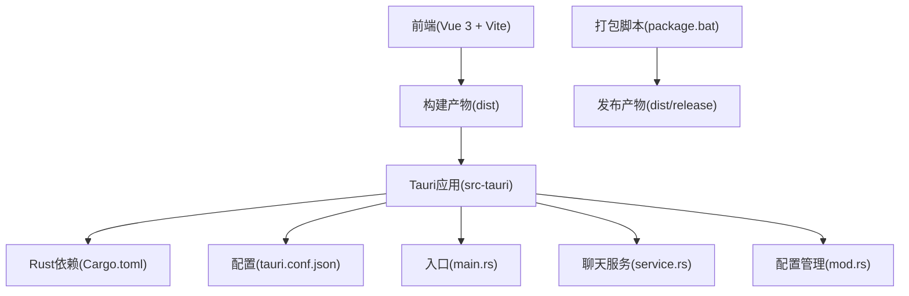
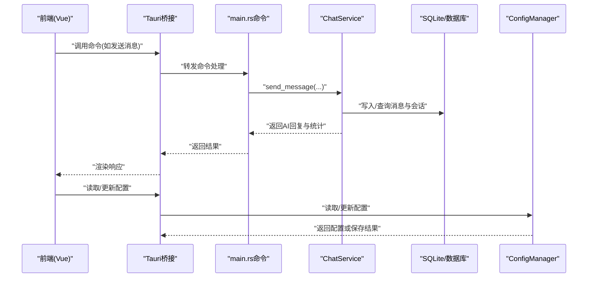
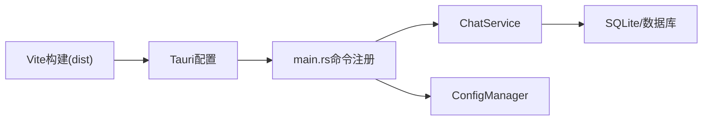

# 部署指南

<cite>
**本文引用的文件**
- [package.json](file://package.json)
- [vite.config.ts](file://vite.config.ts)
- [src-tauri/Cargo.toml](file://src-tauri/Cargo.toml)
- [src-tauri/tauri.conf.json](file://src-tauri/tauri.conf.json)
- [src-tauri/build.rs](file://src-tauri/build.rs)
- [src-tauri/src/main.rs](file://src-tauri/src/main.rs)
- [src-tauri/src/chat/service.rs](file://src-tauri/src/chat/service.rs)
- [src-tauri/src/config/mod.rs](file://src-tauri/src/config/mod.rs)
- [package.bat](file://package.bat)
- [README.md](file://README.md)
- [docs/testing-and-optimization.md](file://docs/testing-and-optimization.md)
- [RUST_ONNX_VECTOR_DB_INTEGRATION_SCHEME.md](file://RUST_ONNX_VECTOR_DB_INTEGRATION_SCHEME.md)
</cite>

## 目录
1. [简介](#简介)
2. [项目结构](#项目结构)
3. [核心组件](#核心组件)
4. [架构总览](#架构总览)
5. [详细组件分析](#详细组件分析)
6. [依赖关系分析](#依赖关系分析)
7. [性能考量](#性能考量)
8. [故障排查指南](#故障排查指南)
9. [结论](#结论)
10. [附录](#附录)

## 简介
本指南面向Malou Agent项目的部署与运维团队，覆盖从开发环境到生产发布的全流程，包括构建配置、打包与签名、平台适配、版本管理、自动化部署与更新机制、Docker容器化与云部署、监控与性能优化等。Malou Agent采用Tauri v2 + Vue 3 + Rust技术栈，前端通过Vite构建，后端由Rust实现，借助Tauri桥接到前端，形成跨平台桌面应用。

## 项目结构
项目采用前后端分离与原生打包结合的组织方式：
- 前端：Vue 3 + TypeScript + Vite，位于根目录，构建产物输出至dist目录
- 后端：Rust + Tauri，位于src-tauri目录，包含Cargo.toml、tauri.conf.json、Rust源码与构建脚本
- 文档：docs目录包含开发、配置、测试与优化文档
- 其他：package.json定义脚本与依赖；package.bat提供Windows打包辅助

图表来源
- [vite.config.ts](file://vite.config.ts#L1-L17)
- [src-tauri/tauri.conf.json](file://src-tauri/tauri.conf.json#L1-L32)
- [src-tauri/Cargo.toml](file://src-tauri/Cargo.toml#L1-L25)
- [src-tauri/src/main.rs](file://src-tauri/src/main.rs#L242-L315)
- [src-tauri/src/chat/service.rs](file://src-tauri/src/chat/service.rs#L1-L224)
- [src-tauri/src/config/mod.rs](file://src-tauri/src/config/mod.rs#L1-L334)
- [package.bat](file://package.bat#L1-L42)

章节来源
- [README.md](file://README.md#L1-L76)
- [package.json](file://package.json#L1-L31)
- [vite.config.ts](file://vite.config.ts#L1-L17)
- [src-tauri/tauri.conf.json](file://src-tauri/tauri.conf.json#L1-L32)
- [src-tauri/Cargo.toml](file://src-tauri/Cargo.toml#L1-L25)

## 核心组件
- 前端构建与开发服务器：Vite配置定义别名、端口与开发服务器参数，便于本地调试与热更新
- Tauri应用配置：tauri.conf.json定义产品名称、版本、窗口属性、安全策略与打包目标
- Rust后端与命令：main.rs注册命令（会话、消息、Token统计、OpenAI配置、数据库测试等），并通过ChatService与ConfigManager提供业务能力
- 配置管理：ConfigManager负责应用配置的加载、持久化与按段落更新，支持本地/远程模型选择与ONNX特性开关
- 打包脚本：Windows专用打包脚本复制可执行文件与DLL、生成快捷方式与说明文件

章节来源
- [vite.config.ts](file://vite.config.ts#L1-L17)
- [src-tauri/tauri.conf.json](file://src-tauri/tauri.conf.json#L1-L32)
- [src-tauri/src/main.rs](file://src-tauri/src/main.rs#L242-L315)
- [src-tauri/src/config/mod.rs](file://src-tauri/src/config/mod.rs#L144-L248)
- [package.bat](file://package.bat#L1-L42)

## 架构总览
下图展示从浏览器到Rust后端的调用链路，以及配置与数据流：

图表来源
- [src-tauri/src/main.rs](file://src-tauri/src/main.rs#L285-L312)
- [src-tauri/src/chat/service.rs](file://src-tauri/src/chat/service.rs#L94-L177)
- [src-tauri/src/config/mod.rs](file://src-tauri/src/config/mod.rs#L257-L334)

## 详细组件分析

### 构建与开发环境配置
- 前端开发服务器
  - 端口与严格端口绑定，便于多开发者协作与CI环境一致化
  - 别名@指向src，提升导入便捷性
- 依赖与脚本
  - package.json定义开发、构建、预览与Tauri命令，便于统一入口
  - Tauri CLI与Vue/Vite/TypeScript等依赖版本明确
- Rust后端
  - Cargo.toml声明Tauri、Serde、Tokio、SQLite、HTTP客户端等依赖
  - build.rs委托tauri_build::build，确保资源与Schema正确注入

章节来源
- [vite.config.ts](file://vite.config.ts#L1-L17)
- [package.json](file://package.json#L1-L31)
- [src-tauri/Cargo.toml](file://src-tauri/Cargo.toml#L1-L25)
- [src-tauri/build.rs](file://src-tauri/build.rs#L1-L3)

### 生产环境优化
- 二进制体积与启动时间
  - 使用Rust编译器优化与链接时优化，减少运行时依赖
  - 前端构建产物dist作为静态资源内嵌于应用
- 安全与合规
  - tauri.conf.json中安全策略字段可按需收紧
  - 仅暴露必要命令，避免过度授权
- 资源与并发
  - ChatService使用Arc<RwLock<...>>实现Send+Sync，支持并发调用
  - Token统计与会话统计在消息写入后即时更新，降低查询压力

章节来源
- [src-tauri/src/chat/service.rs](file://src-tauri/src/chat/service.rs#L11-L35)
- [src-tauri/src/main.rs](file://src-tauri/src/main.rs#L242-L315)
- [src-tauri/tauri.conf.json](file://src-tauri/tauri.conf.json#L21-L23)

### 包装配置与平台适配
- 打包目标与图标
  - bundle.targets设为“all”，可同时生成Windows/macOS/Linux包
  - 图标路径在tauri.conf.json中配置
- 平台差异
  - Windows：package.bat提供打包辅助（复制DLL、创建快捷方式）
  - macOS/Linux：遵循Tauri默认打包流程，注意签名与权限配置
- 开发与构建URL
  - devUrl与frontendDist指向Vite构建产物，确保开发与预览一致

章节来源
- [src-tauri/tauri.conf.json](file://src-tauri/tauri.conf.json#L1-L32)
- [package.bat](file://package.bat#L1-L42)

### 版本管理与自动化部署
- 版本号
  - 前端与后端分别维护版本号，建议统一管理并在CI中注入
- 自动化测试与CI
  - 提供GitHub Actions示例，包含Node.js与Rust工具链、前端与后端测试、集成与性能测试
- 发布流程
  - 建议在CI中执行：前端构建 → 后端构建 → Tauri打包 → 产物归档与签名 → 发布

章节来源
- [docs/testing-and-optimization.md](file://docs/testing-and-optimization.md#L234-L292)

### 更新机制
- 前端更新：通过重新构建dist并替换静态资源实现
- 后端更新：重新编译Rust二进制，替换应用内嵌资源
- 建议引入应用内更新检查（如基于版本号对比）与增量更新策略

章节来源
- [src-tauri/src/main.rs](file://src-tauri/src/main.rs#L60-L67)

### Docker容器化部署与云部署
- 容器化思路
  - 使用Rust官方镜像构建Release二进制，再复制到精简运行时镜像
  - 运行时安装必要的系统库（如SSL证书、CA）
  - 非root用户运行，暴露必要端口
- 云部署建议
  - 将配置文件挂载为卷，避免硬编码
  - 结合负载均衡与健康检查，确保高可用
  - 日志采集与指标上报（见监控章节）

章节来源
- [RUST_ONNX_VECTOR_DB_INTEGRATION_SCHEME.md](file://RUST_ONNX_VECTOR_DB_INTEGRATION_SCHEME.md#L1004-L1087)

### 性能优化与资源压缩
- 前端
  - 使用Vite生产构建，启用代码分割与Tree-shaking
  - 合理拆分路由与组件，减少首屏体积
- 后端
  - Rust编译优化与链接时优化，减少运行时开销
  - ChatService并发读写锁与最小锁持有时间，降低竞争
  - Token统计与会话统计写入合并，减少IO次数
- 启动时间
  - 将数据库初始化与配置加载放在应用启动阶段，避免延迟初始化
  - 预热常用资源（如ONNX模型元数据），缩短首次推理等待

章节来源
- [src-tauri/src/chat/service.rs](file://src-tauri/src/chat/service.rs#L94-L177)
- [src-tauri/src/main.rs](file://src-tauri/src/main.rs#L242-L284)

### 监控与可观测性
- 日志
  - Rust侧使用标准输出/错误输出，结合系统日志收集
  - 建议在生产环境接入结构化日志（JSON格式）
- 指标
  - 记录Token用量、消息吞吐、响应时间、并发数等
- 告警
  - 设置阈值告警（如错误率、延迟、资源占用）
- 追踪
  - 为关键命令与聊天流程添加Span/Trace，定位性能瓶颈

章节来源
- [RUST_ONNX_VECTOR_DB_INTEGRATION_SCHEME.md](file://RUST_ONNX_VECTOR_DB_INTEGRATION_SCHEME.md#L1062-L1087)

## 依赖关系分析
- 前端对后端的依赖通过Tauri命令实现，命令注册集中于main.rs
- ChatService封装数据库与外部API交互，ConfigManager提供配置持久化
- 打包阶段依赖Vite构建产物与Tauri配置

图表来源
- [src-tauri/src/main.rs](file://src-tauri/src/main.rs#L285-L312)
- [src-tauri/src/chat/service.rs](file://src-tauri/src/chat/service.rs#L1-L224)
- [src-tauri/src/config/mod.rs](file://src-tauri/src/config/mod.rs#L144-L248)
- [src-tauri/tauri.conf.json](file://src-tauri/tauri.conf.json#L1-L32)

章节来源
- [src-tauri/src/main.rs](file://src-tauri/src/main.rs#L242-L315)
- [src-tauri/src/chat/service.rs](file://src-tauri/src/chat/service.rs#L1-L224)
- [src-tauri/src/config/mod.rs](file://src-tauri/src/config/mod.rs#L144-L248)

## 性能考量
- 并发与锁
  - 使用Arc<RwLock<...>>保护共享状态，避免Send+Sync限制导致的阻塞
- IO与缓存
  - 会话与消息批量写入，减少事务次数
  - Token统计与会话统计合并更新，降低写放大
- 启动与懒加载
  - 将数据库初始化与配置加载前置，避免运行时延迟
- 前端体积
  - 通过Vite生产构建与按需加载，控制首屏大小

章节来源
- [src-tauri/src/chat/service.rs](file://src-tauri/src/chat/service.rs#L94-L177)
- [src-tauri/src/main.rs](file://src-tauri/src/main.rs#L242-L284)

## 故障排查指南
- 开发环境无法启动
  - 检查Vite端口占用与strictPort设置
  - 确认Node与Rust工具链版本满足依赖要求
- 打包失败
  - 确认Vite已构建dist，且tauri.conf.json中frontendDist指向正确路径
  - Windows环境下检查package.bat是否成功复制DLL与生成快捷方式
- 运行时异常
  - 查看Rust日志输出，定位命令处理与数据库操作错误
  - 使用test_database命令验证数据库连通性与基本操作
- 配置不生效
  - 确认ConfigManager已正确加载配置文件，必要时重置默认配置
  - 通过命令读取当前模型与ONNX特性开关状态

章节来源
- [vite.config.ts](file://vite.config.ts#L13-L16)
- [src-tauri/tauri.conf.json](file://src-tauri/tauri.conf.json#L5-L9)
- [package.bat](file://package.bat#L10-L27)
- [src-tauri/src/main.rs](file://src-tauri/src/main.rs#L219-L238)
- [src-tauri/src/config/mod.rs](file://src-tauri/src/config/mod.rs#L167-L178)

## 结论
Malou Agent的部署以Tauri + Vue 3 + Rust为核心，具备良好的跨平台适配性与性能潜力。通过规范化的构建与打包流程、严格的配置管理、完善的监控与自动化测试，可在Windows、macOS、Linux上稳定交付，并为后续容器化与云部署打下坚实基础。

## 附录

### Windows打包流程（package.bat）
- 创建发布目录并复制可执行文件与DLL
- 生成桌面快捷方式与说明文件
- 输出产物清单并暂停等待

章节来源
- [package.bat](file://package.bat#L1-L42)

### macOS/Linux打包与签名
- 使用Tauri默认打包目标生成对应平台包
- macOS建议启用公证与沙盒配置
- Linux建议提供AppImage或DEB/RPM包，并配置桌面文件

章节来源
- [src-tauri/tauri.conf.json](file://src-tauri/tauri.conf.json#L25-L31)

### CI/CD最佳实践
- 分阶段流水线：安装依赖 → 前端构建 → 后端构建 → 测试 → 打包 → 发布
- 多平台并行：Windows/macOS/Linux并行构建与测试
- 安全与审计：启用依赖扫描与二进制安全检查

章节来源
- [docs/testing-and-optimization.md](file://docs/testing-and-optimization.md#L234-L292)