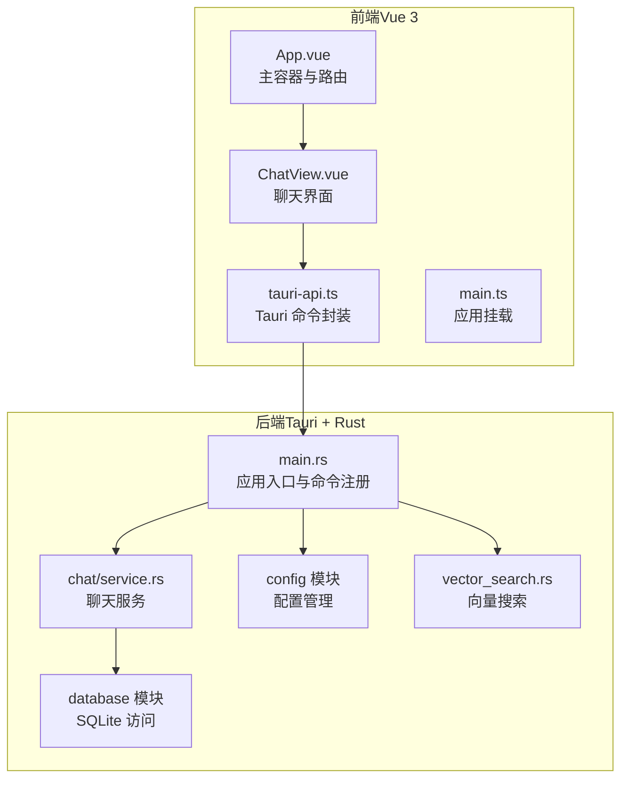
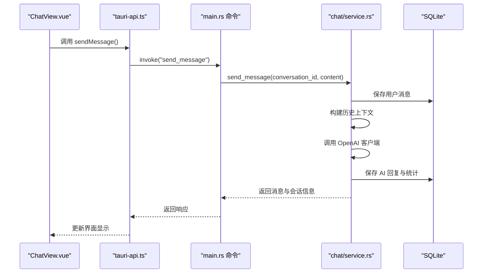
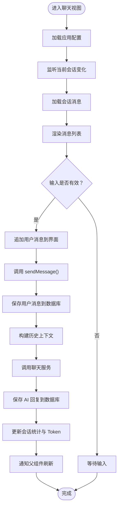
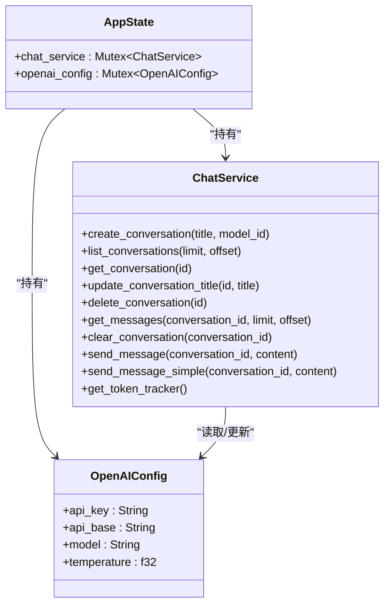
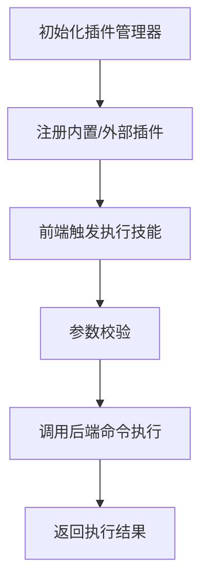
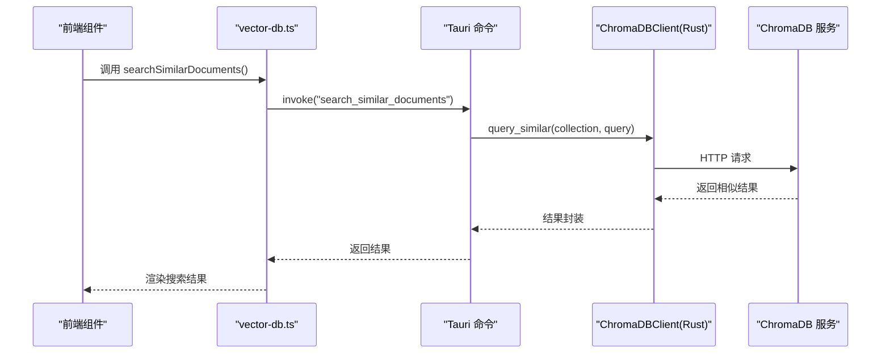
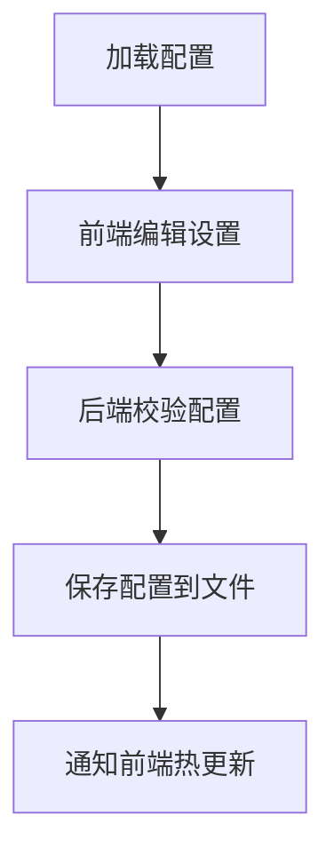
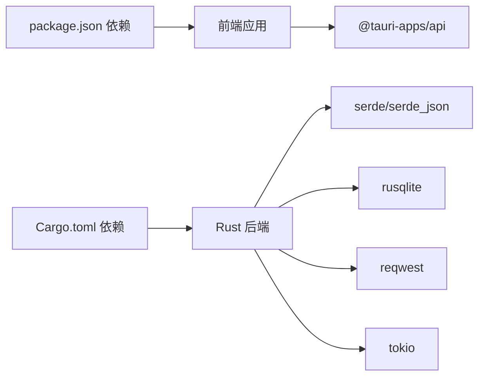

# 项目概述

<cite>
**本文引用的文件**
- [README.md](file://README.md)
- [PROGRESS_REPORT.md](file://PROGRESS_REPORT.md)
- [src-tauri/Cargo.toml](file://src-tauri/Cargo.toml)
- [package.json](file://package.json)
- [src-tauri/tauri.conf.json](file://src-tauri/tauri.conf.json)
- [src/App.vue](file://src/App.vue)
- [src/main.ts](file://src/main.ts)
- [src-tauri/src/main.rs](file://src-tauri/src/main.rs)
- [src-tauri/src/chat/service.rs](file://src-tauri/src/chat/service.rs)
- [src/api/tauri-api.ts](file://src/api/tauri-api.ts)
- [src/components/business/ChatView.vue](file://src/components/business/ChatView.vue)
- [docs/skill-plugins-system.md](file://docs/skill-plugins-system.md)
- [docs/chromadb-integration.md](file://docs/chromadb-integration.md)
- [docs/configuration-management.md](file://docs/configuration-management.md)
</cite>

## 目录
1. [简介](#简介)
2. [项目结构](#项目结构)
3. [核心组件](#核心组件)
4. [架构总览](#架构总览)
5. [详细组件分析](#详细组件分析)
6. [依赖关系分析](#依赖关系分析)
7. [性能考虑](#性能考虑)
8. [故障排查指南](#故障排查指南)
9. [结论](#结论)
10. [附录](#附录)

## 简介
Malou Agent 是一款基于 Tauri + Vue 3 的 Windows 桌面 AI 助手应用，旨在为用户提供本地化的智能对话体验。项目通过前端 Vue 3 + TypeScript + Element Plus + Vite + Pinia 的现代 Web 技术栈，配合 Rust + Tauri 的原生桌面能力，实现高性能、低延迟的本地计算与隐私友好的数据存储。核心功能包括智能聊天对话、文档管理与检索、本地 ONNX 模型推理、向量数据库搜索以及插件化技能系统。项目当前处于快速迭代阶段，已完成前端基础架构与聊天界面，后端正在解决依赖兼容性问题并逐步集成本地推理与向量搜索能力。

- 目标用户：需要在本地进行安全、可控、低延迟 AI 对话与知识检索的个人用户与开发者。
- 典型使用场景：日常办公问答、知识库检索、本地文档问答、多模型切换与技能扩展。

**章节来源**
- file://README.md#L1-L76
- file://PROGRESS_REPORT.md#L1-L92

## 项目结构
项目采用前后端分离的模块化组织方式：
- 前端（src/）：Vue 3 单页应用，组件化业务模块（聊天视图、会话列表、文档管理、设置面板），API 封装与状态管理。
- 后端（src-tauri/）：Rust 应用，包含聊天服务、数据库访问层、配置管理、向量搜索等模块，通过 Tauri 命令暴露给前端调用。
- 文档（docs/）：系统设计与集成方案说明，如技能插件系统、ChromaDB 向量数据库集成、配置管理等。

**图表来源**
- [src/App.vue](file://src/App.vue#L1-L121)
- [src/main.ts](file://src/main.ts#L1-L13)
- [src-tauri/src/main.rs](file://src-tauri/src/main.rs#L1-L323)
- [src-tauri/src/chat/service.rs](file://src-tauri/src/chat/service.rs#L1-L214)

**章节来源**
- file://README.md#L45-L61
- file://src-tauri/tauri.conf.json#L1-L32

## 核心组件
- 前端应用入口与状态管理：应用在入口处初始化 Pinia 状态管理与 Element Plus UI，挂载根组件。
- 聊天视图组件：负责消息渲染、输入处理、模型切换、数据库测试与清空历史等交互。
- Tauri 命令封装：统一的 API 层，将 Rust 命令映射为前端可用的函数，涵盖会话管理、消息管理、Token 统计、OpenAI 配置与数据库测试。
- Rust 应用入口：注册所有命令，初始化数据库与聊天服务，管理应用状态与配置。
- 聊天服务：封装会话与消息的增删改查、历史上下文构建、OpenAI 调用与 Token 统计。

**章节来源**
- file://src/main.ts#L1-L13
- file://src/components/business/ChatView.vue#L1-L569
- file://src/api/tauri-api.ts#L1-L242
- file://src-tauri/src/main.rs#L1-L323
- file://src-tauri/src/chat/service.rs#L1-L214

## 架构总览
系统采用“前端 Web + 后端原生”的混合架构：
- 前端通过 Tauri 提供的 invoke 通道调用后端命令，实现会话、消息、配置、数据库与 Token 统计等功能。
- 后端以 Rust 实现高性能与安全性，使用 SQLite 存储会话与消息，预留 ONNX 推理与向量数据库集成能力。
- 配置管理贯穿前后端，支持热更新与导出导入。

**图表来源**
- [src/components/business/ChatView.vue](file://src/components/business/ChatView.vue#L162-L222)
- [src/api/tauri-api.ts](file://src/api/tauri-api.ts#L105-L132)
- [src-tauri/src/main.rs](file://src-tauri/src/main.rs#L140-L161)
- [src-tauri/src/chat/service.rs](file://src-tauri/src/chat/service.rs#L90-L167)

**章节来源**
- file://src-tauri/src/main.rs#L249-L322
- file://src-tauri/src/chat/service.rs#L17-L31

## 详细组件分析

### 前端应用与聊天界面
- 应用容器：顶部标签页切换聊天、知识库与设置；聊天页采用侧边栏 + 主面板布局，左侧展示会话列表，右侧展示聊天视图。
- 聊天视图：支持消息滚动、输入校验、发送流程、加载态、清空历史、数据库测试与模型切换弹窗。
- 模型选择：根据配置动态生成可用模型列表（远程与本地），支持切换并持久化到配置。

**图表来源**
- [src/components/business/ChatView.vue](file://src/components/business/ChatView.vue#L116-L149)
- [src/components/business/ChatView.vue](file://src/components/business/ChatView.vue#L162-L222)
- [src-tauri/src/chat/service.rs](file://src-tauri/src/chat/service.rs#L90-L167)

**章节来源**
- file://src/App.vue#L1-L121
- file://src/components/business/ChatView.vue#L1-L569

### 后端命令与聊天服务
- 命令注册：在应用启动时注册基础信息、会话管理、消息管理、Token 统计、OpenAI 配置与数据库测试等命令。
- 聊天服务：负责会话与消息的 CRUD、历史上下文构建、调用 OpenAI 客户端、记录 Token 使用与会话统计。
- 状态管理：AppState 包含聊天服务与 OpenAI 配置，通过 Mutex 保护共享状态。

**图表来源**
- [src-tauri/src/main.rs](file://src-tauri/src/main.rs#L53-L56)
- [src-tauri/src/main.rs](file://src-tauri/src/main.rs#L267-L275)
- [src-tauri/src/chat/service.rs](file://src-tauri/src/chat/service.rs#L9-L15)

**章节来源**
- file://src-tauri/src/main.rs#L292-L319
- file://src-tauri/src/chat/service.rs#L17-L31

### 技能插件系统（概念与设计）
- 插件接口：定义可执行的技能接口，支持参数校验与执行。
- 插件管理器：维护插件注册表与配置，提供按 ID 执行技能的能力。
- 前端集成：提供插件商店与配置界面，通过 Tauri 命令与后端交互。
- 安全机制：沙箱隔离、权限控制、代码签名与审计日志。

**图表来源**
- [docs/skill-plugins-system.md](file://docs/skill-plugins-system.md#L27-L60)
- [docs/skill-plugins-system.md](file://docs/skill-plugins-system.md#L128-L150)

**章节来源**
- file://docs/skill-plugins-system.md#L1-L214

### 向量数据库集成（ChromaDB）（概念与设计）
- 客户端封装：Rust 端实现 ChromaDB 客户端，支持集合管理、文档向量化与相似度查询。
- 前端 API：提供向量搜索与文档入库的封装方法。
- 配置选项：支持自定义服务地址、API Key、默认集合与嵌入模型。

**图表来源**
- [docs/chromadb-integration.md](file://docs/chromadb-integration.md#L62-L86)
- [docs/chromadb-integration.md](file://docs/chromadb-integration.md#L34-L57)

**章节来源**
- file://docs/chromadb-integration.md#L1-L124

### 配置管理（概念与设计）
- 配置结构：通用设置、AI 配置、数据库、向量数据库、插件等分组。
- 前端界面：提供多标签页设置面板，支持通用设置、AI 配置、数据库与向量数据库配置。
- 热重载与校验：前端监听配置变更并回写后端，后端提供配置校验与默认值。

**图表来源**
- [docs/configuration-management.md](file://docs/configuration-management.md#L99-L120)
- [docs/configuration-management.md](file://docs/configuration-management.md#L166-L197)

**章节来源**
- file://docs/configuration-management.md#L1-L304

## 依赖关系分析
- 前端依赖：Vue 3、Element Plus、Pinia、Vite、@tauri-apps/api 等。
- 后端依赖：Tauri v2、serde、tokio、rusqlite、reqwest、uuid、chrono 等。
- 构建与打包：前端使用 Vite，后端使用 Cargo；Tauri 配置定义开发/构建 URL 与窗口属性。

**图表来源**
- [package.json](file://package.json#L14-L29)
- [src-tauri/Cargo.toml](file://src-tauri/Cargo.toml#L12-L24)

**章节来源**
- file://package.json#L1-L31
- file://src-tauri/Cargo.toml#L1-L25
- file://src-tauri/tauri.conf.json#L5-L10

## 性能考虑
- 本地优先：通过 SQLite 本地存储与可选的 ONNX 推理减少网络依赖，提升响应速度与隐私性。
- 异步处理：聊天服务对 OpenAI 调用采用异步模式，避免阻塞 UI。
- 上下文裁剪：历史消息仅取最近若干条，降低 Token 使用与上下文长度。
- 前端优化：Pinia 状态管理减少不必要的重渲染，Element Plus 组件按需使用。

[本节为通用指导，无需列出具体文件来源]

## 故障排查指南
- 前端无法连接后端：检查 Tauri 配置中的开发/构建 URL 是否正确，确保前端开发服务器与后端命令通道一致。
- Rust 编译失败：关注依赖版本冲突（如 time crate、tract ONNX 库），必要时锁定或降级相关依赖版本。
- 数据库异常：使用前端提供的数据库测试按钮验证连接与基本 CRUD 能力，查看后端日志定位错误。
- Token 统计异常：确认聊天服务是否正确记录 prompt_tokens、completion_tokens 与 total_tokens。

**章节来源**
- file://PROGRESS_REPORT.md#L42-L52
- file://src-tauri/src/main.rs#L224-L245

## 结论
Malou Agent 以 Tauri + Vue 3 为基础，结合 Rust 后端与 SQLite 存储，构建了一个可扩展、可本地化的桌面 AI 助手。项目在前端实现了完善的聊天交互与配置入口，在后端完成了基础命令与聊天服务的骨架。当前重点在于解决后端依赖兼容性问题，推进本地 ONNX 推理与向量数据库集成，并完善插件化技能系统与配置管理界面。随着这些能力逐步落地，Malou Agent 将为用户提供更强大、更私密、更灵活的本地 AI 对话体验。

[本节为总结性内容，无需列出具体文件来源]

## 附录
- 快速开始：安装依赖 → 启动前端开发服务器 → 构建生产版本 → 启动桌面应用（需先安装 tauri-cli）。
- 技术栈状态：前端与 Tauri 前端已可运行，后端仍在调试中，ONNX 推理与向量搜索待激活与测试。

**章节来源**
- file://README.md#L29-L43
- file://PROGRESS_REPORT.md#L78-L89